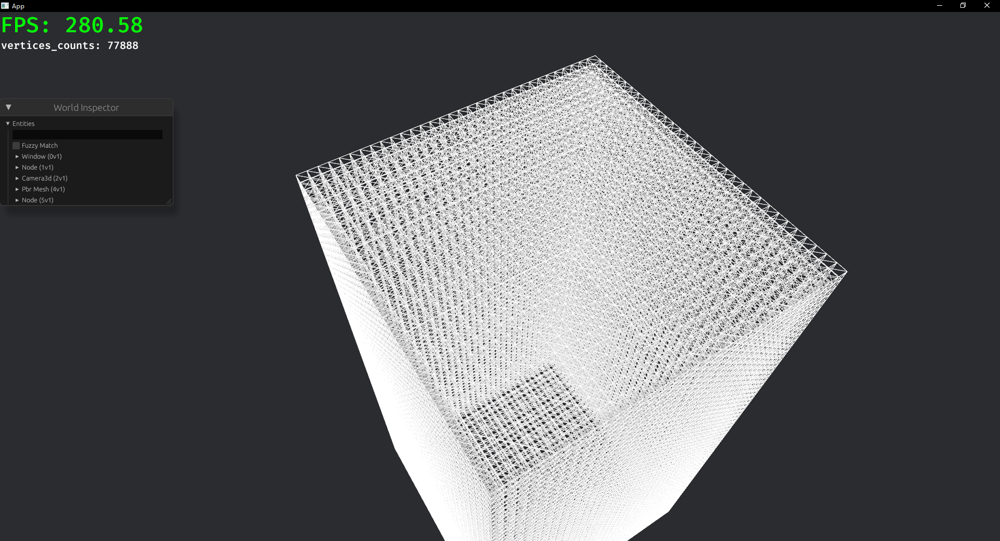

## 介绍
项目创建时间： 
2024年10月左右 
$~~~~$本项目是个人学习Rust和Bevy引擎的实践项目，将会持续学习&更新，以完成所有计划内功能为目标。 
使用Bevy引擎+Rust编程语言，实现的一个简单的3D体素沙盒类游戏。 
主要实现语言： 
Rust 
$~~~~$以ECS [(Entity Component System)](https://mp.weixin.qq.com/s/dfEyst39sZ1fRCV6hcqCDA)架构，实现游戏世界中的实体、组件、系统。 
游戏世界由方块组成，玩家可以自由地放置、破坏方块。 
游戏内有天然建筑，例如自然生成的村庄、城堡、矿道等，利用波函数坍缩噪声技术，生成可拆分与组合的结构性建筑。

## 项目记录
同时也是我的个人博客： 
https://mrtowc.xlog.app/Spirit-Realm  

## 技术栈
1. Bevy  [游戏引擎](https://bevyengine.org/)  
2. Rust [编程语言](https://www.rust-lang.org/zh-CN/)  
2.1. [tokio](https://tokio.rs/tokio/tutorial/spawning) 
2.2. [rayon](https://crates.io/crates/rayon)  
3. Quic [通信协议](https://tquic.net/zh/docs/intro/)  
 https://github.com/genmeta/gm-quic  
 https://tquic.net/zh/docs/intro/  
4. 噪声 用于生成地形，例如： 
OpenSimplex2 与 FBM 噪声：程序化生成地表地形  
波函数坍缩噪声：生成可拆分与组合的结构化、模块化建筑 
参考地址： 
https://lib.rs/crates/noise 
https://iquilezles.org/articles/morenoise/ 
八叉树算法：用于管理大量体素 
5. IPV6协议：用于服务器网络通信 
6. Protobuf / FlatBuffers [数据序列化协议](https://developers.google.com/protocol-buffers/)  

## 核心功能 / 计划实现功能
- [ ] 超平坦世界生成 
- [ ] 噪声世界生成 
- [ ] 方块放置/破坏 
- [ ] 各种优化剔除：   
	遮挡剔除、视锥剔除、LOD / HLOD 技术、八叉树等 
- [ ] 方块材质加载 
- [ ] 区块系统实现 
- [ ] QUIC协议的应用 
- [ ] 服务端通信/多人在线 
- [ ] AABB 碰撞箱: 实现玩家与物体之间物理碰撞 
- [ ] 玩家模型 
	待选模型文件格式：GLTF、JSON以及其他格式 
## 阶段展示： 
一、绘制基础mesh面，无剔除

二、将六个面都被遮挡的方块整体剔除 
但仍旧保留了与空气接触的方块的不可见的mesh面 

三、利用OpenSimplex2噪声多次叠加形成分型布朗运噪声(FBm)生成512x32x512大小的地形
](simplex-FBm.png)