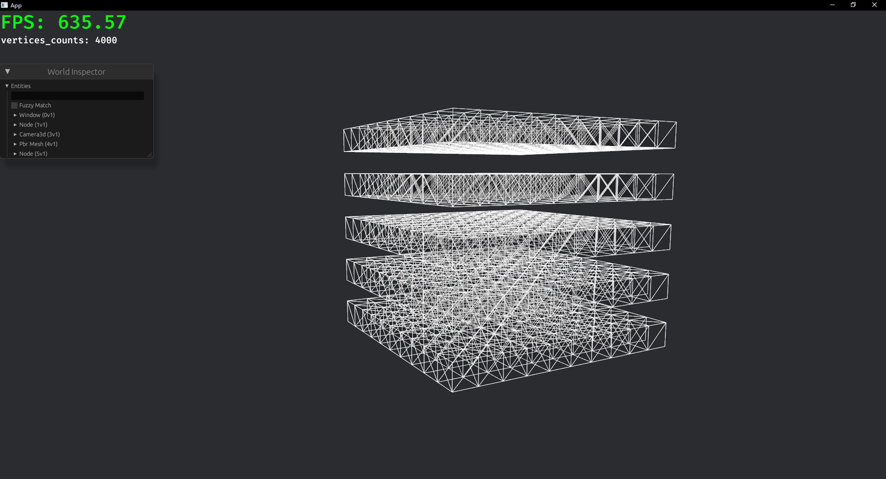

## 介绍
使用Bevy引擎+Rust编程语言，实现的一个简单的3D体素沙盒类游戏。 
主要实现语言：Rust 
以ECS [(Entity Component System)](https://mp.weixin.qq.com/s/dfEyst39sZ1fRCV6hcqCDA)架构，实现游戏世界中的实体、组件、系统。 
游戏世界由方块组成，玩家可以自由地放置、破坏方块。 
游戏内有天然建筑，例如自然生成的村庄、城堡、矿道等，利用波函数坍缩噪声技术，生成可拆分与组合的结构性建筑。

## 技术栈
1. Bevy  [游戏引擎](https://bevyengine.org/)  
2. Rust [编程语言](https://www.rust-lang.org/zh-CN/)  
3. Quic [通信协议](https://tquic.net/zh/docs/intro/)  
 https://github.com/genmeta/gm-quic  
 https://tquic.net/zh/docs/intro/  
4. 噪声 用于生成地形，例如： 
OpenSimplex2 与 FBM 噪声：程序化生成地形  
波函数坍缩噪声：生成可拆分与组合的结构性、模块化建筑 
参考地址： 
https://lib.rs/crates/noise 
https://iquilezles.org/articles/morenoise/ 
八叉树算法：用于管理大量体素 
5. IPV6协议：用于服务器网络通信 

## 核心功能 / 计划实现功能
- [ ] 方块放置/破坏 
- [ ] 各种优化剔除：   
	遮挡剔除、视锥剔除、LOD / HLOD 技术、八叉树等 
- [ ] 方块材质加载 
- [ ] 区块系统实现 
- [ ] QUIC协议的应用 
- [ ] 服务端通信/多人在线 
- [ ] AABB 碰撞箱: 实现玩家与物体之间物理碰撞 
- [ ] 玩家模型 
	待选模型文件格式：GLTF、JSON以及其他格式 

