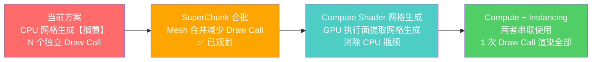

# Compute Shader 网格生成与 Custom Shader Instancing 搭配方案

> **⚠️ 重点借鉴**：本文档是核心技术参考，描述两种方案的协同原理与组合方式，为后续 GPU 驱动渲染管线提供理论基础。

---

## 1. 背景：两个 Bevy 官方 Instancing Demo

### 1.1 Automatic Instancing（自动实例化）

**链接**：https://bevy.org/examples/shaders/automatic-instancing/

Bevy 内置的"零配置"方案。当检测到多个实体共享**同一个 Mesh + Material** 组合时，自动将它们的 Transform 数据合并到实例缓冲区，通过一次 Draw Call 渲染所有实例。

```rust
// 只需创建多个实体，Bevy 自动处理实例化
for x in 0..100 {
    for z in 0..100 {
        commands.spawn((
            Mesh3d(cube_mesh.clone()),
            MeshMaterial3d(material.clone()),
            Transform::from_xyz(x as f32, 0.0, z as f32),
        ));
    }
}
```

**局限**：
- 只能传递 Transform 数据（位置/旋转/缩放）
- 所有实例必须共享完全相同的 Mesh 和 Material
- 无法传递自定义属性（纹理索引、光照、AO 等）

---

### 1.2 Custom Shader Instancing（自定义 Shader 实例化）

**链接**：https://bevy.org/examples/shaders/custom-shader-instancing/

开发者手动控制实例化流程，通过 Storage Buffer 传递任意自定义 per-instance 数据，在自定义 WGSL Shader 中读取并应用。

```rust
// Rust 侧：定义自定义实例数据结构
#[derive(ShaderType)]
struct InstanceData {
    position: Vec3,
    color: Vec4,
    scale: f32,
}

// GPU 侧 shader：从 Storage Buffer 读取实例数据
// @group(1) @binding(0) var<storage> instances: array<InstanceData>;
```

**优势**：
- 每个实例可携带任意自定义数据（位置、颜色、纹理索引、光照、AO...）
- 全部数据在 GPU 侧传递，CPU 开销极低
- 可配合 Texture Array 实现每个实例独立纹理采样

---

## 2. Compute Shader 网格生成 vs Custom Shader Instancing 的关系

### 2.1 它们解决不同阶段的问题

```
CPU 侧                          GPU 侧渲染管线
─────────                      ─────────────────
体素数据                         Vertex Shader  →  Fragment Shader  →  屏幕
  ↓                               读取顶点数据      计算颜色/光照
  Compute Shader  ←─── 这里 ───→  Custom Shader
  网格生成                            Instancing
  （生成顶点/索引）                    （高效渲染）
       ↑                                    ↑
   优化"数据怎么来"                     优化"数据怎么画"
```

| 技术 | 优化的环节 | 解决的问题 |
|------|----------|-----------|
| **Custom Shader Instancing** | 渲染阶段（Vertex/Fragment Shader） | 减少 Draw Call 数量，高效传递实例数据 |
| **Compute Shader 网格生成** | 网格构建阶段（Mesh Generation） | 在 GPU 上生成 Mesh，消除 CPU 瓶颈 |

### 2.2 它们是互补关系，不是替代关系

- **Compute Shader 网格生成** = 在 GPU 上执行面提取/网格生成，输出顶点和索引到 GPU Buffer
- **Custom Shader Instancing** = 在渲染时高效传递每实例自定义数据，合并 Draw Call

两者优化的是**管线中完全不同的环节**，可以**无缝串联**使用。

---

## 3. 两者搭配使用的完整方案

### 3.1 管道架构

```
┌─────────────────────────────────────────────────────────────────────┐
│                          GPU 完整管线                                │
│                                                                     │
│  ┌──────────────────┐    ┌──────────────────────────────────────┐  │
│  │  阶段 1           │    │  阶段 2                               │  │
│  │  Compute Shader  │    │  Graphics Pipeline                    │  │
│  │                   │    │                                      │  │
│  │  输入：体素数据    │    │  Vertex Shader                       │  │
│  │    block_type[]   │    │    ├─ 读取 Compute 生成的顶点数据     │  │
│  │                   │    │    └─ 读取实例数据（Storage Buffer）   │  │
│  │  处理：           │    │       （位置偏移/纹理索引/光照/AO）     │  │
│  │    ├─ 面剔除      │    │                                      │  │
│  │    ├─ 网格顶点打包  │    │  Fragment Shader                     │  │
│  │    └─ 索引输出     │    │    ├─ 采样 Texture Array              │  │
│  │                   │    │    └─ 应用光照/AO 计算                │  │
│  │  输出：            │    │                                      │  │
│  │    Vertex Buffer  │    │  输出：像素                           │  │
│  │    Index Buffer   │    │                                      │  │
│  └──────────────────┘    └──────────────────────────────────────┘  │
│                                                                     │
│  CPU 参与：仅提交 1 次 Compute Dispatch + 1 次 Draw Call            │
└─────────────────────────────────────────────────────────────────────┘
```

### 3.2 伪代码流程

```rust
// ==================== CPU 侧代码 ====================

// 第 1 步：准备体素数据 → GPU Storage Buffer
let voxel_buffers: Vec<StorageBuffer> = all_chunks.iter().map(|chunk| {
    StorageBuffer::new(chunk.block_data)  // block_type[32³]
});

// 第 2 步：准备实例数据 → GPU Storage Buffer
let instance_data: Vec<ChunkInstance> = all_chunks.iter().map(|chunk| {
    ChunkInstance {
        chunk_offset: chunk.world_pos,           // Vec3
        texture_array_handle: chunk.texture_id,   // u32
        light_level: chunk.max_light,             // u32
        ao_data: chunk.ao_encoded,               // u32
    }
});
let instance_buffer = StorageBuffer::new(instance_data);

// 第 3 步：Dispatch Compute Shader（网格生成）
//   → 为每个 Chunk 的体素数据，在 GPU 上执行面提取网格生成
//   → 输出到 VertexBuffer / IndexBuffer
compute_pass.dispatch("voxel_meshing_compute.wgsl",
    voxel_buffers → vertex_buffer, index_buffer
);

// 第 4 步：一次 Draw Call 渲染所有 Chunk
//   → Instancing：每个 Chunk 作为一个实例
//   → Vertex Shader 通过 instance_index 读取实例数据
render_pass.set_vertex_buffer(vertex_buffer);
render_pass.set_index_buffer(index_buffer);
render_pass.draw_indexed(0..total_indices, num_chunks);  // 1 次调用！
```

### 3.3 WGSL Shader 示意

```wgsl
// ==================== Compute Shader：网格生成 ====================
@compute @workgroup_size(8, 8, 8)
fn compute_mesh(
    @builtin(global_invocation_id) id: vec3<u32>,
    // 输入：体素数据
    @group(0) @binding(0) var<storage> voxel_data: array<BlockData>,
    // 输出：顶点缓冲区
    @group(0) @binding(1) var<storage, read_write> vertex_out: array<VertexData>,
    @group(0) @binding(2) var<storage, read_write> index_out: array<u32>,
) {
    // 面提取/网格生成算法（Compute Shader 并行执行）
    // 每个 Workgroup 处理一个 SubChunk 的体素数据
    // 输出合并后的顶点和索引到全局 Buffer
}

// ==================== Vertex Shader：实例化渲染 ====================
struct ChunkInstance {
    chunk_offset: vec3<f32>,
    texture_index: u32,
    light_level: u32,
    ao_flags: u32,
}

@group(1) @binding(0) var<storage> instances: array<ChunkInstance>;

@vertex
fn vertex(
    @builtin(instance_index) inst_id: u32,
    @location(0) position: vec3<f32>,
    @location(1) normal: vec3<f32>,
    @location(2) uv: vec2<f32>,
) -> VertexOutput {
    let inst = instances[inst_id];
    // 将顶点位置偏移到 Chunk 的世界坐标
    let world_pos = position + inst.chunk_offset;
    // 将纹理索引编码到 UV 中（供 Fragment Shader 使用）
    let encoded_uv = vec2<f32>(f32(inst.texture_index) + uv.x, uv.y);
    // ... 后续光照、矩阵变换等
}

// ==================== Fragment Shader：纹理采样与光照 ====================
@group(2) @binding(0) var texture_array: texture_2d_array<f32>;

@fragment
fn fragment(mesh: VertexOutput) -> @location(0) vec4<f32> {
    let layer = u32(floor(mesh.uv.x));
    let sample_uv = vec2<f32>(fract(mesh.uv.x), mesh.uv.y);
    let color = textureSample(texture_array, sampler, sample_uv, layer);
    // 应用光照、AO 等
    return color;
}
```

---

## 4. 三种方案的进阶对比

```
方案 1：纯 Instancing（每个体素一个立方体）
  ┌───────────────────────────────┐
  │ 每个体素 = 1 个立方体 Mesh   │
  │ 16³ Chunk = 4096 个立方体     │
  │ = 4096 × 12 = 49,152 三角形   │
  │                              │
  │ ✅ 性能上限：中                │
  │ ❌ 面数爆炸                    │
  └───────────────────────────────┘
                  │
                  ▼
方案 2：Compute + Instancing（推荐方案）
  ┌───────────────────────────────┐
  │ GPU 上执行面提取网格生成      │
  │ 只生成可见面的四边形           │
  │ 16³ Chunk ≈ 200-800 三角形    │
  │                              │
  │ ✅ 性能上限：高                │
  │ ✅ 面数减少 90%+               │
  │ ✅ 1 次 Compute + 1 次 Draw   │
  └───────────────────────────────┘
                  │
                  ▼
方案 3：Compute + Indirect Drawing（终极方案）
  ┌───────────────────────────────┐
  │ GPU 生成 Mesh + GPU 驱动渲染  │
  │ Draw Indirect：GPU 自行决策    │
  │ 零 CPU 参与渲染逻辑            │
  │                              │
  │ ✅ 性能上限：极高              │
  │ ✅ 适合超大规模体素世界        │
  │ ❌ 实现复杂度高                │
  └───────────────────────────────┘
```

| 方案 | 网格生成 | 渲染方式 | CPU 参与 | 性能上限 | 面数/Chunk |
|------|---------|---------|---------|---------|-----------|
| **纯 Instancing** | 无（立方体原始面） | Instancing | 低 | 中 | ~49,152 |
| **Compute + Instancing** | GPU Compute | Instancing | 极低 | 高 | ~200-800 |
| **Compute + Indirect** | GPU Compute | Draw Indirect | 零 | 极高 | ~200-800 |

---

## 5. 与当前项目的关联

### 5.1 当前项目的状态

- 纹理方案：✅ Texture Array（已在 [`VoxelMaterial`](../src/resource_pack.rs:117) 中使用）
- 网格生成：⏸️ CPU 网格生成（[`greedy_mesh.rs`](../src/greedy_mesh.rs)，**已搁置，不一定启用**）
- 渲染方式：❌ 每 Chunk 独立 Draw Call（N 个 Chunk = N 次 Draw Call）
- Instancing：❌ 未使用

### 5.2 迁移路线



### 5.3 关键收益

| 阶段 | 方案 | Draw Call 数量 | CPU 开销 | 实施难度 |
|------|------|---------------|---------|---------|
| 当前 | 独立 Draw Call（CPU 网格生成已搁置） | N（~200） | 中 | - |
| Phase 1 | SuperChunk 合批 | N/64（~3-5） | 中 | 中 |
| 后续 | Compute Shader 网格生成 | N/64（~3-5） | 极低 | 高 |
| **终极** | **Compute + Instancing** | **1** | **零** | **高** |

---

## 6. 总结

### 核心结论

1. **Custom Shader Instancing** 和 **Compute Shader 网格生成** 是互补关系，不是替代关系
2. 两者分别优化渲染管线的**不同环节**，可以**无缝搭配使用**
3. 搭配方案的核心思路：Compute Shader 生成 Mesh → Instancing 高效渲染，全程 GPU 侧
4. 这是现代体素渲染引擎（Minecraft Sodium、Teardown）的终极方案

### 何时使用哪种方案

| 场景 | 推荐方案 |
|------|---------|
| 零配置快速实现 | Automatic Instancing |
| 需要自定义每实例数据（颜色/纹理索引） | Custom Shader Instancing |
| CPU 网格生成成为瓶颈 | Compute Shader 网格生成 |
| 追求极致性能 | **Compute Shader + Instancing 搭配** |
| 完全 GPU 驱动渲染 | Compute Shader + Indirect Drawing |

### 关键条件

要使用 Compute Shader + Instancing 搭配方案，需要：
- ✅ GPU 支持 Compute Shader（几乎所有现代 GPU）
- ✅ Bevy 自定义渲染管线或 Raw Buffer 访问
- ✅ Texture Array 纹理方案（✅ 当前项目已实现）
- ⚠️ 需要编写 WGSL Compute Shader 和自定义 Material
- ⚠️ 需要管理 GPU Buffer 生命周期

---

## 参考链接

- [Automatic Instancing Demo](https://bevy.org/examples/shaders/automatic-instancing/)
- [Custom Shader Instancing Demo](https://bevy.org/examples/shaders/custom-shader-instancing/)
- [Bevy Custom Shader Material 文档](https://bevy-cheatbook.github.io/shaders/custom-shader.html)
- [WGSL Compute Shader 基础](https://www.w3.org/TR/WGSL/)
- [Texture Array 实现](../Democode/Array%20Texture-Demo.md)
- [体素管理方案.md](./体素管理方案.md)（GPU 管线设计参考）
