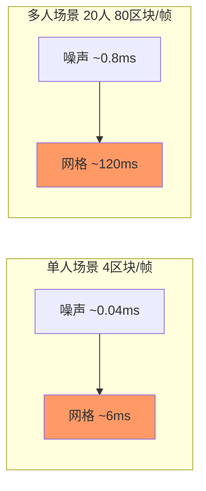
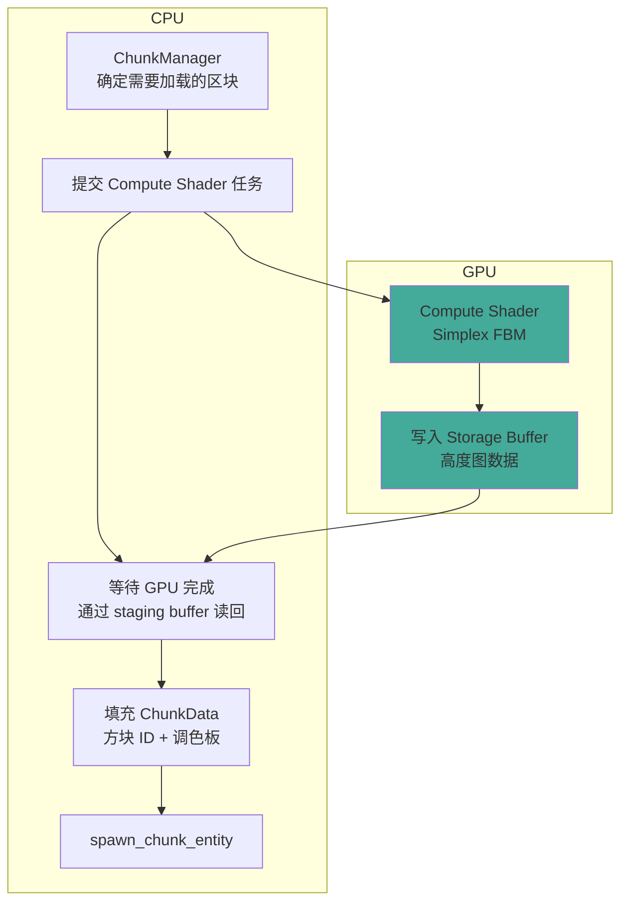
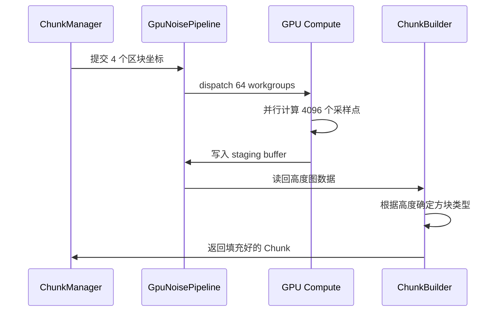
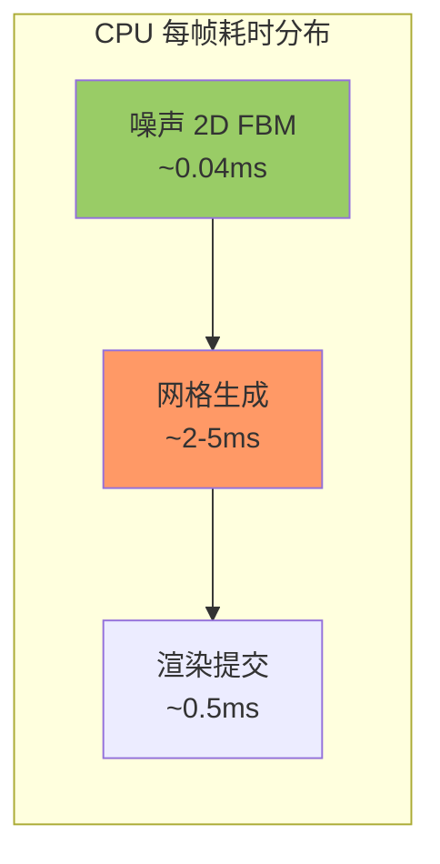
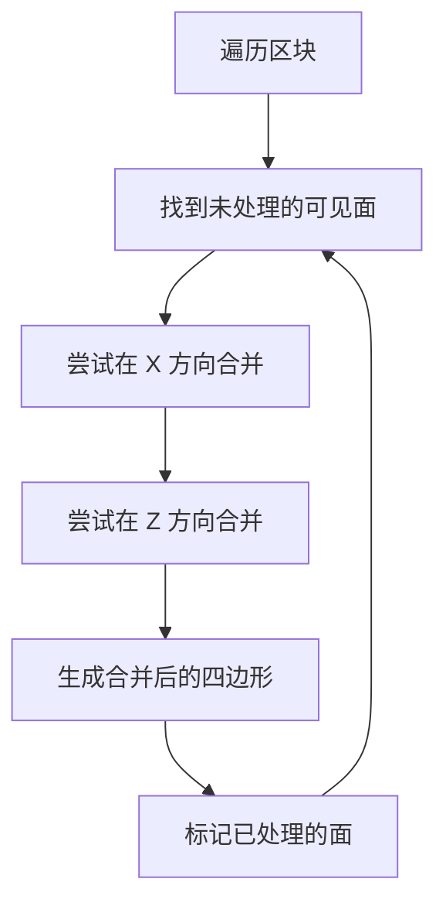
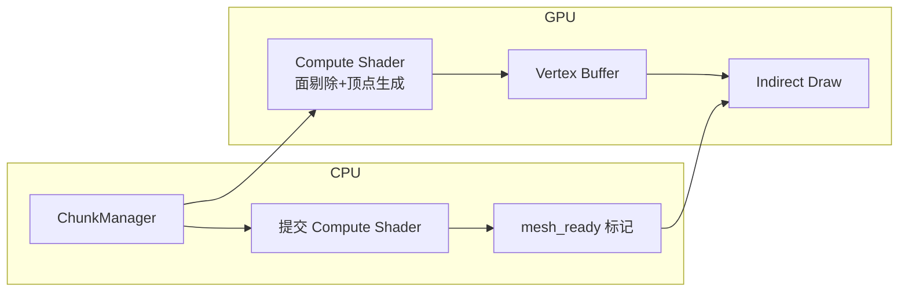
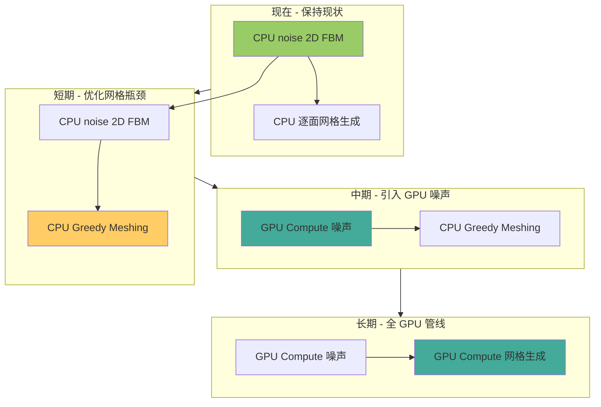

# GPU 噪声迁移技术方案

> 将当前 CPU 端 `noise` crate 的 Simplex FBM 噪声计算迁移到 GPU Compute Shader（WGSL）。
> 目标：消除 CPU 端噪声计算瓶颈，为未来 3D 噪声/洞穴生成铺路。

---

## 1. 现状分析

### 1.1 当前噪声管线


- **依赖库**: [`noise = "0.9"`](../Cargo.toml:9) — 纯 Rust CPU 库
- **噪声类型**: [`Fbm<Simplex>`](../src/chunk.rs:507-513) — Simplex 分形布朗运动
  - Octaves: 4
  - Frequency: 0.005
  - Lacunarity: 2.0
  - Persistence: 0.5
  - Seed: 42
- **采样规模**: 2D 高度图，每个区块 32×32 = **1024 次采样**
- **当前每帧计算量**: 4 个区块 × 1024 次 = **4096 次噪声采样/帧**

### 1.2 性能分析

#### 单人场景

| 场景 | 采样量 | CPU 耗时估计 | 是否瓶颈 |
|------|--------|-------------|---------|
| 2D 高度图（当前） | 1024 次/区块 | ~0.01ms/区块 | ❌ 不是瓶颈 |
| 3D 噪声（未来洞穴） | 32768 次/区块 | ~0.3ms/区块 | ⚠️ 可能成为瓶颈 |
| 批量生成 4 个区块/帧 | 4096 次/帧 | ~0.04ms/帧 | ❌ 不是瓶颈 |

**当前 2D 噪声的 CPU 计算开销可以忽略不计，真正的瓶颈在 [`generate_chunk_mesh()`](../src/chunk.rs:581) 的面剔除和网格构建。**

#### 多人场景分析

> 用户提问：如果服务器内存在大量玩家同时跑图，此时噪声是否成为瓶颈？

现有架构中，[`chunk_manager.rs`](../src/chunk_manager.rs:191-228) 的加载队列是**全局单队列**，所有玩家共享每帧 `CHUNKS_PER_FRAME = 4` 个区块的加载预算。

| 玩家数 | 每帧需加载的独立区块数¹ | 噪声耗时 | 网格生成耗时² | 是否瓶颈 |
|--------|----------------------|---------|-------------|---------|
| 1 人 | 4 | ~0.04ms | ~4-6ms | 网格是瓶颈 ❌ |
| 4 人 | ~16（独立区域无重叠） | ~0.16ms | ~16-24ms | ⚠️ 网格严重瓶颈 |
| 10 人 | ~40（独立区域无重叠） | ~0.4ms | ~40-60ms | 🚨 网格导致卡顿 |
| 20 人 | ~80（独立区域无重叠） | ~0.8ms | ~80-120ms | 💀 帧率崩溃 |

> ¹ 假设各玩家探索完全不同的区域，无区块重叠（最坏情况）。
> ² 以当前逐面网格生成 ~1-1.5ms/区块计算。

**结论**: 在多人场景下，**网格生成仍是瓶颈**（增长斜率 1.5ms/区块），而噪声耗时即使 20 人也仅 ~0.8ms，占比不超过总加载时间的 1%。

#### 瓶颈权重对比



**多人场景放大的是所有瓶颈，但网格生成的放大效应远大于噪声**（网格 1.5ms/区块 vs 噪声 0.01ms/区块，相差 150 倍）。

---

## 2. GPU 噪声方案设计

### 2.1 架构总览



### 2.2 核心组件

#### 2.2.1 WGSL Compute Shader — `noise_generator.wgsl`

```wgsl
// Simplex 噪声在 WGSL 中的实现（需要移植）
struct NoiseParams {
    seed: u32,
    octaves: u32,
    frequency: f32,
    lacunarity: f32,
    persistence: f32,
}

@group(0) @binding(0) var<uniform> params: NoiseParams;
@group(0) @binding(1) var<storage, read_write> output: array<f32>;

@compute @workgroup_size(8, 8, 1)
fn main(@builtin(global_invocation_id) id: vec3<u32>) {
    // 每个线程负责一个 (x, z) 点的噪声采样
    // 输出高度值到 output[id.x + id.y * 32]
}
```

**关键点**:
- Workgroup 尺寸: `(8, 8, 1)`，覆盖 32×32 高度图需要 4×4=16 个 workgroup
- 输出: 32×32 = 1024 个 `f32` 高度值
- 需要将 Simplex 噪声算法从 Rust 移植到 WGSL（约 200-300 行）

#### 2.2.2 Rust 端 — `gpu_noise.rs` 模块

需要新建的组件:

```
src/
├── gpu_noise.rs           # 新模块：GPU 噪声管线
│   ├── GpuNoisePipeline   # Compute Shader 管线封装
│   ├── NoiseBatch         # 批量提交噪声任务
│   └── readback_system    # 读回结果的 Bevy System
├── chunk.rs               # 修改：fill_terrain 可切换 CPU/GPU
└── chunk_manager.rs       # 修改：集成 GPU 噪声管线
```

#### 2.2.3 数据流



### 2.3 集成到现有管线

当前 [`chunk_manager.rs`](../src/chunk_manager.rs:191-228) 中每帧加载区块的循环需要改造：

```rust
// 修改前（当前）
for coord in chunks_to_load {
    let mut chunk = Chunk::filled(0);
    fill_terrain(&mut chunk, &coord);  // CPU 噪声
    // ... spawn entity
}

// 修改后：两种方案可选

// 方案 A：异步 GPU → CPU 回读
let heights = gpu_pipeline.sample_heights(&chunks_to_load);  // 先提交所有 GPU 任务
// 等待 results
for (coord, heights) in chunks_to_load.iter().zip(heights) {
    let mut chunk = Chunk::filled(0);
    fill_terrain_from_heights(&mut chunk, coord, &heights);  // 仅使用高度图
    // ... spawn entity
}

// 方案 B：全 GPU（噪声+方块填充都在 GPU 上完成）
gpu_pipeline.fill_chunks(&chunks_to_load);  // GPU 直接输出 BlockId[]
for (coord, chunk_data) in gpu_pipeline.collect_results() {
    // chunk_data 已经是 BlockId[]，无需再次遍历
}
```

---

## 3. 噪声算法移植（Simplex → WGSL）

### 3.1 需要移植的内容

| 组件 | Rust (noise crate) | WGSL 实现 |
|------|-------------------|-----------|
| Simplex 2D 噪声 | `Simplex` | 手写 WGSL 版本 |
| FBM 组合 | `Fbm::get()` | 循环叠加 octaves |
| 3D Simplex（备用） | `Simplex` 3D | 手写 WGSL 版本 |

### 3.2 移植参考

Simplex 噪声算法有大量公开的 GLSL/WGSL 实现参考：

- [Ashima Arts WebGL-noise](https://github.com/ashima/webgl-noise) — 经典的 GLSL 实现，可直接转换为 WGSL
- [stegu/webgl-noise](https://github.com/stegu/webgl-noise) — 优化的 Simplex 噪声
- WGSL 移植注意事项：
  - `mod` 运算符行为差异
  - 向量函数名映射（`mix`→`mix` 不变，`fract`→`fract` 不变）
  - 矩阵乘法语法

### 3.3 精度要求

| 参数 | 当前 CPU 值 | GPU 建议值 |
|------|------------|-----------|
| 噪声类型 | Simplex | Simplex（f32 精度足够） |
| Octaves | 4 | 4（f32 精度足够） |
| Frequency | 0.005 | 0.005 |
| 输出范围 | f64 (-1.0~1.0) | f32 (-1.0~1.0) |

> f32 精度对地形生成的 **2D 高度图**完全足够。
> 3D 噪声（未来洞穴）也仅需 f32，f16 精度不足。

---

## 4. 实施路线

### 第一阶段：基础设施（优先级：高）

```
目标：搭建 Compute Shader 管线基础，实现 GPU Simplex 2D 噪声
```

1. **创建 [`src/gpu_noise.rs`](../src/) 模块**
   - `GpuNoisePipeline` struct
   - Compute Shader 加载和编译
   - Storage Buffer + Uniform Buffer 绑定

2. **移植 Simplex 2D 噪声到 WGSL**
   - 创建 `assets/shaders/noise_generator.wgsl`
   - 实现 Simplex 2D + FBM
   - 单元测试：与 CPU `noise` crate 输出对比验证

3. **实现 GPU→CPU 回读**
   - 使用 `wgpu::BufferAsyncOperation` 读回高度图
   - 封装为 async 友好的 API

### 第二阶段：集成（优先级：中）

```
目标：将 GPU 噪声管线接入 chunk_manager
```

4. **改造 [`fill_terrain()`](../src/chunk.rs:522)**
   - 新增 `fill_terrain_from_heights()` 函数：从高度图数据填充 ChunkData
   - 保留旧 `fill_terrain()` 作为降级备用方案

5. **集成到 [`chunk_manager.rs`](../src/chunk_manager.rs:191)**
   - 修改加载循环，批量提交 GPU 噪声任务
   - 处理回读时序：确保渲染帧不因等待 GPU 而阻塞

6. **添加降级开关**
   - `use_gpu_noise: bool` 配置项
   - 支持运行时切换 CPU/GPU 噪声

### 第三阶段：优化（优先级：低）

```
目标：提升性能，探索全 GPU 管线
```

7. **批量合并**
   - 将多个区块的噪声采样合并到一次 dispatch
   - 减少 GPU 提交开销

8. **全 GPU 管线探索**
   - 在 GPU 上完成方块类型判定（无需 CPU 回读）
   - 直接输出 `BlockId[]` 到 staging buffer

9. **3D 噪声支持**
   - 移植 Simplex 3D 到 WGSL
   - 支持洞穴、悬垂地形等 3D 特征

---

## 5. 关键决策点

### 5.1 是否值得做 GPU 噪声？

| 因素 | 结论 |
|------|------|
| 当前 2D 噪声性能 | CPU 足够，不是瓶颈 ❌ |
| 未来 3D 噪声需求 | 需要洞穴/悬垂时，GPU 加速有价值 ✅ |
| 管线复杂度增加 | 引入 GPU Compute + 回读机制，增加了系统复杂度 ⚠️ |
| 学习成本 | 需要维护 WGSL 噪声实现，与 CPU 版本双线并行 |

**建议**:
- **短期**: 保持 CPU `noise` crate 不变，优先优化 [`generate_chunk_mesh()`](../src/chunk.rs:581) 这个真正瓶颈
- **中期**: 当引入 3D 噪声（洞穴生成）时，并行启动 GPU 噪声方案
- **长期**: 全 GPU 管线（噪声 → 方块填充 → 网格生成）是终极形态

### 5.2 架构决策

```
方案 A: GPU 噪声 + CPU 方块填充（推荐中期方案）
  - GPU 输出高度图
  - CPU 根据高度决定方块类型
  - 保留调色板压缩逻辑在 CPU
  - 复杂度适中，改造量小

方案 B: 全 GPU 噪声+方块填充（长期目标）
  - GPU 直接输出 BlockId[]
  - 需要把调色板逻辑搬到 GPU
  - 复杂度高，改造量大
  - 减少 GPU→CPU 数据传输量
```

---

## 6. 文件变更清单

| 文件 | 操作 | 说明 |
|------|------|------|
| [`src/gpu_noise.rs`](../src/) | **新建** | GPU 噪声管线模块 |
| [`assets/shaders/noise_generator.wgsl`](../assets/shaders/) | **新建** | Compute Shader |
| [`src/chunk.rs`](../src/chunk.rs) | 修改 | 新增 `fill_terrain_from_heights()` |
| [`src/chunk_manager.rs`](../src/chunk_manager.rs) | 修改 | 集成 GPU 噪声管线 |
| [`src/main.rs`](../src/main.rs) | 修改 | 注册 `GpuNoisePipeline` 资源 |
| [`Cargo.toml`](../Cargo.toml) | 修改 | 可能新增依赖 |
| [`docs/index.md`](../docs/index.md) | 修改 | 添加本文档链接 |

---

## 7. 性能预期

| 场景 | 当前 CPU | GPU 方案 A | GPU 方案 B |
|------|---------|-----------|-----------|
| 2D 噪声 4 区块/帧 | ~0.04ms | ~0.1ms¹ | ~0.08ms¹ |
| 3D 噪声 4 区块/帧 | ~1.2ms | ~0.3ms | ~0.15ms |
| 3D 噪声 16 区块/帧 | ~4.8ms | ~1.0ms | ~0.5ms |

> ¹ GPU 方案在小批量下有固定调度开销，2D 场景反而更慢。
> ² 3D 噪声场景 GPU 优势明显，批量越大收益越高。

---

## 8. 风险与缓解措施

| 风险 | 影响 | 缓解 |
|------|------|------|
| GPU Simplex 与 CPU Simplex 输出不一致 | 地形断裂 | 编写自动化 diff 测试，验证每个噪声采样点 |
| GPU 回读延迟导致帧率抖动 | 卡顿 | 使用双缓冲（ping-pong buffer）隐藏延迟 |
| WGSL 实现性能不达预期 | 加速效果有限 | 保留 CPU 降级开关 |
| 驱动兼容性（不同 GPU） | 部分设备无法运行 | 启动时检测 compute shader 支持 |

---

## 9. 总结

- **当前阶段**：CPU `noise` crate 的 2D 噪声性能完全足够，**不必急于 GPU 化**
- **建议时机**：引入 3D 噪声（洞穴生成）时作为 GPU 迁移的启动信号
- **推荐方案**：方案 A（GPU 噪声 + CPU 方块填充）平衡了复杂度和收益
- **终极形态**：全 GPU 管线（噪声→方块→网格）是体素引擎的性能天花板

---

## 10. 真正的瓶颈：网格生成优化分析

> **核心发现**：当前管线中，网格生成（[`generate_chunk_mesh()`](../src/chunk.rs:364)）的 CPU 开销远大于噪声计算，**才是需要优先优化的对象**。

### 10.1 当前网格生成瓶颈分析

#### 10.1.1 管线耗时分布



当前网格生成是 **CPU 端最大的性能热点**，远超噪声计算。

#### 10.1.2 [`generate_chunk_mesh()`](../src/chunk.rs:364) 性能瓶颈

| 瓶颈 | 当前实现 | 分析 |
|------|---------|------|
| **三重嵌套循环** | `for z → for y → for x` 遍历 32³=32768 个体素 | 每次迭代都调用 `chunk.get()` 和 `is_face_visible()` |
| **面剔除检查** | 每个非空气方块检查 6 个面（最多 196608 次检查） | [`is_face_visible()`](../src/chunk.rs) 每次都要查邻居数据 |
| **Vec 动态扩容** | 使用 `Vec::new()` + `Vec::extend()` | 多次 reallocation，浪费 CPU 周期 |
| **无法合并相邻面** | 每个面生成 4 个独立顶点 | 相邻同材质方块的面可以被合并为更大的四边形（Greedy Meshing） |
| **顶点数据重复** | 相邻方块共享的顶点被重复生成 | 不使用索引缓冲区共享 |

#### 10.1.3 当前实现的问题代码

```rust
// 当前实现（src/chunk.rs:374-410）
for z in 0..CHUNK_SIZE {
    for y in 0..CHUNK_SIZE {
        for x in 0..CHUNK_SIZE {
            let block_id = chunk.get(x, y, z);  // 每次都要查调色板
            if block_id == 0 { continue; }

            for (face_index, (face, offset)) in FACES.iter().cloned().enumerate() {
                if !chunk.is_face_visible(x, y, z, &offset, face_index, neighbors) {
                    continue;
                }
                // 生成 4 个顶点、4 个 UV、1 个法线、6 个索引
                // 每个面都 push 到 Vec
            }
        }
    }
}
```

---

### 10.2 网格优化方案

#### 10.2.1 方案一：Greedy Meshing（贪心网格合并）

**原理**：将相邻的同材质方块面合并为更大的四边形，大幅减少顶点数。



**性能预期**：

| 指标 | 当前（逐面生成） | Greedy Meshing |
|------|----------------|----------------|
| 顶点数/区块 | 平均 4000-8000 | 平均 500-1500 |
| CPU 耗时/区块 | ~0.5-1.5ms | ~0.1-0.3ms |
| GPU 渲染负载 | 高 | 低 |

**实现参考**：Minecraft 社区广泛使用的 [Greedy Meshing 算法](https://0fps.net/2012/06/30/meshing-in-a-minecraft-game/)。

**Rust 伪代码**：

```rust
pub fn generate_greedy_mesh(chunk: &Chunk, ...) -> Mesh {
    for face_direction in [Top, Bottom, Right, Left, Front, Back] {
        // 1. 创建可见性掩码（32×32 的 bool 数组）
        let mut mask = [[false; CHUNK_SIZE]; CHUNK_SIZE];
        for ... { mask[y][x] = is_face_visible(...); }

        // 2. 贪心合并：扫描掩码，合并连续的行
        let mut quads = Vec::new();
        for y in 0..CHUNK_SIZE {
            let mut x = 0;
            while x < CHUNK_SIZE {
                if !mask[y][x] { x += 1; continue; }
                // 找到最大连续宽度
                let w = find_width(&mask, y, x);
                let h = find_height(&mask, y, x, w);
                quads.push(Quad { x, y, w, h });
                // 标记已处理
                for dy in 0..h {
                    for dx in 0..w { mask[y+dy][x+dx] = false; }
                }
                x += w;
            }
        }
        // 3. 为每个合并后的四边形生成 4 个顶点
    }
}
```

#### 10.2.2 方案二：Compute Shader 面提取（全 GPU 网格生成）

**原理**：将面剔除 + 顶点生成完全迁移到 GPU Compute Shader。

**优势**：
- GPU 并行处理 32³ 个体素的 6 个面
- 消除 CPU→GPU 顶点数据传输
- 配合 Indirect Draw 可直接使用 GPU 生成的网格数据

**实现方式**：



**WGSL 设计思路**：

```wgsl
// 每个线程处理一个体素的所有 6 个面
@compute @workgroup_size(8, 8, 1)
fn extract_faces(@builtin(global_invocation_id) id: vec3<u32>) {
    let block_id = chunk_data[id];
    if block_id == 0 { return; }

    for (var face = 0u; face < 6u; face++) {
        if is_face_visible(id, face) {
            // 原子计数器分配顶点槽位
            let slot = atomicAdd(&vertex_counter, 4u);
            // 写入 4 个顶点到 vertex_buffer[slot..slot+3]
            // 写入 6 个索引到 index_buffer
        }
    }
}
```

**性能预期**：

| 指标 | CPU Greedy | GPU Compute |
|------|-----------|------------|
| 延迟/区块 | ~0.1-0.3ms | ~0.02-0.05ms |
| CPU 占用 | 中 | 极低（仅提交 dispatch） |
| 实现复杂度 | 低 | 高 |

#### 10.2.3 方案三：SuperChunk 合批（架构总纲已有描述）

参考 [`docs/架构总纲.md`](../docs/架构总纲.md:73-78) 中的 SuperChunk 设计：

- 将 8×8×4 个相邻 SubChunk 合并为一次 Draw Call
- 减少 Draw Call 数量（从 2000+ 降到 ~60）
- 需要重写网格生成以支持跨 SubChunk 边界合并

---

### 10.3 优化优先级建议

```
优先级 P0（立即优化）:
  1. 预分配 Vec 容量（先计算可见面数量，一次性分配）
  2. 内联 is_face_visible 检查，减少函数调用开销
  3. 跳过全空气区块的网格生成

优先级 P1（短期目标）:
  4. 实现 Greedy Meshing（方案一）
  5. 缓存相邻区块的边界体素数据，减少跨区块查询

优先级 P2（中期目标）:
  6. Compute Shader 面提取（方案二）
  7. SuperChunk 合批（方案三）
```

### 10.4 快速优化清单（低投入高回报）

| 优化项 | 修改位置 | 预期收益 | 工作量 |
|--------|---------|---------|-------|
| 预分配 Vec 容量 | [`generate_chunk_mesh()`](../src/chunk.rs:369-372) | ~10-20% 加速 | 极低 |
| 提前计算可见面数量 | [`generate_chunk_mesh()`](../src/chunk.rs:364) | 减少 reallocation | 低 |
| 内联 `is_face_visible()` | [`chunk.rs`](../src/chunk.rs) | ~5-10% 加速 | 低 |
| 全空气区块跳过网格生成 | [`spawn_chunk_entity()`](../src/chunk.rs:571) | 空气区块节省 100% | 极低 |
| 使用 `SmallVec` 或固定数组 | [`generate_chunk_mesh()`](../src/chunk.rs) | ~5% 加速 | 低 |
| 循环优化：将 `CHUNK_SIZE` 改为常量 | [`chunk.rs`](../src/chunk.rs) | 编译器更好优化 | 极低 |

---

## 11. 最终路线图



### 推荐优先级排序

1. **🔥 立即做** — [`generate_chunk_mesh()`](../src/chunk.rs:364) 的 **Greedy Meshing + Vec 预分配**（P0）
2. **⏳ 等需要时做** — GPU 噪声 Compute Shader（当引入 3D 噪声/洞穴时）
3. **🚀 终极目标** — 全 GPU 管线（噪声→网格→渲染）
