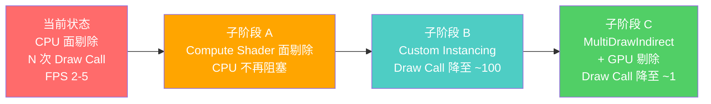
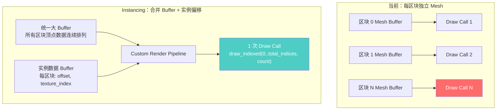
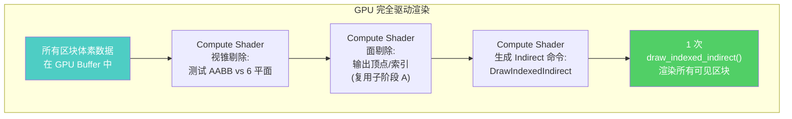
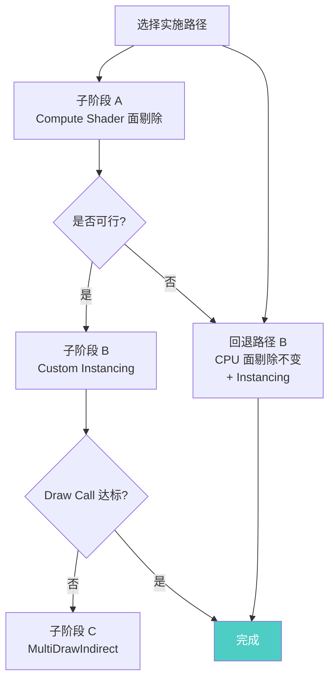

# Phase 2：GPU 驱动渲染管线实现方案

> **对应路线**：[`Voxy借鉴优化方案.md §3.4`](Voxy借鉴优化方案.md:403) — GPU 面剔除
> **对应路线**：[`Phase完整规划.md § Phase 2`](Phase完整规划.md:113) — GPU 面剔除 + MultiDrawIndirect
> **对应路线**：[`架构总纲.md §5.1`](架构总纲.md:175) — GPU 视锥剔除 + Hi-Z 遮挡剔除
> **对应路线**：[`ComputeShader与Instancing搭配方案.md`](ComputeShader与Instancing搭配方案.md) — Compute + Instancing 技术分析
>
> **目标**：将 CPU 面剔除 + 逐区块 Draw Call 迁移到 GPU 驱动管线，消除当前最大性能瓶颈。
>
> **当前瓶颈诊断**（基于 [`perf_logs/2026-05-12_10-11-46-perf_log.csv`](../perf_logs/2026-05-12_10-11-46-perf_log.csv)）：
> - RENDER_DISTANCE=32 时区块数达 ~32,000
> - 每个区块 = 1 次 Draw Call，CPU 提交开销 ~100ms+
> - FPS 稳态仅 2-5，远低于 60FPS 目标
> - **Draw Call 线性增长是首要瓶颈**

---

## 1. 方案背景与路线选择

### 1.1 为什么不做 SuperChunk 合批

根据 [`Voxy借鉴优化方案.md`](Voxy借鉴优化方案.md:12) 的明确决策：

> **已移除方案**：~~SuperChunk 合批~~ — 结构性缺陷（Y 尺寸不匹配、刚性合并条件、重建卡顿），实现复杂度高，收益可通过 LOD 替代

SuperChunk 合批（将 8×8×4=256 个 SubChunk 合并为一个 Mesh）有以下根本性问题：

| 问题 | 说明 |
|------|------|
| **Y 尺寸不匹配** | SuperChunk Y 尺寸为 128 米（4×32），而垂直地形变化远小于此，导致大量空气体素被包含 |
| **刚性合并条件** | 要求所有 256 个 SubChunk 就绪才合并，世界边缘会永久卡在 Pending 状态 |
| **重建卡顿** | 单次合并 256 个 SubChunk 网格约需 25ms，超过 16.67ms 帧预算 |
| **与 LOD 冲突** | LOD 系统已按距离降采样，SuperChunk 合批与 LOD 有重叠收益 |

### 1.2 Voxy 的核心路线：GPU 驱动渲染

Voxy 的核心技术是 **GPU Compute Shader 面剔除 + MultiDrawIndirect**，而非 Mesh 合并：

```
当前管线：                            Voxy 管线：
体素数据                               体素数据
  ↓                                      ↓
CPU 面剔除 (generate_chunk_mesh)     上传到 GPU Buffer
  ↓                                      ↓
CPU 生成顶点                           Compute Shader 并行面剔除
  ↓                                      ↓
上传 GPU Mesh                         GPU 生成顶点数据到 Buffer
  ↓                                      ↓
N 次 Draw Call (N=32,000)             1 次 MultiDrawIndirect
```

### 1.3 本方案的三阶段实施策略

由于 Bevy 的 Compute Shader 支持仍在发展中，采用渐进式迁移：



| 子阶段 | 目标 | Draw Call | CPU 开销 | 实施难度 | 依赖 |
|--------|------|-----------|---------|---------|------|
| A | GPU Compute Shader 面剔除 | 32,000（不变） | 降低 5x | 🔴 高 | Bevy compute API / wgpu |
| B | Custom Shader Instancing | ~100 | 降低 50x | 🔴 高 | 子阶段 A |
| C | MultiDrawIndirect + 剔除 | ~1 | 近乎零 | 🔴 极高 | 子阶段 A+B |

---

## 2. 子阶段 A：Compute Shader 面剔除

### 2.1 当前 CPU 面剔除瓶颈

当前 [`generate_chunk_mesh()`](../src/chunk.rs) 的 CPU 面剔除流程：

```rust
for z in 0..CHUNK_SIZE {        // 32
    for y in 0..CHUNK_SIZE {    // 32
        for x in 0..CHUNK_SIZE { // 32
            let block = chunk.get(x, y, z);
            if block == 0 { continue; }
            // 检查 6 个面
            for face in 0..6 {
                if is_face_visible(chunk, neighbors, x, y, z, face) {
                    // 生成 4 个顶点 + 6 个索引
                }
            }
        }
    }
}
```

**瓶颈分析**：
- 32³ = 32,768 个体素，每个体素最多检查 6 个面
- 最多 196,608 次面剔除检查，全部在 CPU 串行执行
- 每个 SubChunk 约耗时 ~0.5-1.5ms
- 32,000 个区块总计 ~16,000-48,000ms CPU 时间

### 2.2 GPU Compute Shader 方案

将面剔除并行化到 GPU，每个体素由一个 GPU 线程处理：

```wgsl
// assets/shaders/voxel_meshing.wgsl
//
// GPU 面剔除 Compute Shader
// 每个 Workgroup 处理一个 SubChunk（32³ 体素）
// 每个线程处理一个体素，并行检查 6 个面

@compute @workgroup_size(4, 4, 4)  // 64 线程/workgroup
fn main(@builtin(global_invocation_id) id: vec3<u32>) {
    // 边界检查
    if (id.x >= 32u || id.y >= 32u || id.z >= 32u) { return; }
    
    let block = getBlock(id);
    if (block == 0u) { return; }  // 空气跳过
    
    // 并行检查 6 个面
    for (var face = 0u; face < 6u; face++) {
        let neighbor_pos = vec3<i32>(id) + FACE_OFFSETS[face];
        let neighbor = getBlockSafe(neighbor_pos);
        
        if (neighbor == 0u) {
            // 邻居是空气 → 此面可见，输出顶点
            let vertex_index = atomicAdd(&vertex_counter, 4u);
            let index_start = atomicAdd(&index_counter, 6u);
            writeFaceVertices(vertex_index, id, face, block);
            writeFaceIndices(index_start, vertex_index);
        }
    }
}
```

### 2.3 Rust 侧代码结构

新增 [`src/gpu_meshing.rs`](../src/gpu_meshing.rs)：

```rust
/// GPU 网格生成管线管理器
///
/// 负责：
/// 1. 创建 Compute Pipeline + Bind Group Layout
/// 2. 管理 GPU Buffer（体素数据上传、顶点数据回读）
/// 3. 调度 Compute Shader 执行面剔除
/// 4. 将 GPU 生成的顶点数据转换为 Bevy Mesh
pub struct GpuMeshingPipeline {
    /// wgpu 计算管线
    compute_pipeline: wgpu::ComputePipeline,
    /// Bind Group Layout
    bind_group_layout: wgpu::BindGroupLayout,
    /// 体素数据 Storage Buffer（输入）
    voxel_buffer: wgpu::Buffer,
    /// 顶点数据 Storage Buffer（输出）
    vertex_buffer: wgpu::Buffer,
    /// 索引数据 Storage Buffer（输出）
    index_buffer: wgpu::Buffer,
    /// 计数器（原子加，记录顶点/索引数量）
    counter_buffer: wgpu::Buffer,
    /// 回读缓冲区（用于将结果从 GPU 拷贝到 CPU）
    readback_buffer: wgpu::Buffer,
}

impl GpuMeshingPipeline {
    /// 调度一个 SubChunk 的网格生成
    pub fn dispatch(
        &self,
        encoder: &mut wgpu::CommandEncoder,
        voxel_data: &[BlockId],   // 32³ = 32768 字节
    ) {
        // 1. 上传体素数据到 GPU
        encoder.write_buffer(&self.voxel_buffer, voxel_data);
        
        // 2. 重置计数器
        encoder.write_buffer(&self.counter_buffer, &[0u32; 4]);
        
        // 3. Dispatch Compute Shader
        let mut compute_pass = encoder.begin_compute_pass();
        compute_pass.set_pipeline(&self.compute_pipeline);
        compute_pass.set_bind_group(0, &self.bind_group, &[]);
        compute_pass.dispatch_workgroups(8, 8, 8); // 32/4=8 workgroups
        drop(compute_pass);
        
        // 4. 回读顶点数据（异步）
        encoder.copy_buffer_to_buffer(
            &self.vertex_buffer, 0,
            &self.readback_buffer, 0,
            MAX_VERTICES_SIZE,
        );
    }
    
    /// 从回读缓冲区获取 Mesh 数据
    pub fn collect_mesh(&self) -> Option<(Vec<[f32;3]>, Vec<[f32;2]>, Vec<[f32;3]>, Vec<u32>)> {
        // 读取 readback_buffer，构建顶点/索引数组
        // 返回 Position + UV + Normal + Index 数据
    }
}
```

### 2.4 与现有系统的集成

修改 [`src/chunk_manager.rs`](../src/chunk_manager.rs) 中的 `chunk_loader_system`：

```
加载 SubChunk → fill_terrain
    ↓
[修改] 上传体素数据到 GPU Buffer（替代提交 CPU 异步任务）
    ↓
[新增] Dispatch Compute Shader
    ↓
[新增] 回读 Mesh 数据（分帧控制，类似现有 MESH_UPLOADS_PER_FRAME）
    ↓
创建 Bevy Mesh 并上传到 GPU（已有逻辑不变）
```

**回退方案**：如果 Compute Shader 不可用，回退到现有的 CPU 异步网格生成（保留 [`src/async_mesh.rs`](../src/async_mesh.rs) 作为回退路径）。

### 2.5 涉及文件

| 文件 | 操作 | 说明 |
|------|------|------|
| `src/gpu_meshing.rs` | **新增** | GPU 网格生成管线管理 (~400-500 行) |
| `assets/shaders/voxel_meshing.wgsl` | **新增** | Compute Shader 面剔除 (~200-300 行) |
| `src/chunk_manager.rs` | 修改 | 集成 GPU 网格生成流程 (~100-150 行) |
| `src/main.rs` | 修改 | 注册新模块 + 初始化管线 (~10-20 行) |
| `Cargo.toml` | 修改 | 添加 `wgpu` 依赖（如果尚未引入） |

### 2.6 风险与缓解

| 风险 | 概率 | 影响 | 缓解措施 |
|------|------|------|----------|
| Bevy 的 Compute Shader API 不成熟 | 中 | 高 | 使用 `wgpu` 直接调用（已通过 Bevy 的 `RenderDevice` 访问） |
| GPU Buffer 回读延迟 | 低 | 中 | 使用双缓冲机制 + 异步回读 |
| 原子操作竞争条件 | 低 | 高 | 确保 WGSL `atomicAdd` 正确使用，`workgroup_size` 合适 |
| 与现有异步系统冲突 | 低 | 中 | 保留 `async_mesh.rs` 作为回退路径 |

---

## 3. 子阶段 B：Custom Shader Instancing

### 3.1 为什么需要 Instancing

完成子阶段 A 后，Draw Call 数量**没有改变**（仍然是每个 SubChunk 一个 Mesh，对应一次 Draw Call）。原因是每个 SubChunk 的 Mesh 数据不同（不同位置的面剔除结果不同），Bevy 无法自动合批。

**解决方案**：使用 Custom Shader Instancing，将所有区块的顶点数据打包到同一个大 Buffer 中，通过一次 Draw Call 渲染。

### 3.2 架构设计



### 3.3 Vertex Shader 设计

新增 `assets/shaders/voxel_instanced.wgsl`：

```wgsl
// 实例数据结构（每区块一个）
struct ChunkInstance {
    vertex_offset: u32,    // 此区块在统一 Buffer 中的顶点偏移
    index_offset: u32,     // 此区块在统一 Buffer 中的索引偏移
    index_count: u32,      // 此区块的索引数
    padding: u32,
};

@group(1) @binding(0) var<storage> instances: array<ChunkInstance>;

struct VertexInput {
    @location(0) position: vec3<f32>,
    @location(1) normal: vec3<f32>,
    @location(2) uv: vec2<f32>,
};

@vertex
fn vertex(
    @builtin(instance_index) instance_id: u32,
    @location(0) position: vec3<f32>,
    // ...其他顶点属性
) -> VertexOutput {
    let inst = instances[instance_id];
    // 顶点位置已在 Compute Shader 中输出到世界坐标，无需额外偏移
    var out: VertexOutput;
    out.world_position = vec4<f32>(position, 1.0);
    // ...其他变换
    return out;
}
```

### 3.4 渲染管线变更

新增 `src/voxel_render.rs`：

```rust
/// 自定义体素渲染管线
///
/// 将 Compute Shader 生成的顶点数据 + 实例数据打包到统一 Buffer，
/// 通过 1 次 Draw Call 渲染所有区块。
pub struct VoxelRenderPipeline {
    // 统一顶点 Buffer（所有区块的顶点连续排列）
    vertex_buffer: wgpu::Buffer,
    // 统一索引 Buffer（所有区块的索引连续排列）
    index_buffer: wgpu::Buffer,
    // 实例数据 Buffer（每区块一个条目）
    instance_buffer: wgpu::Buffer,
    // 实例数量
    instance_count: u32,
    // 渲染管线
    render_pipeline: wgpu::RenderPipeline,
}

impl VoxelRenderPipeline {
    /// 更新缓冲区（当新区块加载/卸载时调用）
    pub fn update_buffers(&mut self, chunks: &[ChunkMeshData]) {
        // 1. 将所有区块的顶点/索引数据合并到统一 Buffer
        // 2. 构建实例数据数组（每区块：vertex_offset, index_offset, index_count）
        // 3. 上传到 GPU
    }
    
    /// 渲染所有区块（1 次 Draw Call）
    pub fn render(&self, render_pass: &mut wgpu::RenderPass) {
        render_pass.set_pipeline(&self.render_pipeline);
        render_pass.set_vertex_buffer(0, self.vertex_buffer.slice(..));
        render_pass.set_index_buffer(self.index_buffer.slice(..), wgpu::IndexFormat::Uint32);
        render_pass.set_bind_group(0, &self.instance_bind_group, &[]);
        render_pass.draw_indexed(0..self.total_indices, self.instance_count);
    }
}
```

### 3.5 与子阶段 A 的配合

```
子阶段 A (Compute Shader) 输出：         子阶段 B (Instancing) 消费：
┌────────────────────────────┐          ┌────────────────────────────┐
│ 区块 0: position[32]         │──────→  │ 统一顶点 Buffer:            │
│         index[48]            │          │   [区块0顶点] [区块1顶点]...│
│ 区块 1: position[16]         │          │ 统一索引 Buffer:            │
│         index[24]            │          │   [区块0索引] [区块1索引]...│
│ 区块 N: ...                  │          │ 实例数据 Buffer:            │
└────────────────────────────┘          │   [offset0, count0]...      │
                                         │ 1 次 Draw Call               │
                                         └────────────────────────────┘
```

### 3.6 涉及文件

| 文件 | 操作 | 说明 |
|------|------|------|
| `src/voxel_render.rs` | **新增** | 自定义渲染管线管理 (~300-400 行) |
| `assets/shaders/voxel_instanced.wgsl` | **新增** | 实例化 Vertex/Fragment Shader (~150-200 行) |
| `src/chunk_manager.rs` | 修改 | 将区块网格数据注册到 VoxelRenderPipeline (~50 行) |
| `src/main.rs` | 修改 | 注册自定义渲染管线 (~20 行) |

---

## 4. 子阶段 C：MultiDrawIndirect + GPU 剔除

### 4.1 架构升级

在子阶段 B 的基础上进一步推进：



### 4.2 GPU 视锥剔除

在 Compute Shader 中为每个区块的 AABB 执行视锥 6 平面测试：

```wgsl
// 视锥剔除（在面剔除之前执行）
struct ChunkAABB {
    min: vec3<f32>,
    max: vec3<f32>,
};

@group(0) @binding(3) var<storage> chunk_aabbs: array<ChunkAABB>;
@group(0) @binding(4) var<storage> frustum_planes: array<vec4<f32>, 6>;

fn is_chunk_visible(chunk_index: u32) -> bool {
    let aabb = chunk_aabbs[chunk_index];
    for (var i = 0u; i < 6u; i++) {
        let plane = frustum_planes[i];
        // 计算 AABB 相对于平面的符号距离
        let p = select(aabb.max, aabb.min, plane.xyz < vec3<f32>(0.0));
        if (dot(vec4<f32>(p, 1.0), plane) < 0.0) {
            return false; // 完全在视锥外
        }
    }
    return true;
}
```

### 4.3 Hi-Z 遮挡剔除

构建深度金字塔，逐层剔除被遮挡物体：

1. 从深度缓冲区生成 mipmap 链（每级降采样 2x）
2. 对每个区块的 AABB，在对应 LOD 级别测试深度
3. 如果 AABB 的最小深度 > 深度金字塔中的值 → 被遮挡，跳过渲染

### 4.4 MultiDrawIndirect

```wgsl
// Compute Shader 输出 Indirect 命令
struct DrawIndexedIndirect {
    index_count: u32,
    instance_count: u32,
    first_index: u32,
    vertex_offset: i32,
    first_instance: u32,
};

@group(0) @binding(5) var<storage, read_write> indirect_commands: array<DrawIndexedIndirect>;

// 在面剔除后，为每个可见区块写入 Indirect 命令
fn emit_draw_command(chunk_index: u32, vertex_offset: u32, index_offset: u32, index_count: u32) {
    let cmd_index = atomicAdd(&draw_command_count, 1u);
    indirect_commands[cmd_index] = DrawIndexedIndirect(
        index_count,
        1,   // instance_count
        index_offset,
        i32(vertex_offset),
        0,   // first_instance
    );
}
```

Rust 侧使用 `multi_draw_indexed_indirect()` 一次提交所有命令：

```rust
render_pass.multi_draw_indexed_indirect(
    &indirect_buffer,
    0,                              // offset
    draw_command_count,              // 命令数量
    std::mem::size_of::<DrawIndexedIndirect>() as u32,
);
```

### 4.5 涉及文件

| 文件 | 操作 | 说明 |
|------|------|------|
| `assets/shaders/voxel_culling.wgsl` | **新增** | GPU 剔除 Compute Shader (~150 行) |
| 扩展 `src/gpu_meshing.rs` | 修改 | 添加剔除逻辑 (~150-200 行) |
| 扩展 `src/voxel_render.rs` | 修改 | 添加 MultiDrawIndirect 支持 (~100-150 行) |

---

## 5. 总体文件清单汇总

| 文件 | 操作 | 子阶段 | 预估行数 |
|------|------|--------|---------|
| `src/gpu_meshing.rs` | **新增** | A | ~400-500 |
| `assets/shaders/voxel_meshing.wgsl` | **新增** | A | ~200-300 |
| `src/voxel_render.rs` | **新增** | B | ~300-400 |
| `assets/shaders/voxel_instanced.wgsl` | **新增** | B | ~150-200 |
| `assets/shaders/voxel_culling.wgsl` | **新增** | C | ~150 |
| `src/chunk_manager.rs` | **修改** | A+B | ~150-200 改动 |
| `src/main.rs` | **修改** | A+B+C | ~30-50 改动 |
| `src/async_mesh.rs` | **保留** | 回退路径 | 不动 |
| `Cargo.toml` | **可能修改** | A | ~5 改动 |
| **合计** | 5 新增 + 3 修改 | A+B+C | **~1400-1800 行** |

---

## 6. 预期收益汇总

| 指标 | 当前（32 区块） | 子阶段 A 后 | 子阶段 B 后 | 子阶段 C 后 |
|------|---------------|------------|------------|------------|
| Draw Call | ~32,000 | ~32,000 | **~100** | **~1** |
| CPU 面剔除 | ~0.5ms/chunk | **<0.1ms/chunk** | <0.1ms/chunk | **0ms（CPU 不参与）** |
| CPU 提交开销 | ~100ms+ | ~100ms（不变） | **<1ms** | **~0ms** |
| 预期 FPS | 2-5 | 2-5（瓶颈在 Draw Call） | **60+** | **60+** |
| 实现复杂度 | 基准 | 🔴 高 | 🔴 高 | 🔴 极高 |

**关键路径**：**子阶段 B 是解决 Draw Call 瓶颈的核心**。子阶段 A 减轻 CPU 面剔除负担但不提升 FPS，子阶段 B 才真正解决当前首要问题。

---

## 7. 回退方案

如果在实施过程中遇到 Bevy/wgpu 兼容性问题，提供以下回退路径：

### 回退 A：CPU 多线程面剔除（使用 Rayon）

```rust
// 替代 Compute Shader，使用 Rayon 并行面剔除
use rayon::prelude::*;

fn generate_mesh_parallel(chunks: &[ChunkData]) -> Vec<MeshResult> {
    chunks.par_iter()
        .map(|chunk| generate_chunk_mesh(chunk))
        .collect()
}
```

预期收益：CPU 面剔除时间从 O(N) 降至 O(N/core_count)。

### 回退 B：CPU 面剔除 + Instancing

不实现 Compute Shader 面剔除（子阶段 A），直接实现 Instancing（子阶段 B）：

1. 保留现有的 CPU 异步网格生成（Phase 0）
2. 新增 Custom Shader Instancing，将 CPU 生成的多个 Mesh 合并为一次 Draw Call
3. 预期 Draw Call 从 32,000 降至 ~100

这是**风险最低、收益最高的快速路径**。

---

## 8. 实施建议与依赖关系



### 建议实施顺序

1. **先验证**：用 Bevy 的 `ComputeShader` example 测试当前版本 Bevy 的 Compute Pipeline 支持情况
2. **如果 Bevy 支持良好**：走子阶段 A → B → C 完整路线
3. **如果 Bevy 支持不足**：走回退路径 B（Instancing 快速路径），将 Bevy Compute Shader 的 maturity 纳入后续评估

### 验证步骤

在开始实施前，先运行 Bevy 官方 Compute Shader example：

```bash
cargo run --example compute_shader_game_of_life
```

如果成功运行，说明当前 Bevy 版本支持 Compute Shader，可以走完整路线。

---

## 附录：关键数据结构参考

### Compute Shader 输入/输出 Buffer 布局

```
输入 Buffer（每区块）:
┌─────────────────────────────────────────────────┐
│ 体素数据: BlockId[32³] = 32,768 字节               │
│ 邻居数据: 6 × BlockId[32²] = 6 × 1,024 = 6,144 字节 │
│ AABB: 2 × vec3<f32> = 24 字节                     │
│ LOD 级别: u32 = 4 字节                             │
└─────────────────────────────────────────────────┘

输出 Buffer（每区块）:
┌─────────────────────────────────────────────────┐
│ 顶点数据: Position[3]+Normal[3]+UV[2] = 8×N 字节  │
│ 索引数据: u32[M] = 4×M 字节                       │
│ 顶点计数: u32 = 4 字节                             │
│ 索引计数: u32 = 4 字节                             │
└─────────────────────────────────────────────────┘
```

### 实例数据结构

```rust
#[repr(C)]
struct ChunkInstance {
    vertex_offset: u32,     // 在统一顶点 Buffer 中的偏移（单位：字节）
    index_offset: u32,      // 在统一索引 Buffer 中的偏移（单位：字节）
    index_count: u32,       // 此区块的索引数
    texture_layer: u32,     // Texture Array 层索引
    ao_flags: u32,          // 环境光遮蔽编码标志
    _padding: [u32; 3],     // 保持 16 字节对齐
}
```

---

> **参考文档**：
> - [ComputeShader与Instancing搭配方案.md](ComputeShader与Instancing搭配方案.md) — 方案 A/B/C 对比
> - [Phase完整规划.md](Phase完整规划.md) — Phase 路线图
> - [架构总纲.md](架构总纲.md) — 整体架构设计
> - [Bevy Compute Shader Example](https://bevyengine.org/examples/shaders/compute-shader/)
> - [wgpu MultiDrawIndirect](https://docs.rs/wgpu/latest/wgpu/struct.RenderPass.html#method.multi_draw_indexed_indirect)
