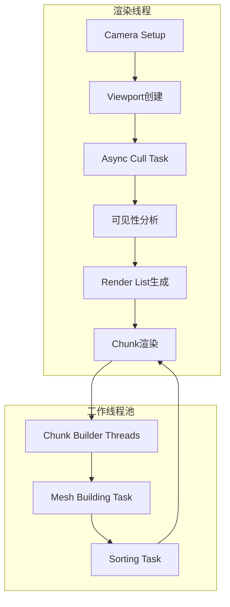

# Sodium 渲染优化模组深度分析报告

## 项目概述

Sodium是一个为Minecraft开发的高性能渲染优化模组，主要针对Java版。其核心目标是减少GPU和CPU端的渲染开销，通过多层次的剔除算法、异步处理和内存优化来实现显著的性能提升。

### 项目结构

```
sodium-dev/
├── common/                    # 核心公共代码
│   └── src/main/java/net/caffeinemc/mods/sodium/
│       ├── client/
│       │   ├── render/        # 渲染系统核心
│       │   │   ├── chunk/     # Chunk渲染管理
│       │   │   │   ├── occlusion/    # 遮挡剔除系统
│       │   │   │   ├── compile/      # 编译构建管线
│       │   │   │   └── translucent_sorting/  # 半透明排序
│       │   │   └── viewport/        # 视锥体管理
│       │   └── world/        # 世界数据管理
│       └── mixin/            # Mixin注入
├── fabric/                   # Fabric mod loader支持
└── neoforge/                 # NeoForge支持
```

---

## 核心渲染架构

### 1. 渲染流程总览

Sodium的渲染流程采用了多层抽象和异步处理：



### 2. 核心类关系

| 类名 | 职责 |
|------|------|
| [`SodiumWorldRenderer`](项目参考/优化参考/sodium-dev/common/src/main/java/net/caffeinemc/mods/sodium/client/render/SodiumWorldRenderer.java) | 渲染器主入口，管理整体渲染流程 |
| [`RenderSectionManager`](项目参考/优化参考/sodium-dev/common/src/main/java/net/caffeinemc/mods/sodium/client/render/chunk/RenderSectionManager.java) | 管理所有Chunk渲染状态和可见性 |
| [`DefaultChunkRenderer`](项目参考/优化参考/sodium-dev/common/src/main/java/net/caffeinemc/mods/sodium/client/render/chunk/DefaultChunkRenderer.java) | 具体执行GPU渲染命令 |
| [`OcclusionCuller`](项目参考/优化参考/sodium-dev/common/src/main/java/net/caffeinemc/mods/sodium/client/render/chunk/occlusion/OcclusionCuller.java) | 遮挡剔除算法实现 |

---

## 遮挡剔除系统 (Occlusion Culling)

Sodium的遮挡剔除系统是其最核心的优化技术，采用了多层次剔除策略。

### 1. 三层可见性模型

Sodium定义了三种可见性级别，从宽到窄：

```java
// OcclusionCuller.java - 注释说明
// Frustum visible implies regular visible implies wide visible.
// Not wide visible implies not regular visible implies not frustum visible.
```

| 级别 | 范围 | 用途 |
|------|------|------|
| Wide | 邻居chunk范围 | 最宽松的剔除，用于初始BFS遍历 |
| Regular | 当前chunk范围 | 中等精度，用于一般渲染 |
| Local | 精确视锥体测试 | 最严格，用于近距离渲染 |

### 2. 方向性可见性图 (DirectionalVisGraph)

每个16x16x16的chunk section都维护一个可见性图，记录从一个面能否"看到"另一个面。

```java
// DirectionalVisGraph.java
public class DirectionalVisGraph {
    private static final int SIZE = 16 * 16 * 16;  // 4096个block
    private static final int[] DIRECTION_SETS = new int[] {
        0b010101, // 0: west, north, down
        0b010110, // 1: west, north, up
        0b011001, // 2: west, south, down
        // ... 4种基础视角组合
    };
}
```

**算法核心**：
1. 将chunk划分为16x16x16的block网格
2. 对每个不透明block标记
3. 从每个面的中心开始DFS/BFS传播可见性
4. 最终得到6x6的可见性矩阵

### 3. 遮挡剔除器 (OcclusionCuller)

使用BFS(广度优先搜索)遍历可见的chunk：

```java
// OcclusionCuller.findVisible() 核心逻辑
public void findVisible(...) {
    // 1. 初始化队列，从相机所在chunk开始
    this.queue.write().enqueue(originSection);
    
    // 2. BFS遍历
    while (this.queue.flip()) {
        // 获取当前chunk的可见性数据
        var visibilityData = section.getVisibilityData();
        
        // 3. 计算可见性连接
        outgoingWide = VisibilityEncoding.getConnections(visibilityData, incomingDirections);
        
        // 4. 遍历相邻chunk
        visitNeighbors(writeQueue, section, outgoingWide, ...);
    }
}
```

### 4. 角度遮挡剔除

除了传统的方块级遮挡，Sodium还实现了角度遮挡剔除：

```java
// OcclusionCuller.java
private static long getAngleVisibilityMaskLocal(Viewport viewport, RenderSection section) {
    var dx = Math.abs(transform.x - section.getCenterX());
    var dy = Math.abs(transform.y - section.getCenterY());
    var dz = Math.abs(transform.z - section.getCenterZ());
    
    var angleOcclusionMask = 0L;
    // 如果在某个方向上chunk更远，则遮挡该方向
    if (dx > dy || dz > dy) {
        angleOcclusionMask |= UP_DOWN_OCCLUDED;
    }
    // ...
    return ~angleOcclusionMask;
}
```

### 5. 光线追踪遮挡剔除 (RayOcclusionSectionTree)

对于重要的穿透性检查，Sodium使用光线投射：

```java
// RayOcclusionSectionTree.java
private boolean isRayBlockedStepped(RenderSection section) {
    // 从chunk中心向相机发射光线
    var steps = Math.min((int)(length * RAY_MIN_STEP_SIZE_INV), RAY_TEST_MAX_STEPS);
    
    for (int i = 1; i < steps; i++) {
        // 检查路径上的每个点是否有遮挡
        var result = this.blockHasObstruction((int)x, (int)y, (int)z);
        if (result == Tree.NOT_PRESENT) {
            return true;  // 光线被遮挡
        }
    }
    return false;
}
```

---

## 视锥剔除系统 (Frustum Culling)

### 1. Viewport类

[`Viewport`](项目参考/优化参考/sodium-dev/common/src/main/java/net/caffeinemc/mods/sodium/client/render/viewport/Viewport.java)是视锥体测试的核心类：

```java
public final class Viewport {
    // Chunk边界扩张以容纳超出16x16x16的模型
    public static final float CHUNK_SECTION_RADIUS = 8.0f;
    public static final float CHUNK_SECTION_MARGIN = 1.0f + 0.125f;  // 模型最大扩展 + epsilon
    
    private final Frustum frustum;
    private final CameraTransform transform;
    
    // 标准视锥体测试
    public boolean isBoxVisible(int intOriginX, int intOriginY, int intOriginZ) {
        return this.frustum.testSection(floatOriginX, floatOriginY, floatOriginZ);
    }
    
    // 宽松测试，用于大型模型
    public boolean isBoxVisibleLooser(...) {
        return this.frustum.testSectionExpanded(..., LOOSER_MARGIN_EXTRA);
    }
}
```

### 2. SimpleFrustum实现

使用`FrustumIntersection`进行高效的AABB裁剪：

```java
public boolean testAab(float minX, float minY, float minZ, float maxX, float maxY, float maxZ) {
    return this.frustum.testAab(minX, minY, minZ, maxX, maxY, maxZ);
}

public int intersectAab(...) {
    return this.frustum.intersectAab(...);  // 返回裁剪平面
}
```

---

## 面剔除优化 (Block Face Culling)

### 1. 原理

只渲染朝向相机的方块面，避免渲染被遮挡的面：

```java
// DefaultChunkRenderer.java
if (useBlockFaceCulling) {
    slices = getVisibleFaces(camera.intX, camera.intY, camera.intZ, chunkX, chunkY, chunkZ);
} else {
    slices = ModelQuadFacing.ALL;  // 全部渲染
}
```

### 2. 可见性计算

```java
// 根据相机位置计算哪些面是可见的
// 返回值是6位的掩码，每位代表一个方向
private static int getVisibleFaces(int camX, int camY, int camZ, int chunkX, int chunkY, int chunkZ) {
    int slices = 0;
    
    // 检查每个方向
    if (camX < chunkX) slices |= ModelQuadFacing.WEST;
    if (camX > chunkX + 16) slices |= ModelQuadFacing.EAST;
    // ... 其他方向
}
```

---

## 异步渲染管线

### 1. 多线程架构

```java
// RenderSectionManager.java
private final ExecutorService asyncCullExecutor = 
    Executors.newSingleThreadExecutor(RenderSectionManager::makeAsyncCullThread);

// ChunkBuilder.java - 工作线程池
private final List<Thread> threads = new ArrayList<>();

public ChunkBuilder(...) {
    int count = getOptimalThreadCount();
    for (int i = 0; i < count; i++) {
        Thread thread = new Thread(worker, "Chunk Render Task Executor #" + i);
        thread.setPriority(Math.max(0, Thread.NORM_PRIORITY - 2));
        thread.start();
    }
}

private static int getOptimalThreadCount() {
    return Mth.clamp(Math.max(getMaxThreadCount() / 3, getMaxThreadCount() - 6), 1, 10);
}
```

### 2. 双缓冲队列

```java
// OcclusionCuller.java
private final DoubleBufferedQueue<RenderSection> queue = new DoubleBufferedQueue<>();

// BFS遍历使用读写队列分离
private void processQueue(ReadQueue<RenderSection> readQueue, WriteQueue<RenderSection> writeQueue) {
    while ((section = readQueue.dequeue()) != null) {
        // 处理可见性
        // ...
        writeQueue.enqueue(neighbor);
    }
}
```

### 3. 任务优先级和延迟

```java
// ChunkUpdateTypes.java
public enum DeferMode {
    IMMEDIATE,    // 立即更新，阻塞渲染
    SOON,         // 最多延迟1帧
    ALWAYS        // 完全异步，不阻塞
}
```

### 4. 异步剔除任务

```java
// CullTask.java
public class CullTask extends AsyncRenderTask<CullResult> {
    public void run() {
        this.occlusionCuller.findVisible(
            wideTree, regularTree, localTree,
            this.viewport,
            this.searchDistanceRegular,
            this.searchDistanceLocal,
            this.useOcclusionCulling,
            this
        );
    }
    
    public void submitTo(ExecutorService executor) {
        this.future = executor.submit(this);
    }
}
```

---

## 着色器优化

### 1. 顶点格式压缩

Sodium使用自定义压缩的顶点格式：

```glsl
// chunk_vertex.glsl
#ifdef USE_VERTEX_COMPRESSION
const uint POSITION_BITS = 20u;           // 位置使用20位
const uint TEXTURE_BITS = 15u;           // 纹理坐标使用15位

// 解压缩函数
uvec3 _deinterleave_u20x3(uvec2 data) {
    uvec3 hi = (uvec3(data.x) >> uvec3(0u, 10u, 20u)) & 0x3FFu;
    uvec3 lo = (uvec3(data.y) >> uvec3(0u, 10u, 20u)) & 0x3FFu;
    return (hi << 10u) | lo;
}
#endif
```

### 2. 材质参数编码

```glsl
// chunk_material.glsl
const uint MATERIAL_USE_MIP_OFFSET = 0u;
const uint MATERIAL_ALPHA_CUTOFF_OFFSET = 1u;

float _material_alpha_cutoff(uint material) {
    return ALPHA_CUTOFF[(material >> MATERIAL_ALPHA_CUTOFF_OFFSET) & 3u];
}
```

### 3. 多draw call合并

```java
// DefaultChunkRenderer.java
// 每个region使用一个draw call渲染
while (iterator.hasNext()) {
    ChunkRenderList renderList = iterator.next();
    var batch = region.getCachedBatch(renderPass);
    
    if (!batch.isFilled) {
        fillCommandBuffer(batch, ...);  // 填充批量绘制命令
    }
    
    executeDrawBatch(commandList, tessellation, batch);
}
```

---

## 雾效遮挡 (Fog Occlusion)

### 1. 原理

在浓雾环境下，完全被雾遮挡的chunk可以直接跳过渲染：

```java
// 从语言文件中的描述
"sodium.options.use_fog_occlusion.tooltip": 
"If enabled, chunks which are determined to be fully hidden by fog effects will not be rendered"
```

### 2. 实现

利用Minecraft的圆柱形雾算法(`max(length(distance.xz), abs(distance.y))`)判断chunk是否在雾中：

```java
// OcclusionCuller.visitNode()
float xzThreshold = (dx * dx) + (dz * dz);
float yThreshold = Math.abs(dy);

// vanilla的圆柱形雾算法
if (testDistance(xzThreshold, yThreshold, this.searchDistanceRegular)) {
    queue.enqueue(section);
}
```

---

## 实体剔除 (Entity Culling)

### 1. 基于Chunk的实体剔除

```java
// SodiumWorldRenderer.java
public boolean isEntityVisible(Entity entity, AABB entityVolume) {
    // 实体首先进行视锥体测试
    if (!this.frustum.isVisible(entityVolume)) {
        return false;
    }
    
    // 大型实体只做视锥体测试
    if (entityVolume > MAX_ENTITY_CHECK_VOLUME) {
        return true;
    }
    
    // 检查实体所在的chunk是否可见
    return this.renderSectionManager.isSectionVisible(sectionPos);
}
```

---

## 内存优化

### 1. Chunk数据克隆缓存

```java
// ClonedChunkSectionCache.java
public class ClonedChunkSectionCache {
    private static final int MAX_CACHE_SIZE = 512;
    private final Long2ReferenceLinkedOpenHashMap<ClonedChunkSection> positionToEntry;
    
    // LRU缓存实现
    public ClonedChunkSectionCache(Level level) {
        this.level = level;
    }
}
```

### 2. 直接内存操作

```java
// SectionRenderDataUnsafe.java
// 使用Unsafe绕过Java堆内存限制
public class SectionRenderDataUnsafe {
    // This code is a terrible hack to get around the fact that we are so incredibly memory bound
}
```

### 3. 内存池技术

```java
// NativeBuffer.java
public class NativeBuffer {
    private static StackTraceElement[] getStackTrace() {
        return SodiumClientMod.options().advanced.enableMemoryTracing ? 
            Thread.currentThread().getStackTrace() : null;
    }
}
```

---

## 性能优化技术总结

| 优化类别 | 具体技术 | 性能提升 |
|----------|----------|----------|
| 遮挡剔除 | 三层可见性BFS、方向性可见性图、角度剔除 | 极高 |
| 视锥剔除 | AABB裁剪、扩展边界测试 | 高 |
| 面剔除 | 相机朝向检测、仅渲染可见面 | 高 |
| 异步处理 | 多线程构建、异步剔除、双缓冲队列 | 高 |
| 着色器 | 顶点压缩、材质编码、批量draw | 中-高 |
| 雾效遮挡 | 雾距离剔除 | 中 |
| 内存优化 | 对象池、缓存、Unsafe直接内存 | 中 |

---

## 关键技术亮点

### 1. 递归可见性传播

DirectionalVisGraph使用DFS从每个面的中心点开始传播可见性，可以精确判断任意两个面之间的可见性。

### 2. 三层剔除协调

Wide → Regular → Local的渐进式剔除，确保了渲染列表的快速生成同时保证了正确性。

### 3. 异步和同步平衡

通过`DeferMode`和任务优先级系统，在帧时间和视觉完整性之间取得平衡。

### 4. 光线投射验证

对关键穿透性检查使用光线投射，避免误剔除。

---

## 对本项目的借鉴意义

基于Sodium的分析，以下优化技术可应用于Voxy体素引擎：

1. **遮挡剔除**: 实现基于SVO(Sparse Voxel Octree)的方向性可见性传播
2. **视锥剔除**: 使用分层视锥体测试优化
3. **面剔除**: GPU上的实例化面剔除
4. **异步管线**: 参考Sodium的Chunk Builder线程池设计
5. **着色器优化**: 顶点格式压缩、纹理坐标打包

---

## 参考文件路径

| 文件 | 描述 |
|------|------|
| [`OcclusionCuller.java`](项目参考/优化参考/sodium-dev/common/src/main/java/net/caffeinemc/mods/sodium/client/render/chunk/occlusion/OcclusionCuller.java) | 遮挡剔除核心算法 |
| [`DirectionalVisGraph.java`](项目参考/优化参考/sodium-dev/common/src/main/java/net/caffeinemc/mods/sodium/client/render/chunk/occlusion/DirectionalVisGraph.java) | 方向性可见性图 |
| [`RayOcclusionSectionTree.java`](项目参考/优化参考/sodium-dev/common/src/main/java/net/caffeinemc/mods/sodium/client/render/chunk/occlusion/RayOcclusionSectionTree.java) | 光线追踪遮挡 |
| [`Viewport.java`](项目参考/优化参考/sodium-dev/common/src/main/java/net/caffeinemc/mods/sodium/client/render/viewport/Viewport.java) | 视锥体测试 |
| [`RenderSectionManager.java`](项目参考/优化参考/sodium-dev/common/src/main/java/net/caffeinemc/mods/sodium/client/render/chunk/RenderSectionManager.java) | 渲染节管理 |
| [`DefaultChunkRenderer.java`](项目参考/优化参考/sodium-dev/common/src/main/java/net/caffeinemc/mods/sodium/client/render/chunk/DefaultChunkRenderer.java) | 默认渲染器 |
| [`ChunkBuilder.java`](项目参考/优化参考/sodium-dev/common/src/main/java/net/caffeinemc/mods/sodium/client/render/chunk/compile/executor/ChunkBuilder.java) | 异步构建器 |
| [`chunk_vertex.glsl`](项目参考/优化参考/sodium-dev/common/src/main/resources/assets/sodium/shaders/include/chunk_vertex.glsl) | 顶点着色器 |
