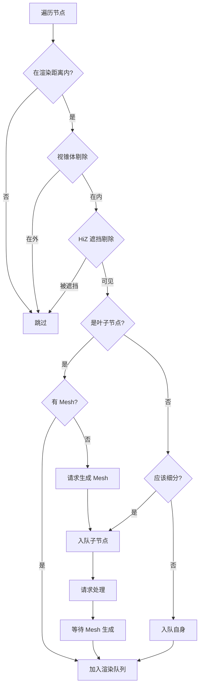

# Voxy 超远视距技术分析文档

## 项目概述

**Voxy** 是一个 Minecraft 渲染引擎优化模组（Mod），专门针对 Sodium 渲染引擎进行增强，主要目标是实现**超远视距渲染**。项目使用 Java/Gradle 构建，依赖于 OpenGL 4.6+ 的现代 GPU特性。

- **项目路径**: `项目参考/优化参考/voxy-dev`
- **核心语言**: Java (客户端) + GLSL (着色器)
- **目标**: 支持 48 公里（48,000 方块）级别的超远视距渲染

---

## 1. 核心技术架构

### 1.1 分层 LOD 系统（Hierarchical LOD）

Voxy 实现超远视距的核心是**层级 LOD（Level of Detail）系统**。该系统将世界空间划分为多层级的节点树，不同距离使用不同的细节级别。

```
┌─────────────────────────────────────────────────────────┐
│                    LOD 0 (最精细)                        │
│  ┌─────┬─────┬─────┬─────┐                              │
│  │     │     │     │     │  16x16x16 blocks per node   │
│  ├─────┼─────┼─────┼─────┤                              │
│  │     │     │     │     │  最近距离使用                │
│  ├─────┼─────┼─────┼─────┤                              │
│  │     │     │     │     │                              │
│  └─────┴─────┴─────┴─────┘                              │
├─────────────────────────────────────────────────────────┤
│                    LOD 1                                 │
│  ┌───────────────┬───────────────┐                     │
│  │               │               │  32x32x32 blocks    │
│  │     4x4      │     4x4       │  per node            │
│  │    LOD 0     │    LOD 0      │                      │
│  └───────────────┴───────────────┘                      │
├─────────────────────────────────────────────────────────┤
│                    LOD 2                                 │
│  ┌───────────────────────────────┐                       │
│  │                               │  64x64x64 blocks      │
│  │      8x8 LOD 1 regions       │  per node            │
│  └───────────────────────────────┘                       │
├─────────────────────────────────────────────────────────┤
│                    LOD 3                                 │
│  ┌───────────────────────────────┐                       │
│  │                               │  128x128x128 blocks   │
│  │     16x16 LOD 2 regions       │  per node            │
│  └───────────────────────────────┘                       │
├─────────────────────────────────────────────────────────┤
│                    LOD 4 (最粗糙)                        │
│  ┌───────────────────────────────┐                       │
│  │                               │  256x256x256 blocks   │
│  │     32x32 LOD 3 regions       │  per node            │
│  └───────────────────────────────┘                       │
└─────────────────────────────────────────────────────────┘
```

### 1.2 节点数据结构

#### GPU 端节点结构

```glsl
// 文件: shaders/lod/hierarchical/node.glsl

struct UnpackedNode {
    uint nodeId;     // 节点唯一ID
    uvec2 rawPos;    // 压缩位置（包含LOD级别）
    ivec3 pos;       // 解压后位置
    uint lodLevel;   // LOD 等级 (0-4)
    uint flags;      // 标记位
    uint meshPtr;    // Mesh 缓冲区指针
    uint childPtr;   // 子节点指针
};
```

#### 位置编码机制

```glsl
// 文件: shaders/lod/pos_util.glsl

// 提取 LOD 级别（高4位）
uint getLoDLevel(uvec2 packedPos) {
    return packedPos.x>>28;
}

// 解压位置信息
ivec3 getLoDPosition(uvec2 packedPos) {
    int y = ((int(packedPos.x)<<4)>>24);
    int x = (int(packedPos.y)<<4)>>8;
    int z = int((packedPos.x&((1u<<20)-1))<<4);
    z |= int(packedPos.y>>28);
    z <<= 8;
    z >>= 8;
    return ivec3(x,y,z);
}
```

#### 节点标记位

```glsl
// flags 各位含义
#define NULL_NODE     ((1<<24)-1)
#define EMPTY_QUEUE_ID ((1<<24)-2)
#define NULL_MESH     ((1<<24)-1)
#define EMPTY_MESH    ((1<<24)-2)

// 判断函数
bool hasMesh(in UnpackedNode node) { return node.meshPtr != NULL_MESH; }
bool isEmptyMesh(in UnpackedNode node) { return node.meshPtr == EMPTY_MESH; }
bool hasChildren(in UnpackedNode node) { return node.childPtr != NULL_NODE; }
bool hasRequested(in UnpackedNode node) { return (node.flags&1u) != 0u; }
```

---

## 2. 渲染距离管理

### 2.1 配置参数

```java
// 文件: src/main/java/me/cortex/voxy/client/config/VoxyConfig.java

public class VoxyConfig {
    // Section 渲染距离，默认 16 个 section
    public float sectionRenderDistance = 16;
    
    // 细分尺寸，影响 LOD 0 的精度
    public float subDivisionSize = 64;
    
    // 服务线程数
    public int serviceThreads = (int) Math.max(CpuLayout.getCoreCount()/1.5, 1);
}
```

### 2.2 渲染距离计算

```java
// 文件: src/main/java/me/cortex/voxy/client/core/VoxyRenderSystem.java

public void setRenderDistance(float renderDistance) {
    // +1 确保圆形渲染时覆盖最外圈
    this.renderDistanceTracker.setRenderDistance((int) Math.ceil(renderDistance+1));
}

public static float getRenderDistance() {
    // Minecraft 原生视距 * 16 = 方块单位
    return Minecraft.getInstance().options.getEffectiveRenderDistance()*16;
}
```

### 2.3 投影矩阵配置

```java
// 文件: src/main/java/me/cortex/voxy/client/core/VoxyRenderSystem.java

private static Matrix4f computeProjectionMat(RenderProperties properties, Matrix4fc base) {
    // 近平面根据渲染距离动态调整
    float near = getRenderDistance()<=32.0f ? 8f : 16f;
    near = VoxyClient.disableSodiumChunkRender() ? 0.1f : near;
    
    // 远平面：16 * 3000 = 48,000 方块
    float far = 16*3000;
    
    // 反向深度缓冲
    if (properties.isReverseZ()) {
        float tmp = near;
        near = far;
        far = tmp;
    }
    
    return extraProjection.mulLocal(
        new Matrix4f(rawMCProj)
            .m22((properties.isZero2One()?far:(far+near)) / (near - far))
            .m32((properties.isZero2One()?far:(far+far)) * near / (near - far))
    );
}
```

---

## 3. GPU 剔除机制

### 3.1 剔除流程图



### 3.2 距离判断

```glsl
// 文件: shaders/lod/hierarchical/traversal_dev.comp

bool isWithinRenderDistance(in UnpackedNode node) {
    if (renderDistance<0.0f) return true;
    vec3 close = closestPointToCamera(node);
    float xzDist = close.x*close.x+close.z*close.z;
    return xzDist <= renderDistance;
}

// 计算节点到相机最近点
vec3 closestPointToCamera(in UnpackedNode node) {
    vec3 nPos = vec3(((node.pos<<node.lodLevel)-camSecPos)<<5)-camSubSecPos;
    float scale = 1<<(node.lodLevel+5);
    return mix(mix(vec3(0), nPos, greaterThan(nPos, vec3(0))), nPos+scale, lessThan(nPos+scale, vec3(0)));
}

// 计算节点到相机最远点
vec3 furthestPointToCamera(in UnpackedNode node) {
    vec3 nPos = vec3(((node.pos<<node.lodLevel)-camSecPos)<<5)-camSubSecPos;
    float scale = 1<<(node.lodLevel+5);
    return mix(nPos+scale, mix(nPos, vec3(0), greaterThan(nPos, vec3(0))), lessThan(nPos+scale, vec3(0)));
}
```

### 3.3 视锥体剔除

```glsl
// 文件: shaders/lod/frustum.glsl

struct Frustum {
    vec4 planes[6];  // 左右上下前后六个裁剪平面
};

// 测试点是否在平面内侧
bool testPlane(vec4 plane, vec3 base, float size) {
    return dot(plane.xyz, base+mix(vec3(size), vec3(0), lessThan(plane.xyz, vec3(0)))) >= -plane.w;
}

// 判断节点是否在视锥体外（被裁剪）
bool outsideFrustum(in Frustum frustum, vec3 pos, float size) {
    return !(testPlane(frustum.planes[0], pos, size) && 
             testPlane(frustum.planes[1], pos, size) &&
             testPlane(frustum.planes[2], pos, size) && 
             testPlane(frustum.planes[3], pos, size) &&
             testPlane(frustum.planes[4], pos, size)); // 不测试远平面
}
```

### 3.4 HiZ 遮挡剔除

```glsl
// 文件: shaders/lod/hierarchical/screenspace.glsl

bool isCulledByHiz() {
    // 使用层次深度图进行快速遮挡测试
    // LOD 0 的节点不做 HiZ 测试
    if (node22.lodLevel!=0) return false;
    // ... 详细实现
}
```

---

## 4. 层级遍历算法

### 4.1 遍历主函数

```glsl
// 文件: shaders/lod/hierarchical/traversal_dev.comp

void traverse(in UnpackedNode node) {
    #ifdef HAS_STATISTICS
    atomicAdd(traversalCounts[node.lodLevel], 1);
    #endif

    // 计算屏幕空间坐标
    setupScreenspace(node);

    // 执行视锥体和 HiZ 剔除
    if (outsideFrustum() || isCulledByHiz()) {
        // 被剔除，不渲染
    } else {
        // 可见节点处理
        if (node.lodLevel!=0 && shouldDecend()) {
            // 非根节点，检查是否继续细分
            if (hasChildren(node)) {
                enqueueChildren(node);
            } else {
                // 没有子节点，请求生成
                addRequest(node);
                
                // 检查是否应该渲染自身作为后备
                bool shouldRenderSelf = renderDistance<0.0f;
                if (!shouldRenderSelf) {
                    vec3 far = furthestPointToCamera(node);
                    shouldRenderSelf = (far.x*far.x+far.z*far.z+(16*16*16))<=renderDistance;
                }
                
                if (shouldRenderSelf) {
                    enqueueSelfForRender(node);
                }
            }
        } else {
            // 根节点或不需要细分
            if (hasMesh(node)) {
                enqueueSelfForRender(node);
            } else {
                addRequest(node);
                if (node.lodLevel != 0) {
                    enqueueChildren(node);
                }
            }
        }
    }
}
```

### 4.2 核心判断逻辑

| 条件 | 操作 |
|------|------|
| `lodLevel != 0 && shouldDecend()` | 继续细分 |
| `hasChildren()` | 入队子节点等待下一帧处理 |
| `!hasChildren()` | 请求生成 Mesh + 条件性渲染自身 |
| `hasMesh()` | 直接入队渲染 |
| `!hasMesh()` | 请求生成 + 入队子节点 |

### 4.3 渲染队列管理

```glsl
// 渲染队列结构
layout(binding = RENDER_QUEUE_BINDING, std430) restrict buffer renderQueueStruct {
    uint renderQueueIndex;      // 当前队列索引
    uint[] renderQueue;          // 渲染的 Mesh ID 列表
};

// 入队渲染
void enqueueSelfForRender(in UnpackedNode node) {
    if (renderQueueIndex < renderQueueMaxSize) {
        lastRenderFrame[getId(node)] = frameId;
        if (!isEmptyMesh(node)) {
            uint renderIndex = atomicAdd(renderQueueIndex, 1);
            if (renderIndex < renderQueueMaxSize) {
                renderQueue[renderIndex] = getMesh(node);
            }
        }
    }
}
```

---

## 5. 性能优化技术

### 5.1 自适应细分尺寸

```java
// 文件: src/main/java/me/cortex/voxy/client/core/VoxyRenderSystem.java

private void autoBalanceSubDivSize() {
    boolean canDecreaseSize = this.renderGen.getTaskCount() < 300;
    int MIN_FPS = 55;
    int MAX_FPS = 65;
    
    // FPS 低时增大细分尺寸（降低精度换取性能）
    if (Minecraft.getInstance().getFps() < MIN_FPS) {
        VoxyConfig.CONFIG.subDivisionSize = Math.min(
            VoxyConfig.CONFIG.subDivisionSize + 60 / Math.max(1f, Minecraft.getInstance().getFps()), 
            256
        );
    }

    // FPS 高时减小细分尺寸（提高精度）
    if (MAX_FPS < Minecraft.getInstance().getFps() && canDecreaseSize) {
        VoxyConfig.CONFIG.subDivisionSize = Math.max(
            VoxyConfig.CONFIG.subDivisionSize - 30 / Math.max(1f, Minecraft.getInstance().getFps()), 
            28
        );
    }
}
```

### 5.2 反向深度缓冲

```java
// 远距离渲染时，Near/Far 反转可以提高深度精度
float far = 16 * 3000;  // 48,000 方块

if (properties.isReverseZ()) {
    float tmp = near;
    near = far;    // near = 48000
    far = tmp;     // far = 8~16
}
```

### 5.3 多线程服务架构

```java
// 文件: src/main/java/me/cortex/voxy/client/config/VoxyConfig.java

public int serviceThreads = (int) Math.max(CpuLayout.getCoreCount()/1.5, 1);

// 线程池管理
public class ServiceManager {
    // 管理 Mesh 生成、存储加载等服务线程
}
```

---

## 6. 关键技术总结

| 技术分类 | 技术名称 | 作用 |
|----------|----------|------|
| **LOD 系统** | 分层节点树 | 不同距离使用不同精度，减少几何数量 |
| **剔除优化** | GPU 视锥体剔除 | 不绘制屏幕外物体 |
| **剔除优化** | HiZ 遮挡剔除 | 被遮挡物体不渲染 |
| **剔除优化** | 距离判断 | 远处跳过细分，直接用低 LOD |
| **深度优化** | 反向深度缓冲 | 远距离深度精度提升 |
| **性能优化** | 自适应细分尺寸 | 根据 FPS 动态调整精度 |
| **并发优化** | 多线程服务 | Mesh 生成、IO 并行处理 |

### 核心设计思想

> **用空间换时间** — 通过预计算并存储不同层级的 Mesh 数据，让 GPU 在渲染时能够快速选择合适的细节级别，避免了运行时的大量几何计算。

---

## 7. 文件索引

### 核心配置文件
- `src/main/java/me/cortex/voxy/client/config/VoxyConfig.java` — 配置参数
- `src/main/java/me/cortex/voxy/client/core/VoxyRenderSystem.java` — 渲染系统核心

### 着色器文件
- `src/main/resources/assets/voxy/shaders/lod/pos_util.glsl` — 位置/LOD 编码
- `src/main/resources/assets/voxy/shaders/lod/frustum.glsl` — 视锥体剔除
- `src/main/resources/assets/voxy/shaders/lod/section.glsl` — Section 元数据
- `src/main/resources/assets/voxy/shaders/lod/hierarchical/node.glsl` — 节点结构
- `src/main/resources/assets/voxy/shaders/lod/hierarchical/traversal_dev.comp` — 层级遍历
- `src/main/resources/assets/voxy/shaders/lod/hierarchical/screenspace.glsl` — 屏幕空间处理

---

## 8. 八叉树结构详解

Voxy 使用了一个**真正的八叉树（Octree）结构**来管理空间层级关系。虽然在生产代码中使用的是优化后的紧凑存储格式，但核心概念是一个标准的 8 分支树。

### 8.1 位置编码格式

```java
// 文件: src/main/java/me/cortex/voxy/common/world/WorldEngine.java

// 位置ID格式 (64位)
public static long getWorldSectionId(int lvl, int x, int y, int z) {
    return ((long)lvl<<60)|((long)(y&0xFF)<<52)|((long)(z&((1<<24)-1))<<28)|((long)(x&((1<<24)-1))<<4);
}
```

位布局：
| 位范围 | 内容 |
|--------|------|
| 60-63 | LOD 级别 (0-4) |
| 52-59 | Y 坐标 |
| 28-51 | Z 坐标 |
| 4-27 | X 坐标 |

### 8.2 节点类型

```java
// 文件: src/main/java/me/cortex/voxy/client/core/rendering/hierachical/NodeManager.java

// 三种节点类型
NODE_TYPE_LEAF   = 0b00<<30  // 叶子节点，包含几何体
NODE_TYPE_INNER  = 0b01<<30  // 内部节点，有子节点
NODE_TYPE_REQUEST = 0b10<<30 // 请求中，等待处理
```

### 8.3 子节点索引计算

```java
// 8叉树标准索引计算
private static int getChildIdx(long pos) {
    int x = WorldEngine.getX(pos);
    int y = WorldEngine.getY(pos);
    int z = WorldEngine.getZ(pos);
    return (x&1)|((y&1)<<2)|((z&1)<<1);
}
```

索引对应关系：
| 索引 | X | Y | Z | 二进制 |
|------|---|---|---|--------|
| 0 | 0 | 0 | 0 | 000 |
| 1 | 1 | 0 | 0 | 001 |
| 2 | 0 | 0 | 1 | 010 |
| 3 | 1 | 0 | 1 | 011 |
| 4 | 0 | 1 | 0 | 100 |
| 5 | 1 | 1 | 0 | 101 |
| 6 | 0 | 1 | 1 | 110 |
| 7 | 1 | 1 | 1 | 111 |

### 8.4 子节点存在性掩码

```java
// 每个节点用 8 位掩码表示子节点存在性
private byte childExistenceMask;

// 示例: 0xFF = 所有子节点都存在
//       0x05 = 子节点 0 和 2 存在
```

### 8.5 父子位置转换

```java
// 创建子节点位置
private static long makeChildPos(long basePos, int addin) {
    int lvl = WorldEngine.getLevel(basePos);
    if (lvl == 0) {
        throw new IllegalArgumentException("Cannot create a child lower than lod level 0");
    }
    return WorldEngine.getWorldSectionId(lvl-1,
            (WorldEngine.getX(basePos)<<1)|(addin&1),
            (WorldEngine.getY(basePos)<<1)|((addin>>2)&1),
            (WorldEngine.getZ(basePos)<<1)|((addin>>1)&1));
}

// 创建父节点位置
private static long makeParentPos(long pos) {
    int lvl = WorldEngine.getLevel(pos);
    if (lvl == MAX_LOD_LAYER) {
        throw new IllegalArgumentException("Cannot create a parent higher than LoD " + MAX_LOD_LAYER);
    }
    return WorldEngine.getWorldSectionId(lvl+1,
            WorldEngine.getX(pos)>>1,
            WorldEngine.getY(pos)>>1,
            WorldEngine.getZ(pos)>>1);
}
```

### 8.6 简化测试结构

```java
// 文件: TestNodeManager.java (测试用简化实现)

private static class Node {
    private final long pos;
    private final Node[] children = new Node[8];  // 8个子节点!
    private byte childExistenceMask;
    private int meshId;
}
```

### 8.7 空间层级示意

```
LOD 4 (256x256x256)
    │
    ├── 8 个子节点 (LOD 3, 128x128x128)
    │       │
    │       ├── 8 个子节点 (LOD 2, 64x64x64)
    │       │       │
    │       │       ├── 8 个子节点 (LOD 1, 32x32x32)
    │       │       │       │
    │       │       │       └── 8 个子节点 (LOD 0, 16x16x16) ← 最小单元
```

### 8.8 核心设计原则

```java
// 文件: NodeManager.java 注释中提到的设计假设

// 1. 所有节点都有子节点（至少有一个子节点存在位被设置）
// 2. 叶子节点总是包含几何体（即使是空几何体）
// 3. 除了顶级节点外，所有节点都有父节点
```

### 8.9 Octree vs SVO 对比分析

**核心区别：**

| 特性 | Octree（八叉树） | SVO（稀疏八叉树） | Voxy 实现 |
|------|-----------------|-------------------|-----------|
| 节点存储 | 密集，父子固定8指针 | 稀疏，只存储存在的节点 | 稀疏存储 ✅ |
| 子节点引用 | 固定8个指针数组 | 动态指针/索引表 | 8位掩码 + 索引 ✅ |
| 空白空间 | 仍分配空节点 | 不分配 | 不分配 ✅ |
| 主要用途 | 碰撞检测等 | 渲染 | 渲染+剔除 ✅ |

**Voxy 更接近 SVO 的关键证据：**

```java
// 1. childExistenceMask - 8位掩码跟踪子节点存在性
private byte childExistenceMask;

// 2. 按需分配 - 只为存在的子节点分配内存
int newPtr = this.nodeData.allocate(Integer.bitCount(newMsk));

// 3. 叶子节点必须有几何体（空几何体也算）
if (this.nodeData.getNodeGeometry(nodeId) == NULL_GEOMETRY_ID) {
    throw new IllegalStateException("leaf nodes must have geometry");
}
```

**但 Voxy 也与传统 SVO 有差异：**

| 差异点 | 传统 SVO | Voxy |
|--------|----------|------|
| 结构 | 单一树 | 5级分层（每级2倍缩放） |
| 遍历 | CPU 端 | GPU Compute Shader 驱动 |
| 用途 | 渲染或碰撞 | 主要用于 GPU 剔除 |

**精确命名：**
> Voxy 的结构可称为 **分层稀疏节点层级结构（Hierarchical Sparse Node Structure）**，它是 SVO 思想与分级 LOD 的结合体。

---

## 10. Voxy 着色器架构详解

### 10.1 着色器文件结构

```
shaders/lod/
├── pos_util.glsl          # 位置/LOD 编码工具函数
├── section.glsl           # Section 元数据结构
├── frustum.glsl           # 视锥体剔除
├── node.glsl              # 节点数据结构
├── quad_format.glsl       # Quad 压缩格式
├── quad_util.glsl         # Quad 工具函数
├── lighting.glsl          # 光照计算
├── block_model.glsl       # 方块模型
│
├── gl46/                  # OpenGL 4.6 渲染管线
│   ├── bindings.glsl      # Uniform/Buffer 绑定定义
│   ├── prep.comp          # 预处理（初始化计数）
│   ├── cmdgen.comp        # Draw Command 生成
│   ├── quads3.vert       # 顶点着色器
│   ├── quads.frag         # 片元着色器
│   └── cull/              # 光栅化剔除
│       ├── raster.vert
│       └── raster.frag
│
└── hierarchical/          # GPU 层级遍历
    ├── traversal_dev.comp  # 层级剔除遍历
    ├── screenspace.glsl    # 屏幕空间计算
    ├── queue.glsl         # 节点队列管理
    └── cleaner/            # 节点清理
```

### 10.2 核心 Uniform 和 Buffer 绑定

```glsl
// 文件: shaders/lod/gl46/bindings.glsl

// 场景 Uniform
layout(binding = 0, std140) uniform SceneUniform {
    mat4 MVP;                    // 模型视图投影矩阵
    ivec3 baseSectionPos;        // 基础 Section 位置
    uint frameId;                // 帧 ID
    vec3 cameraSubPos;           // 相机亚像素位置
};

// Draw Command 结构
struct DrawCommand {
    uint  count;           // 索引数量
    uint  instanceCount;    // 实例数量
    uint  firstIndex;      // 起始索引
    int   baseVertex;      // 基础顶点
    uint  baseInstance;     // 基础实例
};

// Section 元数据缓冲
layout(binding = SECTION_METADATA_BUFFER_BINDING, std430) readonly buffer SectionBuffer {
    SectionMeta sectionData[];  // Section 元数据数组
};

// 可见性缓冲
layout(binding = VISIBILITY_BUFFER_BINDING, std430) restrict buffer VisibilityBuffer {
    uint visibilityData[];  // 每 Section 的可见性状态
};

// 位置缓冲（写入可见 Section 的位置）
layout(binding = POSITION_SCRATCH_BINDING, std430) restrict buffer PositionScratchBuffer {
    uvec2 positionBuffer[];  // 每个可见 Section 的压缩位置
};
```

### 10.3 GPU 剔除流程（Compute Shader）

#### prep.comp - 预处理

```glsl
// 文件: shaders/lod/gl46/prep.comp
// 工作组大小: 1

void main() {
    // 计算 cmdgen 的dispatch 大小
    cmdGenDispatchX = ((sectionCount+127)/128);
    
    // 重置绘制计数
    opaqueDrawCount = 0;
    translucentDrawCount = 0;
    temporalOpaqueDrawCount = 0;
    
    // 设置间接绘制命令
    cullDrawIndirectCommand.count = 6*2*3;      // 6面 × 2(双面) × 3(透明/不透明/双面)
    cullDrawIndirectCommand.instanceCount = sectionCount;
}
```

#### cmdgen.comp - 命令生成（核心）

```glsl
// 文件: shaders/lod/gl46/cmdgen.comp
// 工作组大小: 128

void main() {
    if (gl_GlobalInvocationID.x >= sectionCount) return;
    
    uint sectionId = indirectLookup[gl_GlobalInvocationID.x];
    SectionMeta meta = sectionData[sectionId];
    uint detail = extractDetail(meta);  // LOD 级别
    ivec3 ipos = extractPosition(meta);
    
    // 检查是否可见
    uint dat = visibilityData[sectionId];
    bool shouldRender = (dat&0x7fffffffu) == frameId;
    bool renderTemporally = (dat&0x80000000u)==0;  // 上帧是否可见
    
    if (shouldRender) {
        uint ptr = extractQuadStart(meta);
        ivec3 relative = ipos-(baseSectionPos>>detail);
        
        // 计算邻居合并掩码
        uint msk = 0;
        msk |= uint(((counts.y      &0xFFFFu)!=0) && (relative.y>-1))<<0;  // Down
        msk |= uint((((counts.y>>16)&0xFFFFu)!=0) && (relative.y<1 ))<<1;  // Up
        msk |= uint(((counts.z      &0xFFFFu)!=0) && (relative.z>-1))<<2;  // North
        msk |= uint((((counts.z>>16)&0xFFFFu)!=0) && (relative.z<1 ))<<3;  // South
        msk |= uint(((counts.w      &0xFFFFu)!=0) && (relative.x>-1))<<4;  // West
        msk |= uint((((counts.w>>16)&0xFFFFu)!=0) && (relative.x<1 ))<<5;  // East
        msk |= uint(((counts.x>>16)&0xFFFFu)!=0)<<6;  // 双面Quad
        
        uint cmdCnt = bitCount(msk);  // 实际绘制的 Command 数量
        uint cmdPtr = atomicAdd(opaqueDrawCount, cmdCnt);
        
        // 透明物体按距离排序
        count = counts.x&0xFFFFu;  // Translucent
        if (count != 0) {
            uint tp = atomicAdd(translucentDrawCount, 1)+TRANSLUCENT_WRITE_BASE;
            uint distToCamera = (abs(relative.x)+abs(relative.y)+abs(relative.z))<<detail;
            distToCamera = (TRANSLUCENT_WRITE_BASE-1)-min(distToCamera, TRANSLUCENT_WRITE_BASE-1);
            atomicAdd(translucentCommandData[distToCamera], 1);
        }
        
        // 写入各种 Draw Commands...
    }
}
```

### 10.4 顶点着色器

```glsl
// 文件: shaders/lod/gl46/quads3.vert

void main() {
    QuadData quad;
    // 从位置缓冲读取压缩位置
    uvec2 pos = positionBuffer[gl_BaseInstance];
    // 设置 Quad 数据
    setupQuad(quad, quadData[uint(gl_VertexID)>>2], pos, (gl_VertexID&3) == 1);
    
    uint cornerId = gl_VertexID&3;  // 0,1,2,3
    
    // 计算顶点位置
    gl_Position = getQuadCornerPos(quad, cornerId);
    
    // 输出属性
    interData = quad.attributeData;  // face, modelId, tint, lightmap
    uv = getCornerUV(quad, cornerId);
}
```

### 10.5 片元着色器

```glsl
// 文件: shaders/lod/gl46/quads.frag

void main() {
    vec2 tile;
    #ifdef USE_NV_BARRY
    // 使用 barycentric 坐标计算 UV（三角形模式）
    vec2 uv = gl_BaryCoordNV.yx*(vec2(...)+1)*2;
    #else
    // 标准 UV 计算
    vec2 uv = ...;
    #endif
    
    vec2 uv2 = modf(uv, tile)*(1.0/(vec2(3.0,2.0)*256.0));
    vec2 texPos = uv2 + getBaseUV();
    
    // 计算纹理导数用于 mipmap
    vec2 uvSmol = uv*(1.0/(vec2(3.0,2.0)*256.0));
    vec2 dx = dFdx(uvSmol);
    vec2 dy = dFdy(uvSmol);
    
    // 采样纹理
    colour = textureGrad(blockModelAtlas, texPos, dx, dy);
    
    // 深度测试
    if (DEPTH_SCALAR_COMPARE(gl_FragCoord.z, texelFetch(depthTex, ivec2(gl_FragCoord.xy), 0).r)) {
        discard;
    }
    
    // Alpha 测试（裁剪透明像素）
    if (useDiscard() && (textureLod(blockModelAtlas, texPos, 0).a <= 0.1f)) {
        discard;
    }
    
    // 应用着色和调色
    colour = computeColour(texPos, colour);
    outColour = colour;
}
```

### 10.6 深度处理（反向深度）

```glsl
// 文件: shaders/util/depthutils.glsl

// 反向深度（Reverse-Z）配置
#ifdef USE_REVERSE_Z
    #define REDUCTION min      // 深度越小越近
    #define REDUCTION2 max
    #define DEPTH_SCALAR_COMPARE(a,b) ((a)>(b))  // 越大深度通过
#else
    #define REDUCTION max
    #define REDUCTION2 min
    #define DEPTH_SCALAR_COMPARE(a,b) ((a)<(b))  // 越小深度通过
#endif
```

### 10.7 Quad 数据压缩格式

```glsl
// 文件: shaders/lod/quad_format.glsl
// 每个 Quad 使用 64 位压缩存储

#ifdef QUAD_DATA_USE_64_BIT
#define Quad uint64_t

vec3 extractPos(uint64_t quad) {
    // 位布局: [55-63:lightId][46-54:biomeId][26-45:stateId][11-15:z][16-20:y][21-25:x]
    return vec3(Eu32(quad, 5, 21), Eu32(quad, 5, 16), Eu32(quad, 5, 11));
}

ivec2 extractSize(uint64_t quad) {
    return ivec2(Eu32(quad, 4, 3), Eu32(quad, 4, 7)) + ivec2(1);
}

uint extractFace(uint64_t quad) {
    return Eu32(quad, 3, 0);  // 0-5 表示6个面
}

uint extractStateId(uint64_t quad) {
    return Eu32(quad, 16, 26);  // 方块状态 ID
}
#endif
```

### 10.8 渲染管线总结

```
┌─────────────────────────────────────────────────────────────┐
│                      CPU 端                                  │
│  1. NodeManager - 管理 SVO 节点树                            │
│  2. AsyncNodeManager - 异步节点更新                           │
│  3. RenderGenerationService - 生成 Mesh 数据                  │
└─────────────────────────────────────────────────────────────┘
                              │
                              ▼
┌─────────────────────────────────────────────────────────────┐
│                    GPU 管线 (Compute)                        │
│                                                             │
│  prep.comp          - 初始化计数，重置绘制命令                 │
│       │                                                    │
│       ▼                                                    │
│  Hierarchical       - GPU 视锥体剔除 + HiZ 遮挡剔除          │
│  traversal_dev.comp   (层级遍历，节点入队/出队)              │
│       │                                                    │
│       ▼                                                    │
│  cmdgen.comp        - 生成 Draw Commands                    │
│       │                 - 计算邻居合并                        │
│       │                 - 透明物体按距离排序                 │
└─────────────────────────────────────────────────────────────┘
                              │
                              ▼
┌─────────────────────────────────────────────────────────────┐
│                    GPU 管线 (Raster)                        │
│                                                             │
│  quads3.vert       - 顶点着色器                            │
│       │            - 解码 Quad 位置                         │
│       │            - 应用 MVP 矩阵                          │
│       ▼                                                    │
│  Rasterizer         - 图元装配 + 裁剪                       │
│       │                                                    │
│       ▼                                                    │
│  quads.frag         - 片元着色器                            │
│                    - 纹理采样 + Mipmap                     │
│                    - 深度测试                              │
│                    - Alpha 裁剪                            │
│                    - 光照/调色                             │
└─────────────────────────────────────────────────────────────┘
```

### 10.9 关键技术特点

| 技术 | 描述 | 文件 |
|------|------|------|
| **Quad 压缩** | 64位编码位置/大小/面/状态 | quad_format.glsl |
| **反向深度** | 远距离精度优化 | depthutils.glsl |
| **邻居合并** | 减少 Draw Calls | cmdgen.comp |
| **距离排序** | 透明物体从远到近渲染 | cmdgen.comp |
| **Mipmap 导数** | dFdx/dFdy 计算正确采样级别 | quads.frag |
| **Barycentric** | 可选三角形模式加速光栅化 | quads3.vert |

---

## 11. 参考数据

**核心区别：**

| 特性 | Octree（八叉树） | SVO（稀疏八叉树） | Voxy 实现 |
|------|-----------------|-------------------|-----------|
| 节点存储 | 密集，父子固定8指针 | 稀疏，只存储存在的节点 | 稀疏存储 ✅ |
| 子节点引用 | 固定8个指针数组 | 动态指针/索引表 | 8位掩码 + 索引 ✅ |
| 空白空间 | 仍分配空节点 | 不分配 | 不分配 ✅ |
| 主要用途 | 碰撞检测等 | 渲染 | 渲染+剔除 ✅ |

**Voxy 更接近 SVO 的关键证据：**

```java
// 1. childExistenceMask - 8位掩码跟踪子节点存在性
private byte childExistenceMask;

// 2. 按需分配 - 只为存在的子节点分配内存
int newPtr = this.nodeData.allocate(Integer.bitCount(newMsk));

// 3. 叶子节点必须有几何体（空几何体也算）
if (this.nodeData.getNodeGeometry(nodeId) == NULL_GEOMETRY_ID) {
    throw new IllegalStateException("leaf nodes must have geometry");
}
```

**但 Voxy 也与传统 SVO 有差异：**

| 差异点 | 传统 SVO | Voxy |
|--------|----------|------|
| 结构 | 单一树 | 5级分层（每级2倍缩放） |
| 遍历 | CPU 端 | GPU Compute Shader 驱动 |
| 用途 | 渲染或碰撞 | 主要用于 GPU 剔除 |

**精确命名：**
> Voxy 的结构可称为 **分层稀疏节点层级结构（Hierarchical Sparse Node Structure）**，它是 SVO 思想与分级 LOD 的结合体。

---

## 9. 参考数据

---

## 9. 参考数据

| 参数 | 默认值 | 说明 |
|------|--------|------|
| `sectionRenderDistance` | 16 | Section 级别渲染距离 |
| `subDivisionSize` | 64 | 细分尺寸 |
| `far` | 48,000 | 远裁剪面（方块） |
| `near` | 8~16 | 近裁剪面（动态） |
| LOD 级别数 | 5 | 0-4 级 |
| 节点基础大小 | 16×16×16 | LOD 0 节点尺寸 |
| 最高级节点尺寸 | 256×256×256 | LOD 4 节点尺寸 |
