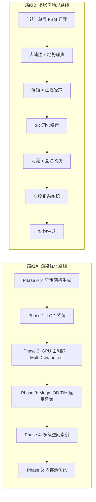
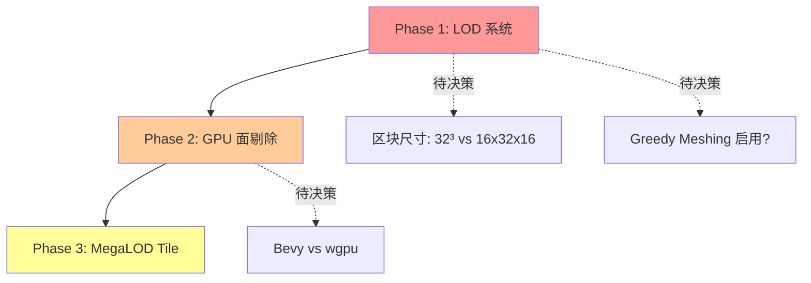
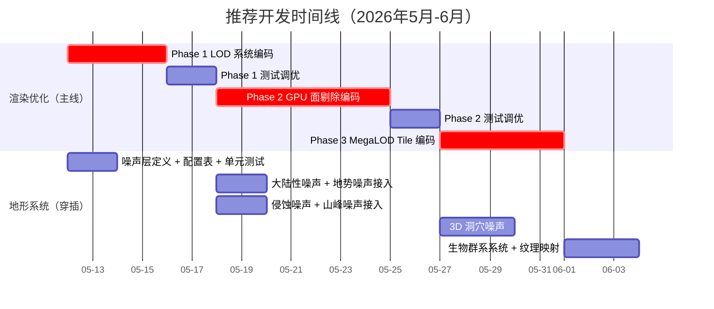

# 开发路线决策与分析

> 本文档分析 Spirit Realm 项目的两条主要开发路线，提供战略决策建议和并行开发方案。
>
> 创建日期：2026-05-11 | 基于 [`Phase完整规划.md`](Phase完整规划.md) 和 [`多噪声层地形生成方案.md`](多噪声层地形生成方案.md) 的架构讨论

---

## 1. 两条路线概述



### 1.1 路线A：渲染优化路线

来源于 [`Phase完整规划.md`](Phase完整规划.md) 和 [`Voxy借鉴优化方案.md`](Voxy借鉴优化方案.md)，核心目标是将渲染视距从当前 8 区块逐步扩展至 128+ 甚至 2048 区块，同时保持 60+ FPS。

| Phase | 内容 | 难度 | 依赖 |
|-------|------|------|------|
| Phase 0 | 异步网格生成 | ✅ 已完成 | — |
| Phase 1 | LOD 系统（四级降采样 + 滞后切换） | 🟡 中 | Phase 0 |
| Phase 2 | GPU 面剔除 + MultiDrawIndirect | 🔴 高 | Phase 1 |
| Phase 3 | MegaLOD Tile 远景系统 | 🔴 高 | Phase 2 |
| Phase 4 | 多级空间索引 | 🟡 中 | Phase 1 |
| Phase 5 | 内存池优化 | 🟢 低 | Phase 0 |

### 1.2 路线B：多噪声地形路线

来源于 [`多噪声层地形生成方案.md`](多噪声层地形生成方案.md)，核心目标是从当前单调的丘陵升级为具备海洋、山脉、峡谷、洞穴、河流、生物群系的 Minecraft 级地形生成系统。

| 层次 | 内容 | 维度 | 频率 |
|------|------|------|------|
| 大陆性噪声 | 大陆/海洋二元分类 | 2D (XZ) | 超低频 0.001 |
| 地势噪声 | 地形高度骨架 | 2D (XZ) | 低频 0.003 |
| 侵蚀噪声 | 峡谷/河谷切割 | 2D (XZ) | 中频 0.008 |
| 山峰噪声 | 尖锐 vs 圆润地形 | 2D (XZ) | 中高频 0.02 |
| 温度噪声 | 生物群系温度带 | 2D (XZ) | 超低频 0.0005 |
| 湿度噪声 | 生物群系湿度带 | 2D (XZ) | 低频 0.002 |
| 洞穴噪声 | 地下空洞和隧道 | 3D (XYZ) | 中高频 0.03 |

---

## 2. 核心分析：为什么要先走渲染优化

### 2.1 性能瓶颈是硬约束

当前的[性能基线](Phase完整规划.md:41)显示：

| 指标 | 当前值 | 瓶颈程度 |
|------|--------|---------|
| Draw Call | ~600-800 | 🔴 接近 Bevy 渲染瓶颈 |
| 视距 | 8 区块（256 米） | 🔴 太近，影响体验 |
| GPU 三角面 | ~8.7M-9.0M | 🟡 8区块已较高 |
| 帧时间 | ~5.9ms | 🟢 稳态尚可 |
| 加载尖峰 | ~21.8ms（已降至 <8ms） | 🟢 Phase 0 已解决 |

**如果不做渲染优化、直接做地形丰富化，渲染负载会显著恶化：**

| 地形特征 | 对性能的影响 |
|----------|-------------|
| 海洋（水面） | 新增半透明渲染层，增加 Draw Call 和排序开销 |
| 3D 洞穴 | 地下产生大量可见面，单区块顶点数可能翻倍 |
| 峡谷/河谷 | 地形起伏增大，可见面增多，区块复杂度增加 |
| 山脉 | 高海拔区块导致 Y 轴加载范围扩大，实体数增加 |
| 生物群系 | 多种方块类型导致材质切换，增加 Draw Call 拆分 |

**结论：越丰富的地形 → 越大的渲染负载 → 当前 8 区块视距下性能会进一步恶化。**

### 2.2 视距是地形呈现的基础

地形的视觉价值与视距直接相关：

| 视距 | 能看到什么 | 地形系统的价值 |
|------|-----------|---------------|
| 8 区块（256 米） | 眼前几块地，走几步到边缘 | 低：再壮丽的地形也看不到全貌 |
| 16 区块（512 米） | 能看到远处山脊 | 中：地形开始有纵深感 |
| 32 区块（1024 米） | 能看到远方山脉轮廓 | 高：地形的全貌开始展现 |
| 128+ 区块（4096+ 米） | 真正的远景体验 | 极高：地形系统价值最大化 |

这也是为什么 [`Phase完整规划.md`](Phase完整规划.md:89) 的 Phase 1 预期收益列表中将"远景视觉质量"列为关键指标——从"突然消失"提升到"远山轮廓"。

### 2.3 渲染路线有明确的依赖链



| Phase | 完成标志 | 价值 |
|-------|---------|------|
| Phase 1 | 16-32 区块视距，LOD0-LOD3 | 视距翻 4 倍，面数可控 |
| Phase 2 | GPU 计算着色器面剔除，Draw Call 降至 ~100 | CPU 瓶颈解除 |
| Phase 3 | 128+ 区块视距，远景瓦片系统 | 终极视距目标 |

渲染路线的各 Phase 之间存在强依赖，中途切换到地形路线再回来需要重新理解上下文，效率降低。

---

## 3. 并行穿插策略

虽然主线走渲染优化，但地形系统有一个**零性能成本的骨架层**可以并行开发。

### 3.1 可独立开发的地形骨架层

以下工作**完全独立于渲染管线**，适合穿插进行：

```rust
// 噪声层定义（纯数据，不影响渲染）
pub struct TerrainNoiseSet {
    continental: Fbm<Simplex>,   // 大陆性噪声
    elevation: Fbm<Simplex>,     // 地势噪声
    erosion: Fbm<Simplex>,       // 侵蚀噪声
    peak: Fbm<Simplex>,          // 山峰噪声
    temperature: Fbm<Simplex>,   // 温度噪声
    humidity: Fbm<Simplex>,      // 湿度噪声
    cave: Fbm<Simplex>,          // 洞穴噪声
}
```

可独立完成的工作项：

1. **噪声层定义**：创建 [`src/terrain.rs`](../src/terrain.rs)，定义噪声层配置表和种子偏移
2. **地形分类算法**：实现 [`TerrainType`](多噪声层地形生成方案.md:229) 枚举和 [`classify_terrain()`](多噪声层地形生成方案.md:238) 分类函数
3. **单元测试**：确保不同种子的地形生成结果可预测、连续

### 3.2 渐进式替换 `fill_terrain()`

当前地形生成函数 [`fill_terrain()`](../src/chunk.rs:560) 使用单层 FBM 噪声。可以分步渐进替换：


**关键原则**：每一步只修改 [`fill_terrain()`](../src/chunk.rs:560) 内部逻辑和 [`src/chunk.rs`](../src/chunk.rs) 的常量定义，不触碰渲染管线代码。

### 3.3 渲染管线兼容性矩阵

| 地形特征 | 接入条件 | 渲染影响 | 推荐接入时机 |
|----------|---------|---------|-------------|
| 大陆/海洋分类 | 无 | 无（仅在体素数据层面） | ✅ 随时可接入 |
| 地势骨架 | 无 | 无 | ✅ 随时可接入 |
| 侵蚀/山峰 | 无 | 方块类型不变，面数可能增加 | ✅ 可提前接入 |
| 3D 洞穴 | 需要 LOD 支持 | 地下面数翻倍，影响性能 | ⏳ Phase 1 之后 |
| 海洋水面渲染 | 需要半透明管线 | 新增半透明层和 Draw Call | ⏳ Phase 2 之后 |
| 生物群系 | 需要纹理系统支持 | 多种材质切换 | ⏳ Phase 2 之后 |

---

## 4. 推荐开发时间线



### 4.1 分阶段详解

#### Week 1（5月12日-5月18日）：Phase 1 LOD 编码 + 噪声骨架

| 天 | 渲染主线 | 地形穿插 |
|---|---------|---------|
| 第1-2天 | 创建 [`src/lod.rs`](../src/lod.rs)，实现 `LodLevel` 和 `LodManager` | 创建 [`src/terrain.rs`](../src/terrain.rs)，定义噪声层配置表 |
| 第3-4天 | 修改 [`src/async_mesh.rs`](../src/async_mesh.rs) 和 [`src/chunk_manager.rs`](../src/chunk_manager.rs)，集成 LOD 调度 | 实现 `classify_terrain()` 地形分类函数 |
| 第5-6天 | Phase 1 测试调优 | 编写单元测试，验证地形分类正确性 |

**Week 1 结束时应有**：
- LOD 系统工作，视距可扩展到 16 区块
- 噪声层骨架完整，地形分类函数可独立运行

#### Week 2-3（5月19日-6月1日）：Phase 2 GPU 面剔除 + 地形接入

| 天 | 渲染主线 | 地形穿插 |
|---|---------|---------|
| 第1-3天 | WGSL 计算着色器编写 | 将大陆性噪声 + 地势噪声接入 `fill_terrain()` |
| 第4-6天 | ChunkData 上传到 GPU Buffer + 顶点数据回读 | 将侵蚀 + 山峰噪声接入 `fill_terrain()` |
| 第7-9天 | MultiDrawIndirect 合并所有 Draw Call | 观察效果，调整噪声参数 |

**Week 2-3 结束时应有**：
- GPU 面剔除工作，Draw Call 从数千降至 ~100
- 五大地形（平原/丘陵/高原/山脉/海洋）可生成

#### Week 4-5（6月2日-6月15日）：Phase 3 MegaLOD + 复杂地形

| 天 | 渲染主线 | 地形穿插 |
|---|---------|---------|
| 第1-3天 | MegaLOD Tile 定义 + 生成 | 3D 洞穴噪声接入 |
| 第4-6天 | 远景瓦片序列化/磁盘缓存 | 洞穴视觉验证 |
| 第7-9天 | 距离雾效 + LOD 切换 | 生物群系系统接入 |

**Week 4-5 结束时应有**：
- 128+ 区块视距可用
- 完整的多噪声地形系统（含洞穴、生物群系）

---

## 5. 关键决策点

| 决策 | 最佳时机 | 影响 | 状态 |
|------|---------|------|------|
| **区块尺寸：32³ vs 16×32×16** | Phase 1 完成后 | 决定 Phase 2 GPU 计算着色器的输入尺寸 | 🤔 建议保持 32³ |
| **Greedy Meshing 是否启用** | Phase 1 完成后评估 | 额外面数优化，与 LOD 叠加 | ⏸ 后备方案 |
| **Bevy Compute Shader vs 裸 wgpu** | Phase 2 开始前 | 决定 GPU 面剔除的实现路径 | ⏳ 待评估 |
| **是否扩展到 LOD4+（1:16）** | Phase 3 实现时 | 为 256+ 区块视距做准备 | ⏳ 待需求 |
| **地形生成是否 GPU 化** | 地形系统稳定后 | 性能提升，但增加复杂度 | ⏳ 远期考量 |

---

## 6. 风险矩阵

| 风险 | 概率 | 影响 | 缓解措施 |
|------|------|------|---------|
| 纯渲染优化导致开发动力不足 | 🟡 中 | 🟡 中 | 穿插地形生成提供视觉正反馈 |
| 地形接入后渲染性能恶化 | 🟡 中 | 🔴 高 | 复杂地形（洞穴/海洋）等渲染优化完成后接入 |
| GPU 面剔除技术难度超出预期 | 🟡 中 | 🔴 高 | 备选方案：CPU 多线程 Rayon |
| Bevy 版本升级导致 API 变更 | 🟢 低 | 🟡 中 | 锁定 Bevy 版本，升级时统一迁移 |
| 地形参数调优耗时过长 | 🟡 中 | 🟢 低 | 先做基本功能，参数留给后续迭代 |

---

## 7. 总结

```
核心结论：
  ① 主线：渲染优化（Phase 1 → Phase 2 → Phase 3）
  ② 穿插：地形骨架层（噪声定义 + 分类器 + 单元测试）
  ③ 约束：地形改动只改 fill_terrain()，不碰渲染管线
  ④ 节奏：每个渲染 Phase 完成后接入对应地形层

一句话：
  先修路（渲染优化），再建城市（地形系统）。
  修路期间可以画城市规划图（噪声层定义），但不能盖楼。
```

---

## 附录：相关文档索引

| 文档 | 说明 |
|------|------|
| [`Phase完整规划.md`](Phase完整规划.md) | 完整 Phase 规划、当前基线、时间线 |
| [`多噪声层地形生成方案.md`](多噪声层地形生成方案.md) | 多噪声层地形生成的完整设计（1183行） |
| [`Voxy借鉴优化方案.md`](Voxy借鉴优化方案.md) | Voxy 借鉴的优化路线图 |
| [`LOD系统设计文档.md`](LOD系统设计文档.md) | Phase 1 LOD 系统详细设计 |
| [`架构总纲.md`](架构总纲.md) | 项目整体架构设计 |
| [`优化建议总结.md`](优化建议总结.md) | 性能基线与优化建议汇总 |
| [`体素管理方案.md`](体素管理方案.md) | SubChunk 存储设计 |
