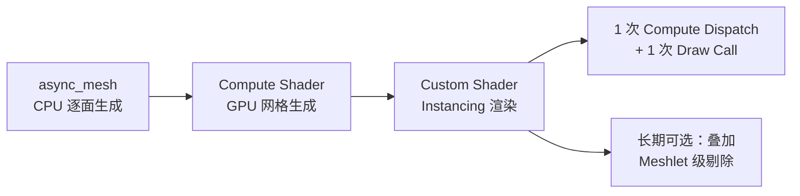

# 虚拟几何 + BVH vs Compute Shader + Instancing：对比分析

> **对比背景**：为 Spirit Realm 体素项目的 Phase 2（GPU 渲染管线）选择技术路线。

---

## 1. 两种方案概览

| 特性 | 方案 A：虚拟几何 + BVH | 方案 B：Compute Shader + Custom Shader Instancing |
|------|----------------------|--------------------------------------------------|
| **网格生成位置** | CPU（保留 async_mesh） | **GPU**（替代 async_mesh） |
| **剔除粒度** | Meshlet 级（64-128 三角形） | 区块级（32³ Chunk） |
| **渲染方式** | Visibility Buffer + Material Pass | 传统光栅化 + Instancing |
| **CPU 开销** | 中（仍需 CPU 生成 Mesh） | **极低**（仅上传 ChunkData） |
| **依赖** | Bevy 内置 Meshlet API | 标准 Compute + Instancing API |

---

## 2. 逐维度对比

| 维度 | 方案 A | 方案 B | 胜出 |
|------|--------|--------|------|
| **CPU 效率** | ⭐⭐ 仍需 async_mesh 工作线程 | ⭐⭐⭐⭐⭐ GPU 承担全部网格生成 | **B** |
| **GPU 剔除精度** | ⭐⭐⭐⭐⭐ Meshlet 级，精细 | ⭐⭐⭐⭐ 区块级，较粗 | **A** |
| **实现复杂度** | ⭐⭐ 需要 Meshlet+BVH+Visibility Buffer | ⭐⭐⭐⭐ 标准 Compute + Instancing | **B** |
| **架构兼容性** | ⭐⭐⭐ 兼容但需适配 Meshlet API | ⭐⭐⭐⭐⭐ 天然对齐 Phase 2 计划 | **B** |
| **大视距可扩展性** | ⭐⭐ 2048 区块下 CPU 成为瓶颈 | ⭐⭐⭐⭐⭐ CPU 零开销 | **B** |
| **动态修改友好度** | ⭐⭐ 需重建 Meshlet + BVH | ⭐⭐⭐⭐⭐ 只需重新上传 ChunkData | **B** |
| **技术风险** | ⭐⭐ 依赖 Bevy Meshlet API | ⭐⭐⭐⭐ 标准 API，风险低 | **B** |
| **总分** | **19/35** | **33/35** | **B** |

---

## 3. 关键决策因素

### 为什么方案 B 更适合本项目

1. **CPU 零开销是关键**：在 2048 区块视距目标下，方案 A 仍需 CPU 生成数百万区块的 Mesh，会成为不可承受的瓶颈
2. **天然对齐现有计划**：方案 B 直接对应 Phase 2（GPU 面剔除）+ Phase 3（Instancing），且有详细的 [`ComputeShader与Instancing搭配方案.md`](./ComputeShader与Instancing搭配方案.md) 作为设计参考
3. **完美匹配 Texture Array**：[`VoxelMaterial`](../src/resource_pack.rs) 已实现 Texture Array，Custom Shader Instancing 可直接配合使用
4. **动态修改低成本**：玩家放置/破坏方块只需重新上传 ~4KB ChunkData，GPU 自动重新生成 Mesh

### 方案 A 的价值（作为长期叠加）

Meshlet 级剔除在**复杂遮挡地形**（山地、洞穴）中有独特价值，建议在方案 B 基础上：

- 先实现方案 B，获得 80% 收益
- 再叠加 Meshlet 级剔除作为增强，获得剩余 20% 收益

---

## 4. 推荐路线

| 阶段 | 动作 | 预期收益 |
|------|------|---------|
| **Phase 2** | Compute Shader 面提取 + 网格生成（替代 async_mesh） | CPU 瓶颈消除 |
| **Phase 2 增强** | Custom Shader Instancing（合并 Draw Call） | Draw Call 降至 1 |
| **长期** | 在方案 B 基础上叠加 Meshlet 级剔除 | 复杂地形遮挡剔除精度提升 |

---

## 5. 结论

**推荐方案 B（Compute Shader 网格生成 + Custom Shader Instancing）**，理由：

1. 从根本上消除 CPU 瓶颈，支持 2048 区块视距目标
2. 天然对齐项目现有架构和 Phase 计划
3. 实现复杂度适中，技术风险低
4. 动态修改友好，体素场景天然适配
5. Meshlet 级剔除可作为长期叠加优化
