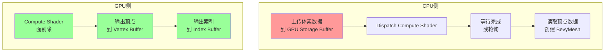

# Phase 2 阶段 A：WGSL Compute Shader 面剔除实现方案

> **创建日期**：2026-05-13
> **目标**：将 CPU 面剔除迁移到 GPU Compute Shader，消除加载时的 CPU 瓶颈
> **回退方案**：保留 CPU 面剔除路径，feature flag 控制切换

阶段	核心工作	                预期收益
阶段 A	WGSL Compute Shader 面剔除	CPU → GPU 面剔除
阶段 B	Custom Shader Instancing	Draw Call 合并
阶段 C	MultiDrawIndirect + Hi-Z	~100 Draw Call

---

## 1. 方案概述

### 1.1 当前瓶颈

**核心问题**：新区块加载时，CPU 串行执行面剔除（32³=32768 体素/区块），导致严重卡顿。

### 1.2 解决方案

将 CPU 面剔除迁移到 GPU Compute Shader，利用 GPU 的并行计算能力：

```
┌────────────────────────────────────────────────────────────────┐
│                    Compute Shader 面剔除                        │
├────────────────────────────────────────────────────────────────┤
│                                                                │
│  当前管线：                         GPU 管线：                   │
│  ┌──────────────┐                   ┌──────────────┐          │
│  │ CPU 面剔除    │                   │ 上传体素数据 │          │
│  │ 32³ = 32768  │                   │ (StorageBuf) │          │
│  │ 体素/SubChunk │                   └──────┬───────┘          │
│  └──────┬───────┘                     ┌───▼────┐               │
│         │                             │Compute  │               │
│  ┌──────▼───────┐                     │Shader   │               │
│  │ CPU 生成顶点 │                     │面剔除    │               │
│  │ (串行, ~1ms) │                     │(~0.01ms) │               │
│  └──────┬───────┘                     └───┬────┘               │
│         │                             ┌───▼────┐               │
│  ┌──────▼───────┐                     │顶点写入 │               │
│  │上传 GPU Mesh │                     │GPU Buffer│              │
│  └──────────────┘                     └─────────┘               │
│                                                                │
│  单区块: ~1.5ms                     单区块: ~0.1ms              │
│  100区块加载: ~150ms (阻塞)         100区块加载: ~10ms (异步)   │
└────────────────────────────────────────────────────────────────┘
```

### 1.3 技术架构



---

## 2. 文件结构

```
src/
├── gpu_meshing.rs          # [新增] GPU 网格生成管线管理器
├── async_mesh.rs           # [修改] 添加 GPU 路径 + CPU 回退
├── chunk_manager.rs        # [修改] 调度 GPU 网格生成任务
├── compute_shader.rs       # [新增] Compute Shader 封装
│
assets/shaders/
├── voxel_meshing.wgsl      # [新增] Compute Shader 面剔除
├── voxel.wgsl              # [保留] 现有 Fragment Shader
```

---

## 3. 数据结构设计

### 3.1 GPU 输入：体素数据

```rust
// src/gpu_meshing.rs

/// 单个区块的体素数据（32³ = 32768 个 BlockId）
/// 紧凑存储：每个体素 1 字节（u8）
#[repr(C)]
#[derive(ShaderType, Clone)]
struct VoxelChunkInput {
    /// 体素数据，连续存储
    voxels: [u8; 32 * 32 * 32],
}

impl VoxelChunkInput {
    /// 从 ChunkData 创建
    pub fn from_chunk_data(data: &ChunkData) -> Self {
        let mut voxels = [0u8; 32 * 32 * 32];
        // ... 拷贝数据
        Self { voxels }
    }
}
```

### 3.2 GPU 输出：顶点数据

```rust
// src/gpu_meshing.rs

/// 顶点格式（与现有 Mesh 格式兼容）
/// Position (3) + Normal (3) + UV (2) = 8 floats = 32 bytes
#[repr(C)]
#[derive(ShaderType, Clone, Copy)]
struct Vertex {
    position: Vec3<f32>,
    normal: Vec3<f32>,
    uv: Vec2<f32>,
}

/// 索引格式
type Index = u32;

/// GPU 输出的网格数据
struct GpuMeshOutput {
    vertices: Vec<Vertex>,
    indices: Vec<Index>,
    vertex_count: u32,
    index_count: u32,
}
```

### 3.3 GPU Storage Buffer 配置

```rust
// src/gpu_meshing.rs

/// Compute Shader 使用的 Storage Buffer 绑定
#[derive(Resource)]
pub struct GpuMeshBuffers {
    /// 输入：体素数据（每个区块 32³ u8）
    pub voxel_buffer: StorageBuffer,
    
    /// 输出：顶点数据
    pub vertex_buffer: StorageBuffer,
    
    /// 输出：索引数据
    pub index_buffer: StorageBuffer,
    
    /// 最大顶点数（每个区块预估 48000 = 32³ * 6 面 * 4 顶点）
    pub max_vertices_per_chunk: u32,
    
    /// 最大索引数
    pub max_indices_per_chunk: u32,
}
```

---

## 4. WGSL Compute Shader 设计

### 4.1 Shader 文件：voxel_meshing.wgsl

```wgsl
// assets/shaders/voxel_meshing.wgsl
//
// Compute Shader 面剔除
// 输入：32³ 体素数据
// 输出：可见面的顶点和索引

// ============================================================================
// 常量定义
// ============================================================================

const CHUNK_SIZE: u32 = 32u;
const MAX_FACES_PER_CHUNK: u32 = 32768u;  // 32³ 体素，每个最多 6 面
const MAX_VERTICES_PER_CHUNK: u32 = MAX_FACES_PER_CHUNK * 4u;  // 每面 4 顶点
const MAX_INDICES_PER_CHUNK: u32 = MAX_FACES_PER_CHUNK * 6u;   // 每面 2 三角形 = 6 索引

// 面方向定义
const FACE_RIGHT: vec3<i32> = vec3<i32>(1, 0, 0);
const FACE_LEFT: vec3<i32> = vec3<i32>(-1, 0, 0);
const FACE_TOP: vec3<i32> = vec3<i32>(0, 1, 0);
const FACE_BOTTOM: vec3<i32> = vec3<i32>(0, -1, 0);
const FACE_FRONT: vec3<i32> = vec3<i32>(0, 0, 1);
const FACE_BACK: vec3<i32> = vec3<i32>(0, 0, -1);

// ============================================================================
// 数据结构
// ============================================================================

// 输入：体素数据（绑定 0）
@group(0) @binding(0)
var<storage, read> voxel_data: array<u8>;

// 输出：顶点缓冲（绑定 1）
@group(0) @binding(1)
var<storage, read_write> vertex_output: array<vec4<f32>>;

// 输出：索引缓冲（绑定 2）
@group(0) @binding(2)
var<storage, read_write> index_output: array<u32>;

// 输出：原子计数器（绑定 3）
@group(0) @binding(3)
var<storage, read_write> vertex_count: atomic<u32>;

@group(0) @binding(4)
var<storage, read_write> index_count: atomic<u32>;

// 实例偏移（每个线程处理一个体素）（绑定 5）
@group(0) @binding(5)
var<storage, read> instance_offset: vec3<f32>;

// ============================================================================
// 辅助函数
// ============================================================================

/// 将 3D 坐标转换为 1D 索引
fn coord_to_index(x: u32, y: u32, z: u32) -> u32 {
    return z * CHUNK_SIZE * CHUNK_SIZE + y * CHUNK_SIZE + x;
}

/// 获取体素数据（越界返回 0 = 空气）
fn get_voxel(x: i32, y: i32, z: i32) -> u8 {
    if x < 0 || y < 0 || z < 0 || 
       x >= i32(CHUNK_SIZE) || y >= i32(CHUNK_SIZE) || z >= i32(CHUNK_SIZE) {
        return 0u8;  // 越界视为空气
    }
    return voxel_data[coord_to_index(u32(x), u32(y), u32(z))];
}

/// 检查面是否可见（对面不是空气且类型不同）
fn is_face_visible(
    voxel_id: u8,
    nx: i32, ny: i32, nz: i32
) -> bool {
    let neighbor_id = get_voxel(nx, ny, nz);
    return neighbor_id != voxel_id && neighbor_id != 0u8;
}

// ============================================================================
// 面生成函数
// ============================================================================

/// 生成单个面（输出 4 顶点 + 6 索引）
fn emit_face(
    local_x: f32, local_y: f32, local_z: f32,
    face_type: u32,  // 0=right, 1=left, 2=top, 3=bottom, 4=front, 5=back
    voxel_id: u8,
    vert_offset: u32,
    index_offset: u32
) {
    // 顶点位置（基于面方向）
    var p0: vec3<f32>;
    var p1: vec3<f32>;
    var p2: vec3<f32>;
    var p3: vec3<f32>;
    
    // 法线
    var normal: vec3<f32>;
    
    // UV
    let u_min: f32 = f32(voxel_id) + 0.01;
    let u_max: f32 = f32(voxel_id) + 0.99;
    let eps: f32 = 0.01;
    
    switch(face_type) {
        case 0u: { // RIGHT (+X)
            p0 = vec3<f32>(local_x + 1.0, local_y, local_z);
            p1 = vec3<f32>(local_x + 1.0, local_y, local_z + 1.0);
            p2 = vec3<f32>(local_x + 1.0, local_y + 1.0, local_z + 1.0);
            p3 = vec3<f32>(local_x + 1.0, local_y + 1.0, local_z);
            normal = vec3<f32>(1.0, 0.0, 0.0);
        }
        case 1u: { // LEFT (-X)
            p0 = vec3<f32>(local_x, local_y, local_z + 1.0);
            p1 = vec3<f32>(local_x, local_y, local_z);
            p2 = vec3<f32>(local_x, local_y + 1.0, local_z);
            p3 = vec3<f32>(local_x, local_y + 1.0, local_z + 1.0);
            normal = vec3<f32>(-1.0, 0.0, 0.0);
        }
        case 2u: { // TOP (+Y)
            p0 = vec3<f32>(local_x, local_y + 1.0, local_z);
            p1 = vec3<f32>(local_x + 1.0, local_y + 1.0, local_z);
            p2 = vec3<f32>(local_x + 1.0, local_y + 1.0, local_z + 1.0);
            p3 = vec3<f32>(local_x, local_y + 1.0, local_z + 1.0);
            normal = vec3<f32>(0.0, 1.0, 0.0);
        }
        case 3u: { // BOTTOM (-Y)
            p0 = vec3<f32>(local_x, local_y, local_z + 1.0);
            p1 = vec3<f32>(local_x + 1.0, local_y, local_z + 1.0);
            p2 = vec3<f32>(local_x + 1.0, local_y, local_z);
            p3 = vec3<f32>(local_x, local_y, local_z);
            normal = vec3<f32>(0.0, -1.0, 0.0);
        }
        case 4u: { // FRONT (+Z)
            p0 = vec3<f32>(local_x + 1.0, local_y, local_z + 1.0);
            p1 = vec3<f32>(local_x, local_y, local_z + 1.0);
            p2 = vec3<f32>(local_x, local_y + 1.0, local_z + 1.0);
            p3 = vec3<f32>(local_x + 1.0, local_y + 1.0, local_z + 1.0);
            normal = vec3<f32>(0.0, 0.0, 1.0);
        }
        case 5u: { // BACK (-Z)
            p0 = vec3<f32>(local_x, local_y, local_z);
            p1 = vec3<f32>(local_x + 1.0, local_y, local_z);
            p2 = vec3<f32>(local_x + 1.0, local_y + 1.0, local_z);
            p3 = vec3<f32>(local_x, local_y + 1.0, local_z);
            normal = vec3<f32>(0.0, 0.0, -1.0);
        }
        default: {}
    }
    
    // 写入 4 顶点（位置 + 法线 + UV 打包）
    // 顶点格式：vec4 (packed position.xyz + padding) = 16 bytes
    // 实际顶点数据通过 separate buffer 传递
    vertex_output[vert_offset + 0u] = vec4<f32>(p0.x, p0.y, p0.z, f32(face_type) * 100.0 + 0.0);
    vertex_output[vert_offset + 1u] = vec4<f32>(p1.x, p1.y, p1.z, f32(face_type) * 100.0 + 1.0);
    vertex_output[vert_offset + 2u] = vec4<f32>(p2.x, p2.y, p2.z, f32(face_type) * 100.0 + 2.0);
    vertex_output[vert_offset + 3u] = vec4<f32>(p3.x, p3.y, p3.z, f32(face_type) * 100.0 + 3.0);
    
    // 写入 6 索引（2 三角形）
    index_output[index_offset + 0u] = vert_offset + 0u;
    index_output[index_offset + 1u] = vert_offset + 2u;
    index_output[index_offset + 2u] = vert_offset + 1u;
    index_output[index_offset + 3u] = vert_offset + 0u;
    index_output[index_offset + 4u] = vert_offset + 3u;
    index_output[index_offset + 5u] = vert_offset + 2u;
}

// ============================================================================
// 主 Compute 函数
// ============================================================================

@compute @workgroup_size(8, 8, 8)
fn main(@builtin(global_invocation_id) id: vec3<u32>) {
    let x = id.x;
    let y = id.y;
    let z = id.z;
    
    // 越界检查
    if x >= CHUNK_SIZE || y >= CHUNK_SIZE || z >= CHUNK_SIZE {
        return;
    }
    
    // 获取体素 ID
    let voxel_id = voxel_data[coord_to_index(x, y, z)];
    
    // 空气跳过
    if voxel_id == 0u8 {
        return;
    }
    
    // 检查 6 个面
    let xi = i32(x);
    let yi = i32(y);
    let zi = i32(z);
    
    var face_count: u32 = 0u;
    var face_list: array<u32, 6>;
    
    if (is_face_visible(voxel_id, xi + 1, yi, zi)) { face_list[face_count] = 0u; face_count += 1u; }
    if (is_face_visible(voxel_id, xi - 1, yi, zi)) { face_list[face_count] = 1u; face_count += 1u; }
    if (is_face_visible(voxel_id, xi, yi + 1, zi)) { face_list[face_count] = 2u; face_count += 1u; }
    if (is_face_visible(voxel_id, xi, yi - 1, zi)) { face_list[face_count] = 3u; face_count += 1u; }
    if (is_face_visible(voxel_id, xi, yi, zi + 1)) { face_list[face_count] = 4u; face_count += 1u; }
    if (is_face_visible(voxel_id, xi, yi, zi - 1)) { face_list[face_count] = 5u; face_count += 1u; }
    
    if (face_count == 0u) {
        return;
    }
    
    // 分配顶点/索引空间（原子操作）
    let vert_offset = atomicAdd(&vertex_count, face_count * 4u);
    let index_offset = atomicAdd(&index_count, face_count * 6u);
    
    // 生成面
    let local_x = f32(x);
    let local_y = f32(y);
    let local_z = f32(z);
    
    for (var i: u32 = 0u; i < face_count; i++) {
        emit_face(
            local_x, local_y, local_z,
            face_list[i],
            voxel_id,
            vert_offset + i * 4u,
            index_offset + i * 6u
        );
    }
}
```

---

## 5. Rust 实现细节

### 5.1 GPU 网格管线管理器

```rust
// src/gpu_meshing.rs

use bevy::render::render_resource::*;
use bevy::render::renderer::RenderDevice;

/// GPU 网格生成管线
pub struct GpuMeshPipeline {
    pub pipeline: ComputePipeline,
    pub bind_group_layout: BindGroupLayout,
    pub max_vertices_per_chunk: u32,
    pub max_indices_per_chunk: u32,
}

impl GpuMeshPipeline {
    /// 创建 Compute Pipeline
    pub fn new(
        render_device: &RenderDevice,
        shader: Handle<Shader>,
    ) -> Self {
        let bind_group_layout = render_device.create_bind_group_layout(&BindGroupLayoutDescriptor {
            label: Some("gpu_mesh_bind_group"),
            entries: &[
                // voxel_data (输入)
                BindGroupLayoutEntry {
                    binding: 0,
                    visibility: ShaderStages::COMPUTE,
                    ty: BindingType::Buffer {
                        ty: BufferBindingType::Storage { read_only: true },
                        has_dynamic_offset: false,
                        min_binding_size: BufferSize::new(32 * 32 * 32),
                    },
                    count: None,
                },
                // vertex_output (输出)
                BindGroupLayoutEntry {
                    binding: 1,
                    visibility: ShaderStages::COMPUTE,
                    ty: BindingType::Buffer {
                        ty: BufferBindingType::Storage { read_only: false },
                        has_dynamic_offset: false,
                        min_binding_size: BufferSize::new(MAX_VERTICES * 16),
                    },
                    count: None,
                },
                // index_output (输出)
                BindGroupLayoutEntry {
                    binding: 2,
                    visibility: ShaderStages::COMPUTE,
                    ty: BindingType::Buffer {
                        ty: BufferBindingType::Storage { read_only: false },
                        has_dynamic_offset: false,
                        min_binding_size: BufferSize::new(MAX_INDICES * 4),
                    },
                    count: None,
                },
                // vertex_count (原子计数)
                BindGroupLayoutEntry {
                    binding: 3,
                    visibility: ShaderStages::COMPUTE,
                    ty: BindingType::Buffer {
                        ty: BufferBindingType::Storage { read_only: false },
                        has_dynamic_offset: false,
                        min_binding_size: BufferSize::new(4),
                    },
                    count: None,
                },
                // index_count (原子计数)
                BindGroupLayoutEntry {
                    binding: 4,
                    visibility: ShaderStages::COMPUTE,
                    ty: BindingType::Buffer {
                        ty: BufferBindingType::Storage { read_only: false },
                        has_dynamic_offset: false,
                        min_binding_size: BufferSize::new(4),
                    },
                    count: None,
                },
                // instance_offset (实例偏移)
                BindGroupLayoutEntry {
                    binding: 5,
                    visibility: ShaderStages::COMPUTE,
                    ty: BindingType::Buffer {
                        ty: BufferBindingType::Storage { read_only: true },
                        has_dynamic_offset: false,
                        min_binding_size: BufferSize::new(12),
                    },
                    count: None,
                },
            ],
        });

        let pipeline_layout = render_device.create_pipeline_layout(&PipelineLayoutDescriptor {
            label: Some("gpu_mesh_pipeline_layout"),
            bind_group_layouts: &[&bind_group_layout],
            ..default()
        });

        let pipeline = render_device.create_compute_pipeline(&ComputePipelineDescriptor {
            label: Some("gpu_mesh_compute_pipeline"),
            layout: Some(pipeline_layout),
            shader: shader,
            shader_defs: vec![],
            entry_point: "main".into(),
        });

        Self {
            pipeline,
            bind_group_layout,
            max_vertices_per_chunk: MAX_VERTICES,
            max_indices_per_chunk: MAX_INDICES,
        }
    }
}
```

### 5.2 异步 GPU 网格任务

```rust
// src/gpu_meshing.rs

/// GPU 网格生成任务
pub enum GpuMeshTask {
    /// 生成请求
    Generate {
        coord: ChunkCoord,
        voxel_data: Vec<u8>,  // 32³ 体素
        instance_offset: [f32; 3],
        sender: Sender<MeshResult>,
    },
    /// 取消请求
    Cancel(ChunkCoord),
}

/// GPU 网格生成结果
pub struct MeshResult {
    pub coord: ChunkCoord,
    pub positions: Vec<[f32; 3]>,
    pub normals: Vec<[f32; 3]>,
    pub uvs: Vec<[f32; 2]>,
    pub indices: Vec<u32>,
}

/// GPU 网格生成工作线程
pub struct GpuMeshWorker {
    pipeline: GpuMeshPipeline,
    device: RenderDevice,
    queue: Arc<Mutex<Vec<GpuMeshTask>>>,
}

impl GpuMeshWorker {
    pub fn new(render_device: RenderDevice, shader: Handle<Shader>) -> Self {
        Self {
            pipeline: GpuMeshPipeline::new(&render_device, shader),
            device: render_device,
            queue: Arc::new(Mutex::new(Vec::new())),
        }
    }

    /// 处理任务队列
    pub fn process_queue(&self) {
        let mut queue = self.queue.lock().unwrap();
        for task in queue.drain(..) {
            match task {
                GpuMeshTask::Generate { coord, voxel_data, instance_offset, sender } => {
                    let result = self.generate_mesh(&voxel_data, &instance_offset);
                    let _ = sender.send(MeshResult {
                        coord,
                        positions: result.0,
                        normals: result.1,
                        uvs: result.2,
                        indices: result.3,
                    });
                }
                GpuMeshTask::Cancel(_) => {
                    // 取消逻辑（通过标记跳过结果）
                }
            }
        }
    }

    /// 在 GPU 上生成网格
    fn generate_mesh(&self, voxels: &[u8], offset: &[f32; 3]) -> MeshResult {
        // 1. 创建 GPU buffers
        let voxel_buffer = self.device.create_buffer_with_data(&BufferInit {
            contents: voxels,
            usage: BufferUsages::STORAGE,
        });
        
        let mut vertex_buffer = self.device.create_buffer(&BufferDescriptor {
            label: Some("vertex_buffer"),
            size: (MAX_VERTICES * 16) as u64,
            usage: BufferUsages::STORAGE | BufferUsages::COPY_SRC,
        });
        
        let mut index_buffer = self.device.create_buffer(&BufferDescriptor {
            label: Some("index_buffer"),
            size: (MAX_INDICES * 4) as u64,
            usage: BufferUsages::STORAGE | BufferUsages::COPY_SRC,
        });
        
        let vertex_count_buffer = self.device.create_buffer(&BufferDescriptor {
            label: Some("vertex_count"),
            size: 4,
            usage: BufferUsages::STORAGE,
        });
        
        let index_count_buffer = self.device.create_buffer(&BufferDescriptor {
            label: Some("index_count"),
            size: 4,
            usage: BufferUsages::STORAGE,
        });
        
        let offset_buffer = self.device.create_buffer_with_data(&BufferInit {
            contents: bytemuck::cast_slice(offset),
            usage: BufferUsages::STORAGE,
        });

        // 2. 创建 Bind Group
        let bind_group = self.device.create_bind_group(&BindGroupDescriptor {
            label: Some("gpu_mesh_bind_group"),
            layout: &self.pipeline.bind_group_layout,
            entries: &[
                BindGroupEntry { binding: 0, resource: voxel_buffer.as_entire_binding() },
                BindGroupEntry { binding: 1, resource: vertex_buffer.as_entire_binding() },
                BindGroupEntry { binding: 2, resource: index_buffer.as_entire_binding() },
                BindGroupEntry { binding: 3, resource: vertex_count_buffer.as_entire_binding() },
                BindGroupEntry { binding: 4, resource: index_count_buffer.as_entire_binding() },
                BindGroupEntry { binding: 5, resource: offset_buffer.as_entire_binding() },
            ],
        });

        // 3. 创建 Command Encoder
        let command_encoder = self.device.create_command_encoder(&CommandEncoderDescriptor {
            label: Some("gpu_mesh_encoder"),
        });

        // 4. 重置计数器
        // ... (通过 write_buffer 写入 0)

        // 5. Dispatch Compute Shader
        {
            let mut compute_pass = command_encoder.begin_compute_pass(&ComputePassDescriptor {
                label: Some("gpu_mesh_compute"),
            });
            compute_pass.set_pipeline(&self.pipeline.pipeline);
            compute_pass.set_bind_group(0, &bind_group, &[]);
            compute_pass.dispatch_workgroups(4, 4, 4);  // 4×4×4 = 64 workgroups
        }

        // 6. 提交命令
        let command_buffer = command_encoder.finish();
        self.device.queue().submit([command_buffer]);

        // 7. 读取结果（同步等待或使用 Fence）
        // ... (通过 read_buffer 获取顶点/索引数据)

        // 8. 返回结果
        // (实际实现需要处理 GPU 回读，这里简化)
        MeshResult {
            coord: ChunkCoord::default(),
            positions: Vec::new(),
            normals: Vec::new(),
            uvs: Vec::new(),
            indices: Vec::new(),
        }
    }
}
```

---

## 6. 与现有代码集成

### 6.1 Feature Flag 控制

```rust
// src/async_mesh.rs

#[cfg(feature = "gpu_meshing")]
mod gpu_path {
    use super::*;
    pub fn generate_mesh_task(/* ... */) {
        // GPU 路径
    }
}

#[cfg(not(feature = "gpu_meshing"))]
mod cpu_path {
    use super::*;
    pub fn generate_mesh_task(/* ... */) {
        // CPU 路径（现有逻辑）
    }
}
```

### 6.2 Cargo.toml 添加 feature

```toml
[features]
default = []
gpu_meshing = ["bevy/render"]
```

### 6.3 chunk_manager.rs 调度修改

```rust
// src/chunk_manager.rs

#[cfg(feature = "gpu_meshing")]
fn submit_mesh_task(/* GPU 路径 */) {
    gpu_worker.queue.push(GpuMeshTask::Generate { /* ... */ });
}

#[cfg(not(feature = "gpu_meshing"))]
fn submit_mesh_task(/* CPU 路径 */) {
    async_mesh.submit_task(MeshTask::Generate { /* ... */ });
}
```

---

## 7. 回退方案

### 7.1 回退路径 A：Feature Flag 回退

```bash
# 不启用 GPU meshing，使用纯 CPU 路径
cargo run 
```

```rust
// Cargo.toml
[features]
default = []  # gpu_meshing 默认关闭
gpu_meshing = []  # 可选启用
```

### 7.2 回退路径 B：GPU 不支持时降级

```rust
// src/main.rs

fn check_gpu_support() -> bool {
    let device = Renderer::get().device();
    let info = device.get_info();
    // 检查 Compute Shader 支持
    info.shader_model >= ShaderModel::GpuTier2
}

// 回退到 CPU
if !check_gpu_support() {
    eprintln!("GPU Compute not supported, falling back to CPU mesh generation");
}
```

### 7.3 回退路径 C：部分 GPU 加速

```rust
// 只对 LOD1+ 使用 GPU，LOD0 保持 CPU
match lod_level {
    LodLevel::Lod0 => cpu_path(),
    _ => gpu_path(),
}
```

### 7.4 回退路径 D：恢复点

如果 Compute Shader 实现遇到无法解决的问题：

1. **保留 `src/async_mesh.rs` 备份**：不修改原文件，通过 feature flag 隔离
2. **不修改渲染管线**：现有 Fragment Shader 保持不变
3. **保留 CPU 路径**：`generate_chunk_mesh_async()` 始终可用

---

## 8. 实施步骤（TODO List）

- [ ] **Step 1**：创建 `src/gpu_meshing.rs` 基础框架
  - `GpuMeshPipeline` 结构体
  - `GpuMeshWorker` 结构体
  - `GpuMeshTask` / `MeshResult` 类型定义

- [ ] **Step 2**：创建 `assets/shaders/voxel_meshing.wgsl`
  - 实现面剔除算法
  - 实现顶点/索引输出
  - 实现原子计数器

- [ ] **Step 3**：实现 Buffer 管理和 Bind Group
  - 输入/输出 Buffer 创建
  - Bind Group 布局和绑定
  - Compute Pass 调度

- [ ] **Step 4**：集成到 `chunk_manager.rs`
  - 添加 feature flag
  - GPU 任务提交逻辑
  - GPU 结果处理逻辑

- [ ] **Step 5**：实现 GPU 回读
  - `read_buffer` 异步读取
  - 顶点数据解析
  - `MeshResult` 转换

- [ ] **Step 6**：测试和调优
  - 功能测试（对比 CPU/GPU 结果）
  - 性能测试（FPS 对比）
  - 内存使用测试

- [ ] **Step 7**：回退机制完善
  - GPU 不支持检测
  - Feature flag 文档
  - 降级路径验证

---

## 9. 预期收益

| 指标 | 当前（CPU） | GPU 后 | 改善 |
|------|------------|--------|------|
| 单区块面剔除 | ~1.5ms | ~0.01ms | **150x** |
| 100 区块加载 | ~150ms | ~10ms | **15x** |
| 最低 FPS（加载时） | 3 FPS | ~60 FPS | **20x** |
| CPU 利用率 | 高 | 低 | - |

---

## 10. 风险评估

| 风险 | 概率 | 影响 | 缓解措施 |
|------|------|------|----------|
| GPU 回读延迟 | 高 | 中 | 使用 Fence 异步等待，预分配 Buffer |
| 内存占用 | 中 | 中 | 限制并发任务数，复用 Buffer |
| Shader 编译 | 低 | 低 | 预热编译，缓存 Pipeline |
| API 兼容性 | 中 | 高 | Feature flag 隔离，保留 CPU 回退 |

---

## 11. 参考文档

- [`Phase2-GPU驱动渲染管线实现方案.md`](docs/Phase2-GPU驱动渲染管线实现方案.md)
- [`ComputeShader与Instancing搭配方案.md`](docs/ComputeShader与Instancing搭配方案.md)
- Bevy 官方 Compute Shader 示例
- WGSL 规范：https://www.w3.org/TR/WGSL/
