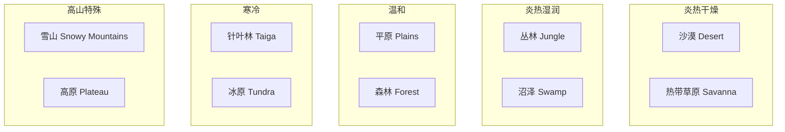
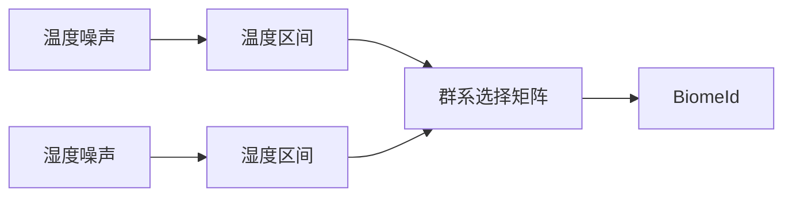
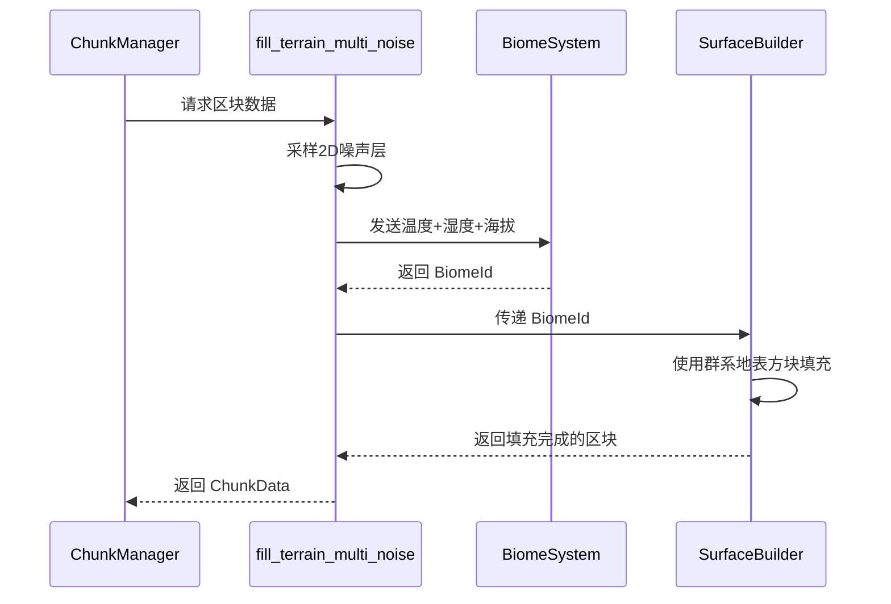

# 灵境项目 - 基础群系系统设计方案

> **项目**：[灵境](./项目背景.md) - Bevy 体素引擎
> **目标**：设计一套简单的基础群系系统，用于驱动地形、植被、方块类型
> **状态**：Architect 模式 - 设计规划中

---

## 1. 群系系统设计目标

### 1.1 需求分析

基于项目现状和 [`docs/多噪声层地形生成方案.md`](docs/多噪声层地形生成方案.md) 的规划，当前项目需要：

| 需求 | 优先级 | 说明 |
|------|--------|------|
| 群系定义数据结构 | P0 | 定义 `BiomeId` 和 `Biome` 结构体 |
| 群系选择逻辑 | P0 | 基于温度+湿度噪声选择群系 |
| 群系影响方块填充 | P1 | 不同群系使用不同地表方块 |
| 简单植被生成 | P2 | 树木、花草等群系特征 |
| 与现有地形系统集成 | P1 | 融入 `fill_terrain()` 流程 |

### 1.2 当前方块类型

现有方块类型（来自 [`src/chunk.rs`](src/chunk.rs:24-41)）：

| BlockId | 方块 | 用途 |
|---------|------|------|
| 0 | 空气 | 空 |
| 1 | 草方块 | 地表 |
| 2 | 石头 | 深层 |
| 3 | 泥土 | 表土 |
| 4 | 沙子 | 海滩/沙漠 |
| 5 | 水 | 海洋/河流 |
| 6 | 深板岩 | 深层岩石 |
| 7 | 基岩 | 世界底部 |
| 8 | 玄武岩 | 地幔过渡 |
| 9 | 雪 | 高山 |

---

## 2. 群系定义

### 2.1 基础群系列表（8个）



### 2.2 群系参数定义

| 群系 | ID | 温度 | 湿度 | 地表方块 | 植被 | 特殊 |
|------|----|------|------|----------|------|------|
| 沙漠 | 0 | > 0.7 | < 0.2 | 沙子(4) | 无 | - |
| 热带草原 | 1 | > 0.5 | 0.2~0.5 | 草(1) | 稀树 | - |
| 丛林 | 2 | > 0.6 | > 0.6 | 草(1) | 密林 | - |
| 沼泽 | 3 | 0.3~0.6 | > 0.7 | 泥土(3) | 树木+藤蔓 | 低洼水浸 |
| 平原 | 4 | 0.2~0.5 | 0.3~0.6 | 草(1) | 草地花 | - |
| 森林 | 5 | 0.1~0.4 | 0.4~0.7 | 草(1) | 树木 | - |
| 针叶林 | 6 | < 0.1 | 0.3~0.6 | 草(1)+雪(9) | 云杉 | 积雪 |
| 冰原 | 7 | < -0.2 | < 0.3 | 雪(9) | 无 | 永久冰冻 |
| 高山 | 8 | - | - | 石头(2)/雪(9) | 无 | 海拔>512 |

### 2.3 数据结构

```rust
/// 群系ID枚举
#[derive(Debug, Clone, Copy, PartialEq, Eq, Hash)]
pub enum BiomeId {
    Desert = 0,
    Savanna = 1,
    Jungle = 2,
    Swamp = 3,
    Plains = 4,
    Forest = 5,
    Taiga = 6,
    Tundra = 7,
    Mountains = 8,
}

/// 群系定义
#[derive(Debug, Clone)]
pub struct Biome {
    pub id: BiomeId,
    pub name: &'static str,
    
    // 气候参数（用于群系选择）
    pub temperature: f64,      // 基础温度 (-1.0 ~ 1.0)
    pub humidity: f64,         // 基础湿度 (-1.0 ~ 1.0)
    
    // 地形参数
    pub surface_block: BlockId,    // 地表方块
    pub under_surface_block: BlockId, // 次表层方块
    pub soil_thickness: i32,      // 表土厚度
    
    // 植被参数
    pub tree_density: f32,        // 树木密度 (0.0 ~ 1.0)
    pub tree_type: TreeType,       // 树木类型
    pub grass_density: f32,       // 草地覆盖度
    
    // 特殊标记
    pub is_snowy: bool,           // 是否有积雪
    pub is_wet: bool,             // 是否湿润（水体）
    pub is_sparse: bool,          // 是否贫瘠（无植被）
}

/// 树木类型
#[derive(Debug, Clone, Copy)]
pub enum TreeType {
    None,       // 无树木
    Oak,        // 橡树（平原、森林）
    Pine,       // 松树（针叶林）
    JungleTree, // 丛林树（密林）
    SwampTree,  // 沼泽树（含藤蔓）
}
```

---

## 3. 群系选择算法

### 3.1 温度-湿度查表



**群系选择矩阵**：

```
温度 ↓ \ 湿度 →    低(<0.2)      中(0.2~0.5)    高(>0.5)
─────────────────────────────────────────────────────
极热(>0.7)        沙漠          沙漠           热带草原
热(0.5~0.7)       热带草原      平原            丛林
温(0.2~0.5)       平原          森林            沼泽
寒(0.0~0.2)       针叶林        针叶林          针叶林
极寒(<0.0)        冰原          冰原            冰原
```

### 3.2 海拔修正

| 海拔范围 | 群系修正 |
|----------|----------|
| Y > 512 | 强制转为 `Mountains`（高山），地表为石头/雪 |
| Y > 256 且 温度 < 0 | 强制转为 `Taiga`（积雪针叶林）|
| Y < 0 且 大陆性噪声 < 0 | 强制转为 `Ocean`（海洋），水体填充 |

### 3.3 代码实现

```rust
/// 根据温度和湿度选择群系
pub fn select_biome(temperature: f64, humidity: f64, elevation: f64) -> BiomeId {
    // 海拔修正
    if elevation > 512.0 {
        return BiomeId::Mountains;
    }
    
    // 温度-湿度查表
    match (temperature, humidity) {
        // 极热
        (t, _) if t > 0.7 => {
            if humidity < 0.2 { BiomeId::Desert }
            else if humidity > 0.5 { BiomeId::Savanna }
            else { BiomeId::Desert }
        }
        // 热
        (t, _) if t > 0.5 => {
            if humidity < 0.3 { BiomeId::Savanna }
            else if humidity > 0.6 { BiomeId::Jungle }
            else { BiomeId::Plains }
        }
        // 温
        (t, _) if t > 0.2 => {
            if humidity < 0.3 { BiomeId::Plains }
            else if humidity > 0.7 { BiomeId::Swamp }
            else { BiomeId::Forest }
        }
        // 寒
        (t, _) if t > 0.0 => BiomeId::Taiga,
        // 极寒
        _ => BiomeId::Tundra,
    }
}

/// 获取群系数据
pub fn get_biome(biome_id: BiomeId) -> &'static Biome {
    match biome_id {
        BiomeId::Desert => &BIOME_DESERT,
        BiomeId::Savanna => &BIOME_SAVANNA,
        BiomeId::Jungle => &BIOME_JUNGLE,
        BiomeId::Swamp => &BIOME_SWAMP,
        BiomeId::Plains => &BIOME_PLAINS,
        BiomeId::Forest => &BIOME_FOREST,
        BiomeId::Taiga => &BIOME_TAIGA,
        BiomeId::Tundra => &BIOME_TUNDRA,
        BiomeId::Mountains => &BIOME_MOUNTAINS,
    }
}

/// 群系数据表
static BIOME_DESERT: Biome = Biome {
    id: BiomeId::Desert,
    name: "沙漠",
    temperature: 0.9,
    humidity: 0.1,
    surface_block: 4, // 沙子
    under_surface_block: 4,
    soil_thickness: 2,
    tree_density: 0.0,
    tree_type: TreeType::None,
    grass_density: 0.0,
    is_snowy: false,
    is_wet: false,
    is_sparse: true,
};
// ... 其他群系类似
```

---

## 4. 与地形生成系统集成

### 4.1 集成架构



### 4.2 填充流程修改

```rust
/// 多噪声层地形生成（集成群系）
pub fn fill_terrain_multi_noise(
    chunk: &mut Chunk,
    coord: &ChunkCoord,
    seed: u32,
) {
    // 步骤 1-3: 现有噪声层采样 + 地形分类
    let (continental, elevation, erosion, peak) = sample_terrain_noise(coord, seed);
    let terrain_type = classify_terrain(continental, elevation, peak, erosion);
    
    // 步骤 3.5: 群系选择（新增！）
    let temperature = sample_temperature(coord, seed);
    let humidity = sample_humidity(coord, seed);
    let biome_id = select_biome(temperature, humidity, elevation);
    let biome = get_biome(biome_id);
    
    // 步骤 4: 地表高度计算
    let surface_height = calculate_height(continental, elevation, peak, erosion);
    
    // 步骤 5: 体素填充（使用群系参数）
    fill_voxels_with_biome(chunk, coord, surface_height, biome);
    
    // 步骤 6: 洞穴剔除
    apply_caves(chunk, coord, seed);
    
    // 步骤 7: 植被生成
    generate_vegetation(chunk, coord, biome);
}

/// 使用群系信息填充体素
fn fill_voxels_with_biome(
    chunk: &mut Chunk,
    coord: &ChunkCoord,
    surface_height: f64,
    biome: &Biome,
) {
    // ... 现有填充逻辑，替换为 biome 参数
    let surface_block = biome.surface_block;
    let under_block = biome.under_surface_block;
    let soil_thickness = biome.soil_thickness;
    
    // 根据群系使用不同的地表方块
    // ...
}
```

---

## 5. 实施计划

### 5.1 任务列表

```markdown
## Task List

### Phase 1: 基础群系数据结构
- [ ] 创建 `src/biome.rs` 模块
- [ ] 定义 `BiomeId` 枚举（8个群系）
- [ ] 定义 `Biome` 结构体
- [ ] 定义 `TreeType` 枚举
- [ ] 实现 `BIOME_*` 常量数据表

### Phase 2: 群系选择逻辑
- [ ] 实现 `select_biome()` 函数
- [ ] 实现 `get_biome()` 函数
- [ ] 添加温度/湿度噪声采样函数

### Phase 3: 集成到地形生成
- [ ] 修改 `fill_terrain_multi_noise()` 调用群系选择
- [ ] 修改体素填充使用群系地表方块
- [ ] 更新垂直分层逻辑（不同群系不同地层）

### Phase 4: 简单植被生成
- [ ] 实现树木生成（基于 `tree_density`）
- [ ] 实现草地生成（基于 `grass_density`）
- [ ] 集成到区块填充流程
```

### 5.2 文件结构

```
src/
├── biome.rs          # 新增：群系系统
├── chunk.rs          # 修改：集成群系到 fill_terrain
├── terrain/          # 新增：地形生成模块（规划中）
│   ├── mod.rs
│   ├── noise_layers.rs
│   ├── surface_builder.rs
│   └── cave_generator.rs
```

---

## 6. 群系效果预览

| 群系 | 外观 | 特征方块 |
|------|------|----------|
| 沙漠 | 金色沙丘，无植被 | 沙子(4) |
| 热带草原 | 稀疏树木，草地 | 草(1) + 橡树 |
| 丛林 | 密林，藤蔓 | 草(1) + 丛林树 |
| 沼泽 | 低洼积水，树木 | 泥土(3) + 藤蔓 + 水(5) |
| 平原 | 平坦草地，花朵 | 草(1) + 花草 |
| 森林 | 树木茂密 | 草(1) + 橡树/白桦 |
| 针叶林 | 雪地松林 | 草(1)/雪(9) + 云杉 |
| 冰原 | 纯白雪原 | 雪(9) |
| 高山 | 裸露岩石，雪峰 | 石头(2) + 雪(9) |

---

## 7. 待扩展方向

| 方向 | 说明 | 优先级 |
|------|------|--------|
| 生物群系细化 | 每个群系添加更多变体（竹林、花卉平原等）| P2 |
| 群系特有特征 | 蘑菇、仙人掌、藤蔓等群系专属元素 | P2 |
| 地下群系 | 洞穴内壁根据群系变化（冰洞、熔岩洞穴）| P3 |
| 过渡群系 | 相邻群系之间的平滑过渡 | P3 |
| 群系权重图 | 使用噪声实现群系边界的模糊过渡 | P3 |