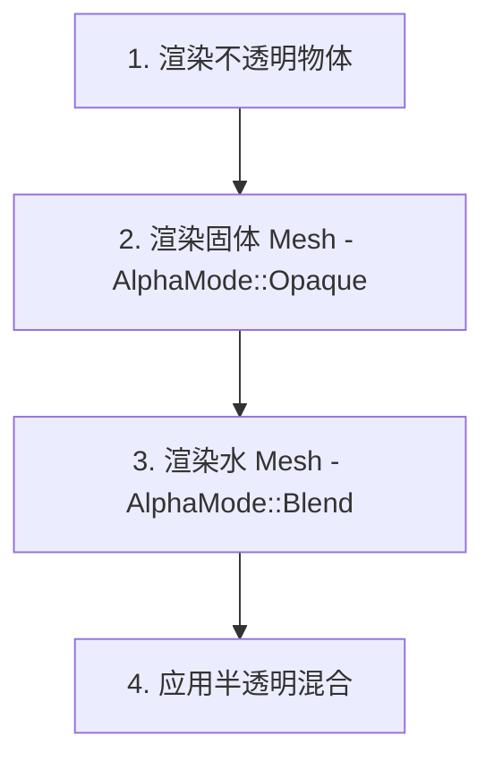

# 水方块区块内部分离方案

## 1. 背景与问题

### 1.1 当前问题

当前实现中，每个区块（32³ 体素）生成单一的 Mesh，所有方块共享同一个材质：

```rust
// 当前架构
ChunkData → Single Mesh → Single Material (AlphaMode::Blend 或 Opaque)
```

当区块包含水方块时，整个区块使用 `AlphaMode::Blend` 材质，导致：
- 水方块：正确半透明
- 不透明方块（草、石头等）：被强制透明渲染，可能出现视觉瑕疵

### 1.2 问题根因

```text
┌─────────────────────────────────────────────────────────────┐
│  区块数据: [草, 草, 草, 水, 水, 泥土, 石头, ...]           │
├─────────────────────────────────────────────────────────────┤
│  当前方案: 生成单一 Mesh → 使用 Blend 材质                  │
│           → 水方块正确，但草方块也被当作透明处理             │
└─────────────────────────────────────────────────────────────┘

┌─────────────────────────────────────────────────────────────┐
│  正确方案: 生成两个 Mesh                                     │
│           → solid_mesh (草+泥土+石头) → Opaque 材质         │
│           → water_mesh (水) → Blend 材质                    │
│           → 各自渲染，互不影响                                │
└─────────────────────────────────────────────────────────────┘
```

## 2. 目标

实现区块内部方块的分类渲染：
- **固体方块**（草、泥土、石头、木头等）→ 使用 `AlphaMode::Opaque` 材质
- **透明方块**（水、冰、玻璃、树叶等）→ 使用 `AlphaMode::Blend` 材质
- 每个区块可能生成 1-2 个 Mesh（solid_mesh 必有，water_mesh 可选）

## 3. 技术方案

### 3.1 数据结构修改

#### 3.1.1 修改 `MeshResult` 结构

**文件**: `src/async_mesh.rs`

```rust
// 现状
pub struct MeshResult {
    pub coord: ChunkCoord,
    pub positions: Vec<[f32; 3]>,
    pub uvs: Vec<[f32; 2]>,
    pub normals: Vec<[f32; 3]>,
    pub indices: Vec<u32>,
    pub contains_water: bool,
}

// 目标
pub struct ChunkMeshResult {
    pub coord: ChunkCoord,
    /// 固体方块的 Mesh 数据（始终存在）
    pub solid: SubMeshData,
    /// 水方块的 Mesh 数据（仅当区块包含水时生成）
    pub water: Option<SubMeshData>,
}

pub struct SubMeshData {
    pub positions: Vec<[f32; 3]>,
    pub uvs: Vec<[f32; 2]>,
    pub normals: Vec<[f32; 3]>,
    pub indices: Vec<u32>,
    pub triangle_count: u32,
}
```

**关键点**：
- `solid` 始终存在（任何区块都有固体方块）
- `water` 为 `Option`，仅当 `chunk.contains_block(5)` 为 true 时生成

#### 3.1.2 添加材质资源

**文件**: `src/chunk_manager.rs`

```rust
/// 全局共享的不透明材质（用于固体方块）
pub struct SolidVoxelMaterial {
    pub handle: Handle<VoxelMaterial>,
}

/// 全局共享的透明材质（用于水方块）
pub struct TransparentVoxelMaterial {
    pub handle: Handle<VoxelMaterial>,
}
```

### 3.2 网格生成逻辑修改

#### 3.2.1 修改 `generate_combined_mesh`

**文件**: `src/async_mesh.rs`

```rust
/// 分离 Mesh 生成：水方块和固体方块分开处理
///
/// 返回两个独立的 Mesh 数据：
/// - solid: 固体方块（草、泥土、石头等）
/// - water: 水方块（使用 Greedy Mesh 优化）
pub fn generate_chunk_mesh_separated(
    chunk: &ChunkData,
    uv_table: &UvLookupTable,
    neighbors: &ChunkNeighbors,
) -> ChunkMeshResult {
    // 1. 生成固体方块的 Mesh（跳过水方块）
    let solid_data = generate_solid_mesh(chunk, uv_table, neighbors);
    
    // 2. 生成水方块的 Mesh（使用 Greedy Mesh）
    let water_data = if chunk.contains_block(WATER_BLOCK_ID) {
        Some(generate_water_mesh_greedy(chunk, neighbors, uv_table))
    } else {
        None
    };
    
    ChunkMeshResult {
        coord: chunk.coord,
        solid: solid_data,
        water: water_data,
    }
}

/// 生成固体方块的 Mesh（水方块被跳过）
fn generate_solid_mesh(...) -> SubMeshData {
    // 遍历所有固体方块，跳过 block_id == 5（水）
    // 生成标准的面 mesh
}

/// 使用 Greedy Mesh 生成水方块的 Mesh
fn generate_water_mesh_greedy(...) -> SubMeshData {
    // 仅处理 block_id == 5 的方块
    // 使用贪心合并优化
}
```

#### 3.2.2 修改 LOD 支持

**文件**: `src/lod.rs`

```rust
/// LOD 级别的分离 Mesh 生成
pub fn generate_lod_mesh_separated(
    chunk: &ChunkData,
    uv_table: &UvLookupTable,
    neighbors: &ChunkNeighbors,
    lod: LodLevel,
) -> ChunkMeshResult {
    // 类似地分离固体和水方块
    // 注意：LOD 级别可能不需要 Greedy Mesh
}
```

### 3.3 渲染系统修改

#### 3.3.1 修改 `ChunkEntry`

**文件**: `src/chunk_manager.rs`

```rust
pub struct ChunkEntry {
    pub entity: Entity,
    pub data: Arc<ChunkData>,
    pub last_accessed: u64,
    /// 固体方块的 Mesh Handle
    pub solid_mesh_handle: Handle<Mesh>,
    /// 水方块的 Mesh Handle（可选）
    pub water_mesh_handle: Option<Handle<Mesh>>,
    pub material_handle: Handle<VoxelMaterial>,
    pub lod_level: LodLevel,
    pub triangle_count: u32,
}
```

#### 3.3.2 修改区块加载系统

**文件**: `src/chunk_manager.rs`

```rust
pub fn chunk_loader_system(...) {
    // ...
    for result in results {
        let entry = loaded.entries.get_mut(&result.coord);
        
        if let Some(solid_data) = result.solid {
            // 上传固体 Mesh
            let solid_mesh = meshes.add(create_bevy_mesh(solid_data));
            entry.solid_mesh_handle = solid_mesh.clone();
            
            // 更新实体：替换固体 Mesh
            commands.entity(entry.entity).replace(Mesh3d(solid_mesh));
        }
        
        if let Some(water_data) = result.water {
            // 创建或获取水 Mesh 实体
            let water_mesh = meshes.add(create_bevy_mesh(water_data));
            
            if entry.water_entity.is_none() {
                // 创建水 Mesh 实体
                let water_entity = commands.spawn((
                    Mesh3d(water_mesh.clone()),
                    MeshMaterial3d(transparent_material.handle.clone()),
                    Transform::from_translation(entry.position),
                    Visibility::default(),
                )).id();
                entry.water_entity = Some(water_entity);
            } else {
                // 更新已有水 Mesh
                commands.entity(entry.water_entity.unwrap())
                    .replace((Mesh3d(water_mesh), Transform::from_translation(entry.position)));
            }
            entry.water_mesh_handle = Some(water_mesh);
        } else if entry.water_entity.is_some() {
            // 区块不再包含水，移除水 Mesh 实体
            commands.entity(entry.water_entity.unwrap()).despawn();
            entry.water_entity = None;
            entry.water_mesh_handle = None;
        }
    }
}
```

#### 3.3.3 修改区块卸载

**文件**: `src/chunk_manager.rs`

```rust
fn unload_chunk_entity(
    commands: &mut Commands,
    entry: &ChunkEntry,
    meshes: &mut Assets<Mesh>,
) {
    // 移除固体 Mesh
    meshes.remove(&entry.solid_mesh_handle);
    
    // 移除水 Mesh（如果存在）
    if let Some(water_handle) = entry.water_mesh_handle {
        meshes.remove(&water_handle);
    }
    
    // 移除实体
    commands.entity(entry.entity).despawn();
    
    // 移除水实体（如果存在）
    if let Some(water_entity) = entry.water_entity {
        commands.entity(water_entity).despawn();
    }
}
```

### 3.4 脏块重建修改

**文件**: `src/chunk_dirty.rs`

```rust
/// 重建脏块的 Mesh
fn rebuild_dirty_chunk(...) {
    // 收集异步结果
    let results = async_mesh.collect_results(...);
    
    for result in results {
        // 分离处理 solid 和 water mesh
        if let Some(solid_data) = result.solid {
            // 使用 opaque 材质
        }
        if let Some(water_data) = result.water {
            // 使用 transparent 材质
        }
    }
}
```

## 4. 渲染顺序

透明物体的渲染顺序非常重要：



Bevy 的标准渲染顺序：
1. `Opaque` 排序组：先渲染
2. `Transparent` 排序组：后渲染，按距离排序

需要确保：
- 固体 Mesh 使用 `Opaque` 排序
- 水 Mesh 使用 `Transparent` 排序

## 5. 预估代码量

| 模块 | 文件 | 改动类型 | 预估行数 |
|------|------|----------|----------|
| MeshResult 重构 | `src/async_mesh.rs` | 数据结构 | ~30 |
| 网格分离生成 | `src/async_mesh.rs` | 函数修改 | ~150 |
| LOD 适配 | `src/lod.rs` | 函数修改 | ~80 |
| ChunkEntry 扩展 | `src/chunk_manager.rs` | 数据结构 | ~40 |
| 材质管理 | `src/chunk_manager.rs` | 资源管理 | ~30 |
| 区块加载系统 | `src/chunk_manager.rs` | 系统修改 | ~120 |
| 脏块重建 | `src/chunk_dirty.rs` | 系统修改 | ~80 |
| 区块卸载 | `src/chunk_manager.rs` | 函数修改 | ~30 |
| **总计** | | | **~560 行** |

## 6. 实施步骤

### Phase 1: 数据结构重构
1. 修改 `MeshResult` → `ChunkMeshResult`
2. 添加 `SubMeshData` 结构
3. 更新 `contains_block` 逻辑确认

### Phase 2: 网格生成分离
1. 修改 `generate_combined_mesh` 分离逻辑
2. 实现 `generate_solid_mesh`（跳过水方块）
3. 保留 `generate_water_mesh_greedy`
4. 更新 LOD 函数

### Phase 3: 渲染系统适配
1. 扩展 `ChunkEntry` 添加水 Mesh 相关字段
2. 添加/获取 `water_entity`
3. 修改 `chunk_loader_system` 处理双 Mesh
4. 修改卸载逻辑清理水实体

### Phase 4: 测试与调优
1. 验证固体方块渲染正常
2. 验证水方块半透明正确
3. 验证区块切换时资源正确释放
4. 验证 LOD 切换正常

## 7. 注意事项

### 7.1 水面渲染特殊处理
Minecraft 中水的顶面和底面渲染方式不同：
- 顶面：使用水的纹理
- 底面：使用深水或半透明效果

当前方案会保持一致处理，如果需要区分，需要在面生成时标记水面/水底。

### 7.2 性能考量
- 每个区块多一个 Mesh 会增加 draw call
- 可以考虑合并所有水 Mesh 到一个全局 Mesh（Instance Rendering）
- Greedy Mesh 已经减少了水的顶点数

### 7.3 区块边界处理
- 水方块在区块边界时，需要正确访问邻居区块数据
- 当前 `ChunkNeighbors` 结构已经支持此功能

## 8. 替代方案

### 方案 B: 全局水 Mesh（Instance 方案）

不分离到每个区块，而是将所有水方块合并到一个全局 Mesh：

```rust
// 全局水 Mesh 管理器
pub struct GlobalWaterMeshManager {
    pub mesh: Handle<Mesh>,
    pub entities: HashSet<ChunkCoord>,  // 包含水的区块
}

// 每个包含水的区块只添加一个 Instance
```

**优点**: 减少 draw call
**缺点**: 复杂度和内存管理增加

### 方案 C: 保持现状

当前 alpha=255 的纹理在 Blend 模式下视觉差异不大，可以接受现状，直到性能或视觉问题突出时再优化。

## 9. 结论

推荐实施 **方案 A（区块内部分离）**，因为：
1. 代码量适中（~560 行）
2. 架构清晰，易于维护
3. 解决根本问题
4. 为未来扩展（树叶、冰等透明方块）打下基础
