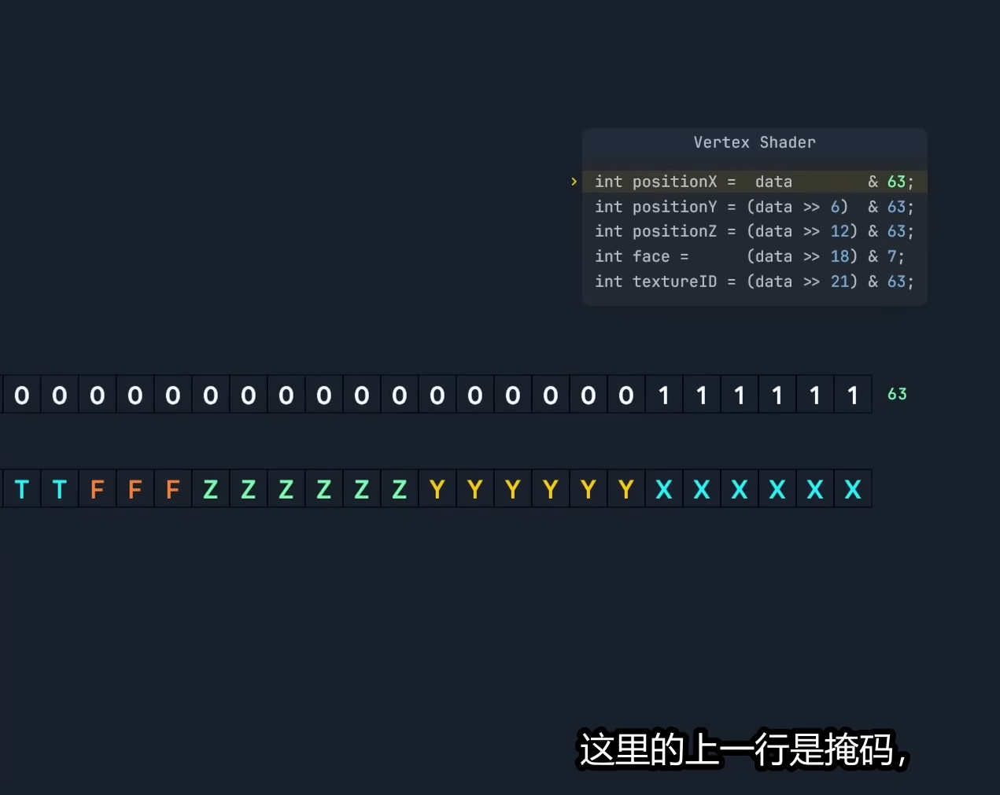

## 目前阶段：
### 已完成
- 完成了基于噪声生成的世界，使用opensimplex2配合FBM叠加生成地形。
- 基于方块的优化，可见的块中，不可见的面还未剔除
- 实现了区块的实时加载和卸载：目前存储方块和区块都是hashmap  
注：hashmap还是std库的，由于siphash非常慢，所以计划改为nohash
### 待完成
- 优化方块 && 区块的存储方式：由hashmap改为数组存储方块，再由hashmap保存区块
- 实现新的剔除优化方法，尝试实现实时剔除所有不可见的面: [遮挡剔除]  
以修复地形生成高度过高时，方块显示不正常的问题。 
位运算：将坐标、法线、uv、方块id等数据压缩到16位，再通过位运算进行存储。 
[关于剔除](https://www.bilibili.com/video/BV1HH4y1A7nu/?spm_id_from=333.1387.favlist.content.click&vd_source=511b084e4bf87d71d725c5db0fb20b7f) 
[关于地形LOD](https://www.bilibili.com/video/BV1HH4y1A7nu/?spm_id_from=333.1387.favlist.content.click&vd_source=511b084e4bf87d71d725c5db0fb20b7f) 

- 目前的添加面的方式是整个方块的添加，需要改为按面添加， 
例如只有y+面可见，则只添加y+面
- 引入八叉树，实现基于八叉树的剔除优化、区块的加载和卸载、方块的显示 
https://github.com/Adam-Gleave/svo-rs  
https://github.com/mkmarek/svo-rs/tree/master

## 未来计划：
- 给方块添加材质贴图，比如石头、草方块、泥土块，包括纹理图集
- 添加天空盒
- 实现方块的破坏放置
- 实现群系的生成  
https://www.bilibili.com/video/BV13u411j7KX/?spm_id_from=333.1387.favlist.content.click&vd_source=511b084e4bf87d71d725c5db0fb20b7f
- 添加碰撞体 / 物理系统，例如： 
https://github.com/Jondolf/avian